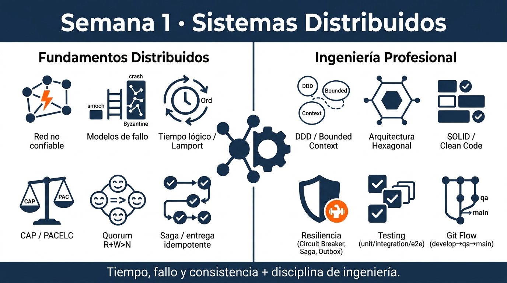

<!-- HU-STATUS TEMPLATE - do NOT remove the <!-- ... --> markers or the table headers.
     Your weekly grade is read AUTOMATICALLY from this file:
       01-week/hu-status/README.md  (inside YOUR fork). English. -->

# Weekly Status - Week 01

<!-- CONFIG-START - must match your profile repo (username/username) CONFIG -->
- FULL_NAME:Daniel Felipe Cerquera Idrobo
- GITHUB_USER: Pipecerquera
- TEAM: Barbersaas
- SPRINT_GOAL: Understand and document the main distributed architecture styles and their trade-offs.
<!-- CONFIG-END -->

## 1. User stories worked this week
| HU ID | Title | Status (todo/doing/done) | Evidence (PR or commit URL) |
|---|---|---|---|
| HU-000-001 | As a team, we want to document the BarberSaaS PRD (product scope, personas, functional/non-functional requirements) so that the rest of the project has a shared source of truth | done | https://github.com/Pipecerquera/sistemas-distribuidos-2026-b-g2-daniel-cerquera/commit/b74c7f0594723fe06d3bebf4c8c7a312bc403384 |

## 2. My individual contribution
-Researched and documented the main distributed architecture styles, including client-server, peer-to-peer, SOA and microservices.
-Prepared the weekly visual summary to consolidate the concepts and their main trade-offs.
-Organized and updated the Week 01 documentation in the repository.

## 3. Blockers and risks
-No major blockers during the week.
-The main risk was ensuring that the architectural concepts and their trade-offs were clearly summarized and represented in the weekly documentation.

## 4. Plan for next week
-Study containerization with Docker.
-Understand the differences between images, containers and registries.
-Practice writing Dockerfiles and using Docker Compose for multi-service applications.
-Document the concepts and evidence for Week 02.

## 5. Compliance self-check
- [x] Conventional Commits - `type(scope): summary`
- [ ] Per-environment HU branch + PR to that environment (hu-xxx-dev -> develop, ...) — not applicable this week: work was committed directly to `main`, no HU branch/PR flow used yet.
- [ ] Testable acceptance criteria — not applicable: this week's deliverable was conceptual/documentation (architecture styles, PRD), not a testable product HU.
- [ ] Tests added/updated (unit / integration) — not applicable: no code was written this week.
- [ ] DDD / hexagonal boundaries respected (domain has no I/O) — not applicable: no code was written this week.
- [x] No secrets; config via environment variables

## 6. Evidence links
- Repo: https://github.com/Pipecerquera/sistemas-distribuidos-2026-b-g2-daniel-cerquera.git
- PDR-BarberSaaS.md added: https://github.com/Pipecerquera/sistemas-distribuidos-2026-b-g2-daniel-cerquera/commit/b74c7f0594723fe06d3bebf4c8c7a312bc403384
- Week 1 visual summary added: https://github.com/Pipecerquera/sistemas-distribuidos-2026-b-g2-daniel-cerquera/commit/6f704186cb10a1454b000411812619033c0274cb

## Resumen visual de la semana 1

## PDR de la semana 1
[Ver PDR - BarberSaaS](PDR-BarberSaaS.md)
-
