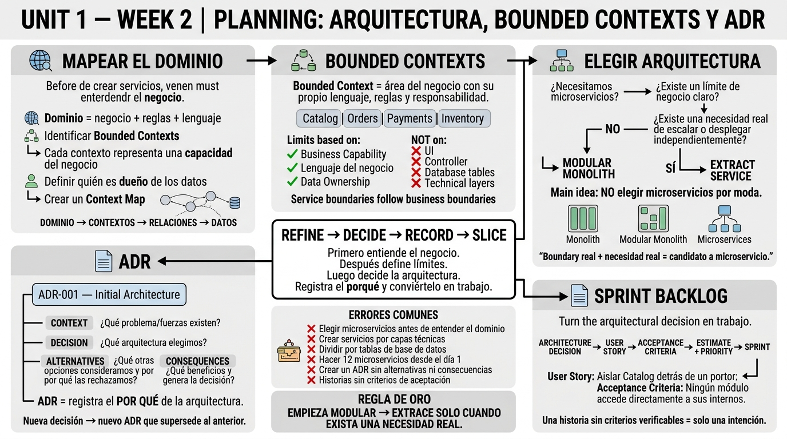

<!-- HU-STATUS TEMPLATE - do NOT remove the <!-- ... --> markers or the table headers.
     Your weekly grade is read AUTOMATICALLY from this file:
       02-week/hu-status/README.md  (inside YOUR fork). English. -->

# Weekly Status - Week 02

<!-- CONFIG-START - must match your profile repo (username/username) CONFIG -->
- FULL_NAME: Daniel Felipe Cerquera Idrobo
- GITHUB_USER: Pipecerquera
- TEAM: Barbersaas
- SPRINT_GOAL: Map the BarberSaaS domain into bounded contexts, decide the architecture style (modular monolith vs. microservices) and record the decision in an ADR.
<!-- CONFIG-END -->

## 1. User stories worked this week
| HU ID | Title | Status (todo/doing/done) | Evidence (PR or commit URL) |
|---|---|---|---|
| N/A | Conceptual session (bounded contexts, architecture decision, ADR structure) — no code or standalone document produced this week; ADR-002 (modular monolith) was written later, on 2026-08-31, in the DOCS repo | done | https://github.com/Pipecerquera/sistemas-distribuidos-2026-b-g2-daniel-cerquera/commit/e79a2aea06424dc878401a10c869e856082f4266 |

## 2. My individual contribution
- Mapped the BarberSaaS domain into candidate bounded contexts (Catalog, Orders, Payments, Inventory), defining boundaries by business capability and data ownership instead of technical layers.
- Worked through the architecture decision tree (modular monolith vs. extract-service vs. microservices) to avoid choosing microservices prematurely.
- Studied the ADR structure (Context / Decision / Alternatives / Consequences) used to justify and record an architecture decision.
- Practiced turning an architecture decision into sprint backlog items (architecture decision → user story → acceptance criteria → estimate/priority → sprint).
- Prepared the Week 02 visual summary consolidating these concepts.

## 3. Blockers and risks
- The `CODE` repo (BarberSaaS backend/mobile) is not yet under version control, so this week's bounded-context/architecture work could not yet be validated against real code.
- Main risk: picking an architecture prematurely without a clear business boundary or real scaling need — mitigated by following the "start modular, extract only when there is a real need" rule from this week's material.

## 4. Plan for next week
- Study Domain-Driven Design building blocks (Entity, Value Object, Aggregate, Aggregate Root, Domain Event).
- Study hexagonal architecture (adapters → application → domain) and dependency direction.
- Understand data ownership and service contracts between bounded contexts, plus sync vs. async communication.
- Study the Anti-Corruption Layer (ACL) pattern for isolating the domain from external/legacy systems.
- Document the concepts and evidence for Week 03 (vertical-slice MVP).

## 5. Compliance self-check
- [ ] Conventional Commits - `type(scope): summary` — not met: this week's commits (`e79a2ae`, `15dc1e4`) don't follow `type(scope): summary`.
- [ ] Per-environment HU branch + PR to that environment (hu-xxx-dev -> develop, ...) — not applicable: work was committed directly to `main`, no HU branch/PR flow used yet.
- [ ] Testable acceptance criteria — not applicable: this week's deliverable was conceptual, not a testable product HU.
- [ ] Tests added/updated (unit / integration) — not applicable: no code was written this week.
- [ ] DDD / hexagonal boundaries respected (domain has no I/O) — not applicable: no code was written this week (DDD/hexagonal are next week's topic).
- [x] No secrets; config via environment variables

## 6. Evidence links
- Repo: https://github.com/Pipecerquera/sistemas-distribuidos-2026-b-g2-daniel-cerquera.git
- Week 2 visual summary added: https://github.com/Pipecerquera/sistemas-distribuidos-2026-b-g2-daniel-cerquera/commit/e79a2aea06424dc878401a10c869e856082f4266
- Related architecture decision (written later, 2026-08-31, in the DOCS repo): `05-architecture/decisions/records/ADR-002-modular-monolith.md`

