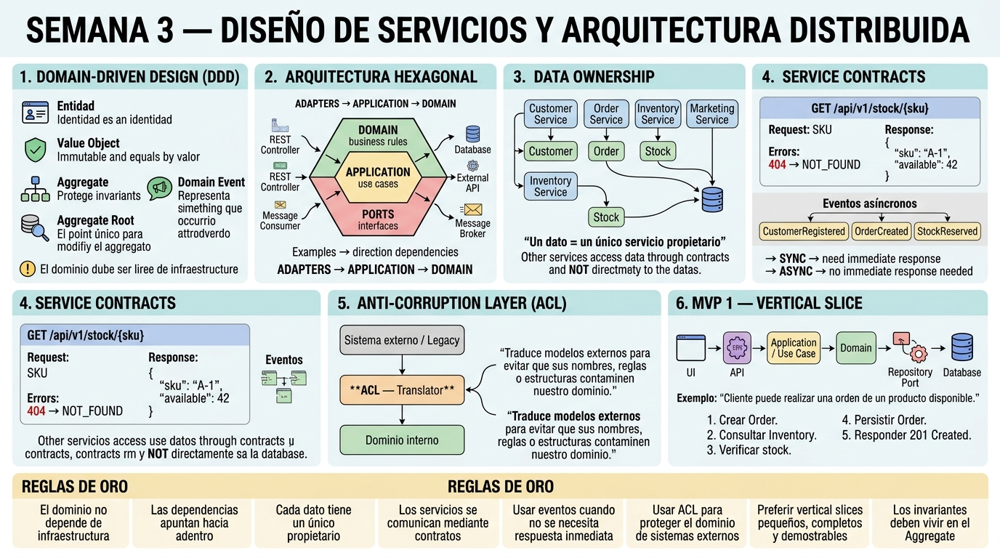

<!-- HU-STATUS TEMPLATE - do NOT remove the <!-- ... --> markers or the table headers.
     Your weekly grade is read AUTOMATICALLY from this file:
       03-week/hu-status/README.md  (inside YOUR fork). English. -->

# Weekly Status - Week 03

<!-- CONFIG-START - must match your profile repo (username/username) CONFIG -->
- FULL_NAME: Daniel Felipe Cerquera Idrobo
- GITHUB_USER: Pipecerquera
- TEAM: Barbersaas
- SPRINT_GOAL: Design services and distributed architecture: apply DDD building blocks, hexagonal architecture, data ownership/service contracts and the Anti-Corruption Layer pattern, and outline a vertical-slice MVP.
<!-- CONFIG-END -->

## 1. User stories worked this week
| HU ID | Title | Status (todo/doing/done) | Evidence (PR or commit URL) |
|---|---|---|---|
| HU-000-006 | Session 1 — As a team, we want to pick one bounded context and model it (aggregate root, entities/value objects, invariants, domain events) so that boundaries and contracts can be refined in Session 2 | done | Aggregates + invariants: https://github.com/code-corhuila/barber-saas-docs/blob/main/02-domain/entities-and-rules.md — Domain events catalog: https://github.com/code-corhuila/barber-saas-docs/blob/main/02-domain/Domain_Events_Luxury_Barber_EN.md |
| HU-000-007 | Session 2 — As a team, for MVP 1 we want to define service contracts (sync/events), decide data ownership per entity, add ACLs for the external systems we consume, and slice the first vertical feature into testable stories | partial | Data ownership (per bounded context): https://github.com/code-corhuila/barber-saas-docs/blob/main/02-domain/domain-map.md — ACL for Firebase FCM and Gmail SMTP (new this week): [`acl-external-systems.md`](acl-external-systems.md) — vertical-slice backlog with testable ACs: https://github.com/code-corhuila/barber-saas-docs/blob/main/04-requirements/user-stories.md |

## 2. My individual contribution
- Modeled the `Appointment` aggregate (and, for context, `Barbershop`, `BarberProfile`, `LoyaltyCard`) with its aggregate root, value objects (`TimeSlot`, `Money`), and invariants (no overlapping bookings, immutable `priceAtBooking`, valid status transitions) — `02-domain/entities-and-rules.md`.
- Reviewed the real domain events catalog (`AppointmentCreated`, `StickerGranted`, etc.), including the honest note that BarberSaaS has no message broker — events are in-process synchronous calls, not messages on a topic (`02-domain/Domain_Events_Luxury_Barber_EN.md`).
- Confirmed data ownership is already assigned per bounded context (each context's section in `domain-map.md` lists exactly which DB tables it owns) rather than left implicit.
- Wrote the Anti-Corruption Layer analysis for the two real external systems BarberSaaS consumes — Firebase Admin SDK (FCM push notifications) and Gmail SMTP (password-reset email) — covering the external model, the domain model, and where the translation/isolation happens for each (`hu-status/acl-external-systems.md`, new this week).
- Prepared the Week 03 visual summary consolidating these concepts.

## 3. Blockers and risks
- The `CODE` repo (BarberSaaS backend/mobile) was not yet under version control when this was first drafted; it is now (`barbersaas-code`, see Week 06+), so the aggregate/invariant model can be cross-checked against the real Java entities going forward.
- **Real gap found, not fixed this week:** `07-api/contracts/openapi/auth-service.yaml` (DOCS repo) is still the generic scaffold contract and does not match the real implementation — it documents JWT **RS256** with 1h expiry and a `/jwks` key-verification endpoint, while the actual backend uses **HS512** (a symmetric secret, for which a JWKS endpoint makes no sense), 24h access-token expiry, and a 7-day refresh token (`05-architecture/overview.md` §5, P4). Leaving this here as an explicit finding rather than silently treating the contract as "done" — it needs its own task to rewrite it against the real endpoints.
- Main risk: mixing infrastructure concerns into the domain layer, or skipping service contracts between bounded contexts — mitigated by following this week's golden rules (domain independent of infrastructure, dependencies point inward, one owner per datum) and by keeping the ACL boundary strictly at the two real third-party integrations, not at inter-module calls (which are governed by ADR-002 instead).

## 4. Plan for next week
- Build a service using hexagonal architecture and patterns: request journey (API → application logic → database), Dependency Inversion Principle, and walking-skeleton vs. big-bang integration.
- Plan MVP 1 with a contract-first API (OpenAPI spec before coding).
- Set up the sprint board (To Do / In Progress / Testing / Done), estimate with story points (Fibonacci) and prioritize with the MoSCoW matrix.
- Define the sprint goal and Definition of Done (code reviewed, unit tests passed, acceptance criteria met, documentation updated) for MVP 1.
- Document the concepts and evidence for Week 04.

## 5. Compliance self-check
- [ ] Conventional Commits - `type(scope): summary` — not met: this week's commits (`e79a2ae`, `15dc1e4`) don't follow `type(scope): summary`.
- [ ] Per-environment HU branch + PR to that environment (hu-xxx-dev -> develop, ...) — not applicable: work was committed directly to `main`, no HU branch/PR flow used yet.
- [x] Testable acceptance criteria — met: the vertical-slice backlog (`04-requirements/user-stories.md`) carries Gherkin `Given/When/Then` criteria per HU.
- [ ] Tests added/updated (unit / integration) — not applicable: no code was written this week.
- [ ] DDD / hexagonal boundaries respected (domain has no I/O) — the aggregate model (`entities-and-rules.md`) documents this rule, but it is not yet cross-checked against the real Java entities in `barbersaas-code`.
- [x] No secrets; config via environment variables

## 6. Evidence links
- Repo: https://github.com/Pipecerquera/sistemas-distribuidos-2026-b-g2-daniel-cerquera.git
- Week 3 visual summary added: https://github.com/Pipecerquera/sistemas-distribuidos-2026-b-g2-daniel-cerquera/commit/e79a2aea06424dc878401a10c869e856082f4266
- Session 1 — aggregate model (root, VOs, invariants): https://github.com/code-corhuila/barber-saas-docs/blob/main/02-domain/entities-and-rules.md
- Session 1 — domain events catalog: https://github.com/code-corhuila/barber-saas-docs/blob/main/02-domain/Domain_Events_Luxury_Barber_EN.md
- Session 2 — data ownership per bounded context: https://github.com/code-corhuila/barber-saas-docs/blob/main/02-domain/domain-map.md
- Session 2 — ACL for external systems (Firebase FCM, Gmail SMTP): [`acl-external-systems.md`](acl-external-systems.md)
- Session 2 — vertical-slice backlog with testable acceptance criteria: https://github.com/code-corhuila/barber-saas-docs/blob/main/04-requirements/user-stories.md
- Session 2 — flagged issue (not fixed): generic/incorrect API contract, https://github.com/code-corhuila/barber-saas-docs/blob/main/07-api/contracts/openapi/auth-service.yaml

