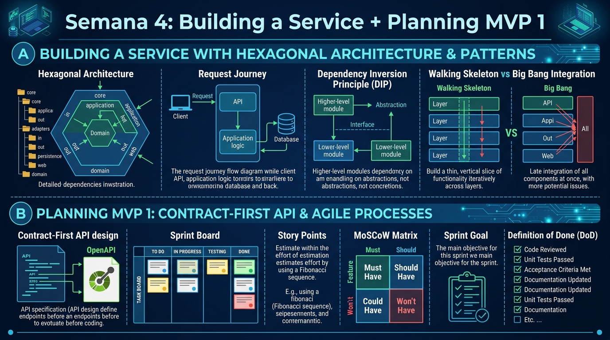

<!-- HU-STATUS TEMPLATE - do NOT remove the <!-- ... --> markers or the table headers.
     Your weekly grade is read AUTOMATICALLY from this file:
       04-week/hu-status/README.md  (inside YOUR fork). English. -->

# Weekly Status - Week 04

<!-- CONFIG-START - must match your profile repo (username/username) CONFIG -->
- FULL_NAME: Daniel Felipe Cerquera Idrobo
- GITHUB_USER: Pipecerquera
- TEAM: Barbersaas
- SPRINT_GOAL: Build a service using hexagonal architecture and patterns, and plan MVP 1 with a contract-first API, sprint board, story points and a Definition of Done.
<!-- CONFIG-END -->

## 1. User stories worked this week
| HU ID | Title | Status (todo/doing/done) | Evidence (PR or commit URL) |
|---|---|---|---|
| N/A | As a team, we want to expand the BarberSaaS PRD to v2.0 (modular monolith design, MVP scope, API design principles) so that MVP 1 architecture and planning have a documented source of truth | done | https://github.com/Pipecerquera/sistemas-distribuidos-2026-b-g2-daniel-cerquera/commit/4ec13d58e4bb9c5b9752e15a5d203fd0c479399a |

## 2. My individual contribution
- Studied hexagonal architecture applied to building a real service: request journey (API → application logic → database), Dependency Inversion Principle, and walking-skeleton vs. big-bang integration.
- Expanded the BarberSaaS PRD from v1.0 to v2.0, adding the modular-monolith design section, updated MVP scope and API design principles.
- Practiced contract-first API design (OpenAPI spec before coding) and MVP 1 planning: sprint board (To Do/In Progress/Testing/Done), story-point estimation (Fibonacci), MoSCoW prioritization and Definition of Done.
- Prepared the Week 04 visual summary consolidating these concepts.

## 3. Blockers and risks
- The `CODE` repo (BarberSaaS backend/mobile) is still not under version control, so the hexagonal-architecture/walking-skeleton concepts could not yet be applied to real code.
- Main risk: MVP scope creep if the MoSCoW matrix and Definition of Done aren't enforced when planning MVP 1 — mitigated by documenting them explicitly in the PRD v2.0.

## 4. Plan for next week
- Containerize the service with Docker: Dockerfile → image → container flow, registry push/pull, multi-stage builds, ENV vs. volumes.
- Design the Docker Compose networking diagram and apply Docker security practices (least privilege, image scanning, signed images, network isolation).
- Release/ship MVP 1: Git promotion flow (develop → QA → main), Release Definition of Done checklist, MVP scope vs. quality trade-off.
- Run the MVP 1 demo flow (prep, live demo, Q&A, feedback) and hold a retrospective (what went well / what can improve / action items).
- Document the concepts and evidence for Week 05.

## 5. Compliance self-check
- [x] Conventional Commits - `type(scope): summary` — commit `4ec13d5` ("feat: update deliverables for weeks 1 to 5") follows the format, though it's a single batch commit covering weeks 1-5, not week-04-specific.
- [ ] Per-environment HU branch + PR to that environment (hu-xxx-dev -> develop, ...) — not applicable: work was committed directly to `main`, no HU branch/PR flow used yet.
- [ ] Testable acceptance criteria — not applicable: this week's deliverable was conceptual/documentation, not a testable product HU.
- [ ] Tests added/updated (unit / integration) — not applicable: no code was written this week.
- [ ] DDD / hexagonal boundaries respected (domain has no I/O) — studied this week but not yet applied to real code (no code exists yet in the `CODE` repo).
- [x] No secrets; config via environment variables

## 6. Evidence links
- Repo: https://github.com/Pipecerquera/sistemas-distribuidos-2026-b-g2-daniel-cerquera.git
- PDR-BarberSaaS.md updated to v2.0 + Week 4 visual summary: https://github.com/Pipecerquera/sistemas-distribuidos-2026-b-g2-daniel-cerquera/commit/4ec13d58e4bb9c5b9752e15a5d203fd0c479399a

