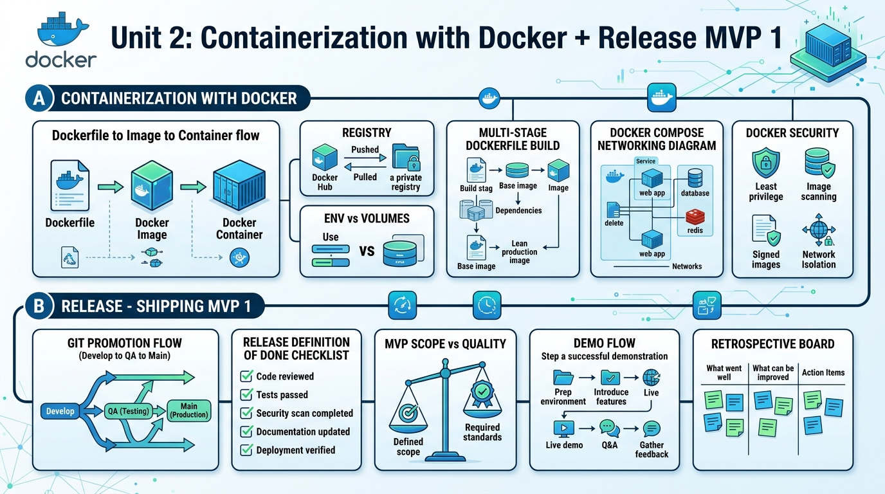

<!-- HU-STATUS TEMPLATE - do NOT remove the <!-- ... --> markers or the table headers.
     Your weekly grade is read AUTOMATICALLY from this file:
       05-week/hu-status/README.md  (inside YOUR fork). English. -->

# Weekly Status - Week 05

<!-- CONFIG-START - must match your profile repo (username/username) CONFIG -->
- FULL_NAME: Daniel Felipe Cerquera Idrobo
- GITHUB_USER: Pipecerquera
- TEAM: Barbersaas
- SPRINT_GOAL: Research cross-cutting domains and the Strangler Fig migration pattern, and study containerization with Docker plus the MVP 1 release/shipping process.
<!-- CONFIG-END -->

## 1. User stories worked this week
| HU ID | Title | Status (todo/doing/done) | Evidence (PR or commit URL) |
|---|---|---|---|
| N/A | As a team, we want to document cross-cutting domains (security, observability, configuration, resilience, auditing) and the Strangler Fig pattern so that we have written guidance for distributed/microservices concerns and legacy migration | done | Docx: https://github.com/Pipecerquera/sistemas-distribuidos-2026-b-g2-daniel-cerquera/commit/4ec13d58e4bb9c5b9752e15a5d203fd0c479399a — Infographic: https://github.com/Pipecerquera/sistemas-distribuidos-2026-b-g2-daniel-cerquera/commit/1c9e285f0444bf20bca48c2eba54e47b9bf44781 |

## 2. My individual contribution
- Wrote "Dominios Transversales", a research document on cross-cutting concerns (security, observability, configuration management, resilience, auditing/traceability) in distributed and microservices architectures — concept, difference from business domains, and centralization strategies (API Gateway, service mesh, sidecars, DevSecOps).
- Built an infographic explaining the Strangler Fig pattern for incrementally migrating a legacy system.
- Studied Docker containerization (Dockerfile → image → container, registry push/pull, multi-stage builds, ENV vs. volumes, Compose networking diagram, Docker security) and the MVP 1 release/shipping process (Git promotion flow develop→QA→main, Release Definition of Done checklist, MVP scope vs. quality, demo flow, retrospective) from this week's session material.
- Prepared the Week 05 visual summary consolidating the Docker + Release MVP 1 concepts.

## 3. Blockers and risks
- The `CODE` repo (BarberSaaS backend/mobile) is still not under version control, so Docker containerization and the release/promotion flow studied this week could not yet be applied to a real service.
- Main risk: treating cross-cutting concerns as ad hoc code inside each business module instead of centralizing them (security, observability, config) — noted explicitly in the research document as the source of duplication and inconsistency.

## 4. Plan for next week
- Continue with the Unit 2 course topics per the syllabus; specific content for Week 06 is not yet defined.

## 5. Compliance self-check
- [x] Conventional Commits - `type(scope): summary` — commit `4ec13d5` ("feat: update deliverables for weeks 1 to 5") follows the format; the other week-05 commit (`1c9e285`, "Update week 5") does not.
- [ ] Per-environment HU branch + PR to that environment (hu-xxx-dev -> develop, ...) — not applicable: work was committed directly to `main`, no HU branch/PR flow used yet.
- [ ] Testable acceptance criteria — not applicable: this week's deliverable was research/documentation, not a testable product HU.
- [ ] Tests added/updated (unit / integration) — not applicable: no code was written this week.
- [ ] DDD / hexagonal boundaries respected (domain has no I/O) — not applicable: no code was written this week.
- [x] No secrets; config via environment variables

## 6. Evidence links
- Repo: https://github.com/Pipecerquera/sistemas-distribuidos-2026-b-g2-daniel-cerquera.git
- Dominios_transversales.docx + Week 5 visual summary added: https://github.com/Pipecerquera/sistemas-distribuidos-2026-b-g2-daniel-cerquera/commit/4ec13d58e4bb9c5b9752e15a5d203fd0c479399a
- strangler-fig-infografia.html added: https://github.com/Pipecerquera/sistemas-distribuidos-2026-b-g2-daniel-cerquera/commit/1c9e285f0444bf20bca48c2eba54e47b9bf44781

