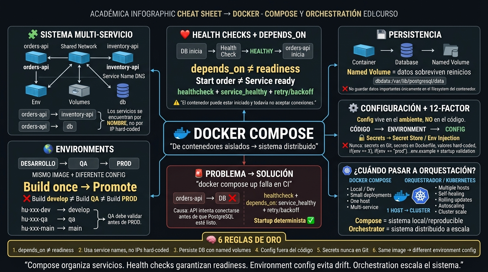

<!-- HU-STATUS TEMPLATE - do NOT remove the <!-- ... --> markers or the table headers.
     Your weekly grade is read AUTOMATICALLY from this file:
       06-week/hu-status/README.md  (inside YOUR fork). English. -->

# Weekly Status - Week 06

<!-- CONFIG-START - must match your profile repo (username/username) CONFIG -->
- FULL_NAME: Daniel Felipe Cerquera Idrobo
- GITHUB_USER: Pipecerquera
- TEAM: Barbersaas
- SPRINT_GOAL: Bring the whole system up with a single `docker compose up` (shared network, health-gated startup, env config, volumes), then define the three real environments, their config matrix, and the sliced MVP 2 orchestration stories.
<!-- CONFIG-END -->

## 1. User stories worked this week
| HU ID | Title | Status (todo/doing/done) | Evidence (PR or commit URL) |
|---|---|---|---|
| HU-000-012 | Session 1 — As a team, we want to bring our whole system up with a single `docker compose up` (shared network, health checks gating startup, config via env, data in volumes) so the stack is reproducible for anyone on the team | doing | Verified against the real compose files, already on `develop` before this week (commit `6a790e8`): [root `docker-compose.yml`](https://github.com/code-corhuila/barber-saas/blob/develop/docker-compose.yml), [backend `docker-compose.yml`](https://github.com/code-corhuila/barber-saas/blob/develop/barbersaas-backend/barbersaas-backend/docker-compose.yml). Shared network ✅, health checks + `depends_on: condition: service_healthy` gating `postgres → backend → nginx` ✅, named volume `postgres_data` ✅ — but config-via-env is incomplete, see Blockers |
| HU-000-013 | Session 2 (planning) — As a team, we want to define our three environments with a documented config matrix, keep secrets out of Git (`.env.example`), confirm the branch↔environment mapping, and slice the MVP 2 orchestration stories with testable acceptance criteria, so MVP 2 has a real plan instead of assumptions | doing | Partially met — see below and Blockers |
| HU-000-011 | Session 2 (carried over from Week 05) — As a team, we want to ship MVP 1 (promote to main, tag v1.0.0, verify the DoD checklist with evidence, demo, retrospective) so that we close Corte 1 and move on to Corte 2 | doing (unchanged since Week 05) | `barber-saas` still has no commits after `d85979a` (2026-09-03); still on `develop` only, no PR to `qa`/`main`, no tag — see Blockers |

**HU-000-013 breakdown (what's actually there vs. missing):**
- Secrets out of Git + `.env.example`: done — [`.env.example`](https://github.com/code-corhuila/barber-saas/blob/develop/barbersaas-backend/barbersaas-backend/.env.example) exists and `.env` is git-ignored (`barbersaas-backend/barbersaas-backend/.gitignore:13`).
- Branch↔environment mapping confirmed: done — `develop → hu-xxx-dev`, `qa → hu-xxx-qa`, `main → hu-xxx-main`, documented in this repo's root `README.md` and in CODE's `CLAUDE.md`.
- Three environments + a documented config matrix (variable names + per-env values) for *this* project: **not done**. DOCS (`barber-saas-docs`) has `10-devops/environments.md`, but it is the generic framework scaffold from `chore: initialize governance structure` (2026-08-20, `b694d35`) — 4 generic environments (`local/dev/staging/production`) with Vault/Kubernetes/canary-deploy language that doesn't match this project's real 3 branch-mapped environments or its actual stack. Nobody has touched it since the initial scaffold.
- MVP 2 orchestration stories sliced with testable acceptance criteria: **not done** — `04-requirements/user-stories.md` in DOCS has no MVP 2 / orchestration entries; last touched 2026-08-31 for unrelated content.

## 2. My individual contribution
- Built a self-study infographic ("Docker Compose y Orchestration") covering multi-service networking by service name, health checks vs. `depends_on`, named-volume persistence, 12-factor config, environment promotion, and when to move from Compose to an orchestrator — used it to actually audit the real `docker-compose.yml` files against Session 1's requirements instead of taking them for granted.
- Audited the real compose setup in `barber-saas` against Session 1's acceptance bar and found it's only partially met: `postgres` has a `healthcheck`, `backend` depends on it with `condition: service_healthy`, `nginx` depends on `backend` the same way, and Postgres data lives in the named volume `postgres_data` — but `POSTGRES_PASSWORD: root` and `JWT_SECRET: change_this_in_production_...` are hard-coded literals inside `docker-compose.yml` instead of being sourced from `.env` like `MAIL_USERNAME`/`MAIL_PASSWORD` already are. That is a direct violation of the "config via env, secrets never hard-coded" rule the infographic itself documents.
- Checked DOCS for Session 2's environments/config-matrix and MVP 2 orchestration backlog and confirmed neither exists yet for the real project (see HU-000-013 breakdown above) — reporting this as a real gap instead of marking the HU done on the strength of the generic scaffold.
- Executed SPEC-002/PLAN-002 on the DOCS repo (`barber-saas-docs`): wrote ADR-003 (academic microservice extraction), rewrote `service-catalog.md` with the 11 real modules plus an extraction roadmap, scaffolded the `notification-service` docs (README, data model, decisions, events), and deleted the fictitious `01-api-gateway` service folder (explicitly authorized by Daniel: "si no sirve para nada, bórrala"). This is separate from the two graded sessions above but landed in the same window.
- Did not advance the pending MVP 1 shipping items from Week 05 (promotion to `qa`/`main`, tag, DoD verification, demo, retro) — no new commits landed on `barber-saas` this week; honestly carried over rather than marked done.

## 3. Blockers and risks
- **Session 1 is not fully met:** `POSTGRES_PASSWORD` and `JWT_SECRET` are hard-coded in `docker-compose.yml` instead of coming from `.env`/`.env.example`, contradicting the "config via env" requirement. Needs a small fix (move both to env vars, extend `.env.example`) before this HU can honestly move to "done."
- **Session 2 is mostly not met for the real project:** the only `environments.md` in DOCS is the unadapted generic framework scaffold (untouched since 2026-08-20), and there is no MVP 2 orchestration backlog anywhere. Only the secrets-out-of-git and branch↔environment mapping parts are actually done.
- **MVP 1 shipping is still stalled, second week in a row:** no PR/promotion from `develop` to `qa` or `main`, no `v1.0.0` tag, DoD checklist still not verified with real command output, no demo, no retro. Same gap reported in Week 05 — needs a concrete owner and date, not just "next week."
- **SPEC-002 work on DOCS is done but not committed or pushed.** Per the ecosystem's git-authorization rule, nothing gets committed without Daniel's explicit go-ahead for that specific action — these changes (ADR-003, service catalog, notification-service docs, api-gateway deletion) have been sitting in the DOCS working tree since 2026-09-03. Risk: if left uncommitted much longer, they could conflict with a teammate's parallel edit to `09-microservices/` or `05-architecture/overview.md`.
- **Instructor material for this week was not pushed to this repo:** `06-week/01-session/` and `06-week/02-session/` still contain only `.gitkeep`. The Session 1/2 prompts used for the HU table above were given directly by Daniel, not found as files in this repo — worth checking whether the instructor's push is just delayed or expected to land some other way.
- Known inconsistency not fixed on purpose (out of SPEC-002's approved scope): `05-architecture/overview.md` (~line 199) in DOCS still describes `notification-service` as "Q4 2026 (trigger-based)", which now contradicts ADR-003's extraction plan. Candidate for a short SPEC-003.

## 4. Plan for next week
- Fix Session 1's config-via-env gap: move `POSTGRES_PASSWORD` and `JWT_SECRET` out of `docker-compose.yml` into `.env`/`.env.example`, then re-verify `docker compose up` end-to-end.
- Write a real `environments.md` / config matrix for BarberSaaS's actual 3 branch-mapped environments (develop/qa/main), replacing reliance on the generic scaffold, and slice the MVP 2 orchestration stories with testable acceptance criteria in `04-requirements/user-stories.md`.
- Get Daniel's explicit authorization to commit and push the SPEC-002 changes in DOCS (`Spec: SPEC-002` trailer), so the ADR-003 / catalog / notification-service work stops living only in a local working tree.
- Open a short SPEC-003 to fix the `overview.md` / ADR-003 inconsistency around `notification-service`'s timeline.
- Force a decision on MVP 1 shipping: pick an actual date to promote `develop` → `qa` → `main`, tag `v1.0.0`, run `mvn test` / `docker compose up` and paste the real output as DoD evidence, then do the demo and retro — this cannot carry over a third week without becoming the main risk of Corte 1.

## 5. Compliance self-check
- [ ] Conventional Commits - `type(scope): summary` — not applicable yet: no new commit landed this week (compose fix and DOCS SPEC-002 work are both still pending).
- [ ] Per-environment HU branch + PR to that environment (hu-xxx-dev -> develop, ...) — not used yet for either HU-000-012 or HU-000-013.
- [x] Testable acceptance criteria — Session 1 and Session 2's acceptance criteria are testable and were actually checked against real files (see HU table and breakdown above) rather than assumed.
- [ ] Tests added/updated (unit / integration) — not applicable: no application code was changed this week, only audited.
- [ ] DDD / hexagonal boundaries respected (domain has no I/O) — not applicable: no domain code touched this week.
- [ ] No secrets; config via environment variables — **not met, real gap**: `docker-compose.yml` still hard-codes `POSTGRES_PASSWORD` and `JWT_SECRET` instead of sourcing them from `.env` (see Blockers).

## 6. Evidence links
- Repo: https://github.com/Pipecerquera/sistemas-distribuidos-2026-b-g2-daniel-cerquera.git
- This week's infographic: `06-week/hu-status/Week-06.jpg` (in this same folder)
- Session 1 evidence: [root `docker-compose.yml`](https://github.com/code-corhuila/barber-saas/blob/develop/docker-compose.yml), [backend `docker-compose.yml`](https://github.com/code-corhuila/barber-saas/blob/develop/barbersaas-backend/barbersaas-backend/docker-compose.yml) (health checks, `depends_on: condition: service_healthy`, named volume `postgres_data`, hard-coded-secret gap)
- Session 2 evidence: [`.env.example`](https://github.com/code-corhuila/barber-saas/blob/develop/barbersaas-backend/barbersaas-backend/.env.example); branch↔environment mapping in this repo's root `README.md`; gap evidence — DOCS `10-devops/environments.md` (unadapted scaffold, commit `b694d35`) and absence of MVP 2 entries in `04-requirements/user-stories.md`
- DOCS (`barber-saas-docs`), uncommitted working-tree evidence for SPEC-002 (verified via `git status` / `git diff --stat` on 2026-09-03 and again this week — still pending commit): `05-architecture/decisions/records/ADR-003-academic-microservice-extraction.md`, `09-microservices/service-catalog.md`, `09-microservices/services/notification/`, deletion of `09-microservices/services/01-api-gateway/`
- CODE (`barber-saas`), last commit before this week's window: https://github.com/code-corhuila/barber-saas/commit/d85979a (2026-09-03, README rewrite) — nothing landed after it as of this delivery
- Pending items honestly tracked in "Blockers and risks" above

