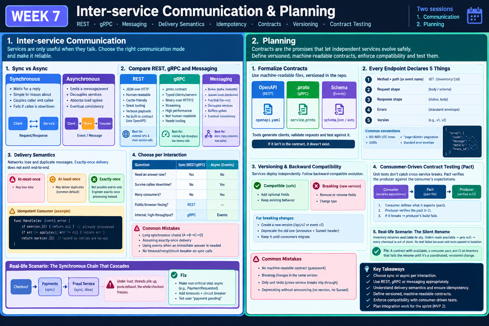

<!-- HU-STATUS TEMPLATE - do NOT remove the <!-- ... --> markers or the table headers.
     Your weekly grade is read AUTOMATICALLY from this file:
       07-week/hu-status/README.md  (inside YOUR fork). English. -->

# Weekly Status - Week 07

<!-- CONFIG-START - must match your profile repo (username/username) CONFIG -->
- FULL_NAME: Daniel Felipe Cerquera Idrobo
- GITHUB_USER: Pipecerquera
- TEAM: Barbersaas
- SPRINT_GOAL: Close the SPEC-002 commit debt in DOCS (get the real microservices catalog and ADR-003 onto `main`), ship SPEC-003's loyalty/notification wiring in both CODE and DOCS, align the API contracts with the real auth model (SPEC-004), and start closing the config-via-env gap flagged in Week 06.
<!-- CONFIG-END -->

## 1. User stories worked this week
| HU ID | Title | Status (todo/doing/done) | Evidence (PR or commit URL) |
|---|---|---|---|
| HU-000-011 | Carried over (Week 05→07) — As a team, we want to ship MVP 1 (promote to `main`, tag `v1.0.0`, verify the DoD checklist with evidence, demo, retrospective) so that we close Corte 1 and move on to Corte 2 | doing (unchanged, 3rd straight week) | `barber-saas` `main` still at [`4e5ab0a`](https://github.com/code-corhuila/barber-saas/commit/4e5ab0a) (2026-09-03); no PR `develop`→`qa`/`main`, no tag — see Blockers |
| HU-000-014 | As a client, I want a loyalty sticker granted automatically when my appointment is completed, and to be notified about loyalty events, so I don't depend on staff remembering to grant it manually | done | CODE [`122b362`](https://github.com/code-corhuila/barber-saas/commit/122b362) (`AppointmentService.complete()` now grants the sticker in-transaction; `LoyaltyService` notifies on grant/redeem); DOCS [`003fb45`](https://github.com/code-corhuila/barber-saas-docs/commit/003fb45) + [`2f5afed`](https://github.com/code-corhuila/barber-saas-docs/commit/2f5afed) (domain-events reconciled to match, 14 stale file references fixed) |
| HU-000-015 | As the team, we want DOCS's microservices governance work (ADR-003, real 11-module service catalog, `notification-service` extraction docs) actually committed and merged to `main`, not just verified in a working tree, so the SPEC-002 gap open since Week 05 finally closes | done | DOCS [`9632692`](https://github.com/code-corhuila/barber-saas-docs/commit/9632692), confirmed present on `origin/main` (`main` HEAD is [`19bd6ce`](https://github.com/code-corhuila/barber-saas-docs/commit/19bd6ce), a descendant) |
| HU-000-016 | As the team, we want DOCS's API contracts to reflect the real auth model (HS512/24h, roles `ADMIN_BARBERSHOP`/`BARBER`/`CLIENT`/`SUPER_ADMIN`) instead of the inherited RS256/1h template, and to drop the fictional `api-gateway.yaml`, so `07-api` stops contradicting the implemented `AuthService` | doing (pushed, not yet merged) | DOCS [`34981fa`](https://github.com/code-corhuila/barber-saas-docs/commit/34981fa) on branch [`docs/004-align-api-contracts`](https://github.com/code-corhuila/barber-saas-docs/tree/docs/004-align-api-contracts), pushed to `origin`; not merged into `main` — see Blockers |
| HU-000-017 | As the team, we want config-via-env genuinely enforced in `docker-compose.yml`/`application.yml` (no hardcoded secrets), closing the gap Week 06 reported | doing, partial | CODE [`72c622f`](https://github.com/code-corhuila/barber-saas/commit/72c622f) (2026-09-17, `fix(config): stop hardcoding mail credentials, source them from env`): `docker-compose.yml`, `application.yml` and a new `.env.example` — mail credentials fixed; `JWT_SECRET`/`POSTGRES_PASSWORD` still hardcoded — see Blockers |
| HU-000-018 | As the team, we want the architecture decision rewritten for the microservices the course requires, so DOCS stops describing a modular monolith (ADR-004 full microservice decomposition, superseding ADR-002/003) | doing | DOCS [`494c563`](https://github.com/code-corhuila/barber-saas-docs/commit/494c563) (2026-09-20) on its branch; PR [#19](https://github.com/code-corhuila/barber-saas-docs/pull/19) closed without merge and replaced by PR #20, merged in Week 09 |

## 2. My individual contribution
- Finished HU-000-014 end to end: implemented the automatic sticker grant + loyalty notifications in `AppointmentService`/`LoyaltyService` (CODE, commit `122b362`, includes a test update), then reconciled DOCS's `domain-events.md` to match (commits `003fb45`, `2f5afed`) — including fixing a filename that 14 other files in DOCS referenced but that didn't actually exist (`Domain_Events_Luxury_Barber_EN.md` vs. the real `domain-events.md`).
- Got explicit authorization from Daniel and finally committed the SPEC-002 work (ADR-003, real service catalog, `notification-service` docs, `api-gateway` deletion) that had been sitting uncommitted in DOCS's working tree since 2026-09-03 — closing a blocker reported in both Week 05 and Week 06.
- Validated DOCS's new branch strategy (child branch → PR → merge to `main`) end to end with a throwaway test file (`7677549` then cleaned up in `33f51ad`) before adopting it, then documented the exception formally in `git-conventions.md` and aligned `CLAUDE.md` to point at that single source of truth (`1cf7851`).
- Executed SPEC-004: audited `07-api/` against the real, implemented `AuthService` and found the inherited template was wrong on every axis that matters (RS256 instead of HS512, 1h instead of 24h expiry, generic roles instead of the real four) — fixed `auth-service.yaml`, added the missing `guidelines.md`/`authentication.md` that `07-api/README.md` already referenced, dropped the fictional `api-gateway.yaml` (same cleanup as SPEC-002), and added a planned `notification-service.yaml` contract consistent with ADR-003. Pushed to `docs/004-align-api-contracts`, not yet merged (see Blockers).
- Started closing the config-via-env gap Week 06 flagged: while touching `application.yml` for the mail settings I found `spring.mail.password` had a real-looking Gmail app password hardcoded as the Spring default fallback value (`${MAIL_PASSWORD:<value>}`), committed to git history, not just a placeholder. Removed the hardcoded fallback, wired `MAIL_USERNAME`/`MAIL_PASSWORD` through `docker-compose.yml` and a new `.env.example` (committed as [`72c622f`](https://github.com/code-corhuila/barber-saas/commit/72c622f)). Did not yet touch `JWT_SECRET`/`POSTGRES_PASSWORD`, which are still hardcoded — flagging as unfinished rather than claiming the HU done.
- Wrote ADR-004 (full microservice decomposition, superseding ADR-002's modular monolith and ADR-003's single extraction) after the course required real microservices: [`494c563`](https://github.com/code-corhuila/barber-saas-docs/commit/494c563), opened as DOCS PR [#19](https://github.com/code-corhuila/barber-saas-docs/pull/19) (closed and replaced by #20, merged in Week 09).

## 3. Blockers and risks
- **Security: a real-looking credential was committed to `barber-saas` git history**, not just present as an insecure default — `application.yml`'s `spring.mail.password` fallback was a real Gmail app-specific password, reachable by anyone who clones the repo history even after today's fix removes the default going forward. This needs the password rotated in the actual Gmail account, not just removed from the file — flagging it here instead of only in the diff so it isn't missed. Not rotating it myself since that's an action outside this repo's scope.
- **Config-via-env is still incomplete**: this week's uncommitted fix only covers `MAIL_USERNAME`/`MAIL_PASSWORD`. `JWT_SECRET` and `POSTGRES_PASSWORD` are still hardcoded literals in `docker-compose.yml`, unchanged since Week 06. The uncommitted diff (`docker-compose.yml`, `application.yml`, new `.env.example`) is sitting in CODE's working tree pending Daniel's explicit go-ahead to commit, per the ecosystem's git-authorization rule.
- **SPEC-004 is pushed but not merged**: DOCS `main` now has CODEOWNERS (added by the instructor, commit `19bd6ce`, 2026-09-14), so merging `docs/004-align-api-contracts` requires a PR and teacher approval — a new step in the flow that didn't exist when SPEC-002 was merged this same week. No PR opened yet.
- **MVP 1 shipping is stalled a 3rd consecutive week**: `barber-saas` `main` is still at `4e5ab0a` (2026-09-03), no tag, no PR to `qa`/`main`. Carried over from Week 05 and Week 06 with no new progress — this is the single largest risk to Corte 1 at this point and needs an owner and a hard date, not another "next week."
- **Team contribution is effectively single-author this week**: every non-instructor commit in both CODE and DOCS this week is mine (`Pipecerquera`); no teammate commits landed in either repo. `JUANDAX233` has contributed to DOCS before (not this week). Worth raising with the team before it becomes a grading risk for the group as a whole.
- **No instructor material for Week 07**: `07-week/01-session/` and `07-week/02-session/` are empty, same gap reported in Week 06. This week's HUs were derived directly from the ecosystem's own SPEC backlog (SPEC-002/003/004) rather than from a session prompt.

## 4. Plan for next week
- Get authorization to commit and push the config-via-env fix in CODE, then finish it properly: move `JWT_SECRET` and `POSTGRES_PASSWORD` out of `docker-compose.yml` into `.env`/`.env.example` too, and confirm the mail password has been rotated outside the repo.
- Open the PR for `docs/004-align-api-contracts` → `main` and get the teacher's CODEOWNERS approval, closing HU-000-016.
- Force a real decision on MVP 1 shipping: pick a date this week to promote `develop` → `qa` → `main`, tag `v1.0.0`, capture `mvn test`/`docker compose up` output as DoD evidence, then do the demo and retro.
- Check in with the rest of the team (Barbersaas / G2) about the single-author pattern this week before the next delivery.

## 5. Compliance self-check
- [x] Conventional Commits - `type(scope): summary` — all commits this week in CODE and DOCS follow `type(scope): summary`, most with a `Spec: SPEC-NNN` trailer (`122b362`, `003fb45`, `2f5afed`, `9632692`, `34981fa`).
- [ ] Per-environment HU branch + PR to that environment (hu-xxx-dev -> develop, ...) — not used; CODE work landed directly on `develop` (documented exception, no new branches per Daniel's decision) and DOCS work used `docs/NNN-slug` branches, not the `hu-xxx-*` convention this checklist describes.
- [x] Testable acceptance criteria — SPEC-002/003/004 each have a checkable diff (real catalog present, sticker auto-granted in the transaction, `auth-service.yaml` matching the real HS512/24h/roles) rather than a vague claim.
- [x] Tests added/updated (unit / integration) — `AppointmentServiceTest.java` updated in `122b362` to cover the automatic sticker grant.
- [x] DDD / hexagonal boundaries respected (domain has no I/O) — `LoyaltyService`'s new notification calls go through the existing `NotificationService`, not directly from `domain/`; no I/O added to `domain/entity`.
- [ ] No secrets; config via environment variables — **not met, real gap** (see Blockers): a real credential was found hardcoded in git history and only partially remediated this week; `JWT_SECRET`/`POSTGRES_PASSWORD` are still hardcoded in `docker-compose.yml`.

## 6. Evidence links
- Repo: https://github.com/Pipecerquera/sistemas-distribuidos-2026-b-g2-daniel-cerquera.git
- This week's infographic: `07-week/hu-status/Week-07.png` (in this same folder)
- CODE (`barber-saas`), loyalty/notification wiring: https://github.com/code-corhuila/barber-saas/commit/122b362
- CODE, MVP 1 still stalled: `main` at https://github.com/code-corhuila/barber-saas/commit/4e5ab0a (2026-09-03, unchanged since Week 05)
- CODE, config-via-env fix in progress (uncommitted working-tree diff, verified via `git status`/`git diff` today): `barbersaas-backend/barbersaas-backend/docker-compose.yml`, `.../application.yml`, new `.../.env.example`
- DOCS (`barber-saas-docs`), SPEC-002 finally merged to `main`: https://github.com/code-corhuila/barber-saas-docs/commit/9632692 (present on `main` at https://github.com/code-corhuila/barber-saas-docs/commit/19bd6ce)
- DOCS, domain-events reconciliation: https://github.com/code-corhuila/barber-saas-docs/commit/003fb45 , https://github.com/code-corhuila/barber-saas-docs/commit/2f5afed
- DOCS, branch-strategy exception documented: https://github.com/code-corhuila/barber-saas-docs/commit/1cf7851
- DOCS, SPEC-004 (pushed, pending PR/merge): https://github.com/code-corhuila/barber-saas-docs/commit/34981fa on branch https://github.com/code-corhuila/barber-saas-docs/tree/docs/004-align-api-contracts
- DOCS, instructor's new CODEOWNERS gate on `main`: https://github.com/code-corhuila/barber-saas-docs/commit/19bd6ce
- Pending items honestly tracked in "Blockers and risks" above
- **Complete record of my individual work this week** (every pull request, commit, issue, comment, tag and release of mine; generated from git and GitHub):
  - Pull requests: **1** (0 merged, 1 closed without merge).
  - `barber-saas-docs` (1):
    - [#19](https://github.com/code-corhuila/barber-saas-docs/pull/19) docs(architecture): ADR-004 supersedes ADR-002/003 — full microservice decomposition — closed without merge 2026-09-21
  - Commits: **9** changes authored by me, each listed once (the copies a rebase merge or a `cherry-pick -x` promotion to `qa`, `release.2.0.0` and `main` makes keep the same author date and message, so they are not repeated; the promotion pull requests above carry their trail).
    - `sistemas-distribuidos-2026-b-g2-daniel-cerquera` (2):
      - [`ab11102`](https://github.com/Pipecerquera/sistemas-distribuidos-2026-b-g2-daniel-cerquera/commit/ab1110254d6ea23762bf78ff86b7fb5a205473c7) docs(hu-status): complete week 07 delivery — 2026-09-17
      - [`99d6078`](https://github.com/Pipecerquera/sistemas-distribuidos-2026-b-g2-daniel-cerquera/commit/99d60788b179ac001c54a1bf2a3880b05004bbc9) docs(week-07): add evidence photo to hu-status delivery — 2026-09-20
    - `barber-saas` (1):
      - [`72c622f`](https://github.com/code-corhuila/barber-saas/commit/72c622fc88d8c4a3eeed310b8f002438be6681ab) fix(config): stop hardcoding mail credentials, source them from env — 2026-09-17
    - `barber-saas-docs` (6):
      - [`1cf7851`](https://github.com/code-corhuila/barber-saas-docs/commit/1cf7851cdaf9da142acb1f9fdba3ce8419aff7bd) docs(governance): document DOCS branch-strategy exception and align CLAUDE.md — 2026-09-14
      - [`9632692`](https://github.com/code-corhuila/barber-saas-docs/commit/963269222310bd8d32ddce53819fa6b8af1d1cb7) docs(microservices): apply SPEC-002 — real service catalog, ADR-003, drop fictional api-gateway — 2026-09-14
      - [`33f51ad`](https://github.com/code-corhuila/barber-saas-docs/commit/33f51ad3c0f9c7b0d0b40d2466ea4aa44593edcd) chore: remove test-branch workflow demo file — 2026-09-14
      - [`7677549`](https://github.com/code-corhuila/barber-saas-docs/commit/7677549302fb65c8cdbf37c4069687e652591f1d) chore: add test file to validate test-branch -> main workflow — 2026-09-14
      - [`34981fa`](https://github.com/code-corhuila/barber-saas-docs/commit/34981fa73f9eb2a6a1aba48446e53b66e9cfa842) docs(api): apply SPEC-004 — align API contracts with real auth (HS512/24h) and roles — 2026-09-17
      - [`494c563`](https://github.com/code-corhuila/barber-saas-docs/commit/494c563da0188441e16fc63154d920d24a000725) docs(architecture): supersede ADR-002/003 with ADR-004 full microservice decomposition — 2026-09-20
  - Issues opened: **0**.
  - Comments on pull requests and issues: **0**.
  - Tags and releases: **0**.
- *End of the complete record.*

