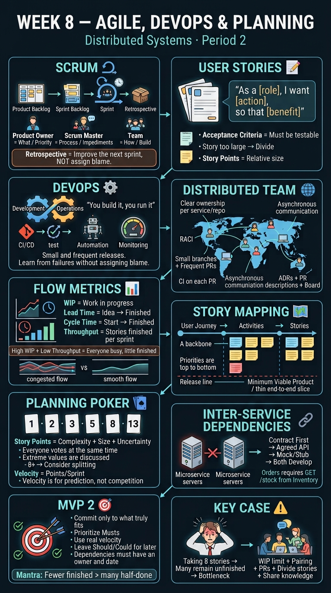

<!-- HU-STATUS TEMPLATE - do NOT remove the <!-- ... --> markers or the table headers.
     Your weekly grade is read AUTOMATICALLY from this file:
       08-week/hu-status/README.md  (inside YOUR fork). English. -->

# Weekly Status - Week 08

<!-- CONFIG-START - must match your profile repo (username/username) CONFIG -->
- FULL_NAME: Daniel Felipe Cerquera Idrobo
- GITHUB_USER: Pipecerquera
- TEAM: Barbersaas
- SPRINT_GOAL: Break the 4-week MVP1 shipping stall and start unblocking the DOCS PR backlog (5 open, 0 merged), while turning the epic-level product backlog into real, testable Sprint 2 stories with a WIP limit and daily sync — the prerequisite Session 08 needs before MVP2's story map and planning-poker estimates can be real instead of invented.
<!-- CONFIG-END -->

## 1. User stories worked this week
| HU ID | Title | Status (todo/doing/done) | Evidence (PR or commit URL) |
|---|---|---|---|
| HU-000-011 | Carried over (Week 05→08) — As a team, we want to ship MVP 1 (promote to `main`, tag `v1.0.0`, verify the DoD checklist with evidence, demo, retrospective) so that we close Corte 1 and move on to Corte 2 | doing (unchanged, 4th straight week) | `barber-saas` `main` still at [`4e5ab0a`](https://github.com/code-corhuila/barber-saas/commit/4e5ab0a) (2026-09-03); no PR `develop`→`qa`/`main`, no tag — see Blockers |
| HU-000-016 | Carried over — As the team, we want DOCS's API contracts to reflect the real auth model (HS512/24h, real roles), so `07-api` stops contradicting `AuthService` | **done — merged to `main`** | DOCS [PR #16](https://github.com/code-corhuila/barber-saas-docs/pull/16) (SPEC-004+SPEC-008), squash-merged as [`fead52a`](https://github.com/code-corhuila/barber-saas-docs/commit/fead52a6a31673e6014705e78953892647780435) (2026-09-24). Went through 5 rounds of the automated review, each answered in writing (applied or reasoned-declined): `07-api/open-questions.md` added ([`47bbe9b`](https://github.com/code-corhuila/barber-saas-docs/commit/47bbe9b)); a real bug in `notification-service.yaml`'s planned server URLs fixed ([`9baf72c`](https://github.com/code-corhuila/barber-saas-docs/commit/9baf72c)); `auth-service.yaml` translated to English for consistency and a pedagogical citation trimmed from `open-questions.md` ([`eceee3f`](https://github.com/code-corhuila/barber-saas-docs/commit/eceee3f)) — full trail in the [PR comment thread](https://github.com/code-corhuila/barber-saas-docs/pull/16) |
| HU-000-017 | Carried over — As the team, we want config-via-env genuinely enforced (no hardcoded secrets) in CODE | doing, partial (progressed) | CODE [`72c622f`](https://github.com/code-corhuila/barber-saas/commit/72c622f) (2026-09-17): mail credentials now sourced from `MAIL_USERNAME`/`MAIL_PASSWORD` env vars, `.env.example` added; `JWT_SECRET`/`POSTGRES_PASSWORD` still hardcoded in `docker-compose.yml` — see Blockers |
| HU-000-018 | As the team, we want the "full microservices" decision (superseding the modular-monolith ADR-002/003) formally recorded as ADR-004 and opened for review, so the 29-repo polyrepo has documented rationale instead of being an unreviewed working-tree file | doing (PR open, not merged) | DOCS [`494c563`](https://github.com/code-corhuila/barber-saas-docs/commit/494c563) (2026-09-20), [PR #20](https://github.com/code-corhuila/barber-saas-docs/pull/20) — earlier duplicate [PR #19](https://github.com/code-corhuila/barber-saas-docs/pull/19) closed after a branch-name fix |
| HU-000-019 | Session 08-1 — As the team, we want a prioritized Sprint 2 backlog of testable stories, a WIP limit, a PR for every change, a daily sync, and tracked throughput, so the sprint runs like a real one instead of ad hoc work | **not started** | `03-product/product-backlog.md` is still epic-level only (last touched 2026-08-31) and says explicitly it deliberately excludes story points, acceptance criteria, and sprint assignment because that planning "hasn't actually happened" yet; no WIP limit in practice either — DOCS has 5 PRs open and 0 merged this week (`gh pr list --repo code-corhuila/barber-saas-docs --state open`) |
| HU-000-020 | Session 08-2 (planning) — As the team, we want a story map of the product, planning-poker estimates for the MVP 2 backlog, sequenced cross-service dependencies (contract-first + mocks), and a realistic MVP 2 scope committed to our velocity | **not started, blocked by HU-000-019** | Session 2 explicitly refines and estimates the Session 1 backlog; with no refined backlog yet, there is nothing real to estimate or map — no story-map or planning-poker artifact exists in DOCS or WEEKLY |

## 2. My individual contribution
- Landed the mail-credential half of the config-via-env fix in CODE (`72c622f`, 2026-09-17): removed the real Gmail app password that was hardcoded as a Spring default fallback in `application.yml`, wired `MAIL_USERNAME`/`MAIL_PASSWORD` through `docker-compose.yml`, and added `.env.example`. Left `JWT_SECRET`/`POSTGRES_PASSWORD` explicitly flagged as still hardcoded in the commit message rather than silently dropping them from the gap Week 06 opened.
- With Daniel's explicit authorization, committed ADR-004 in DOCS (`494c563`) — the ADR that formally supersedes ADR-002/ADR-003 with the full-microservice-decomposition decision the course now requires — and opened it as PR #20 (after PR #19, opened from a since-renamed branch, had to be closed).
- Checked this week's two session activities (sprint discipline, MVP2 story map/planning poker) against the actual repo state instead of writing them up as completed: `product-backlog.md`'s own header says story points and sprint assignment don't exist yet, and the DOCS PR queue (5 open, 0 merged) shows no WIP limit is actually being enforced. Reported both as **not started**, per HU-000-019/020 above, instead of inventing estimates or a story map that don't exist.
- Completed the mandatory individual Session 08-2 activity ("madurar el contrato de API" — study the course's reference `api-contract.md` in `sistemas-distribuidos-2026-b-g2/08-week/02-session/spec/`, then contribute a real, closeable gap to your team's own `07-api/`): instead of duplicating the already-drafted `guidelines.md`/`authentication.md` from PR #16, added `07-api/open-questions.md` declaring 3 real gaps already evidenced elsewhere in the repo but never surfaced at the contract layer — missing rate-limit contract on `/api/auth/**` (`AT-002`), the known non-idempotent `POST /api/admin/loyalty/grant` (documented in `02-domain/domain-events.md`), and `notification-service.yaml`'s undated/unnamed extraction per ADR-003 — each with an owner and a closing criterion, following the reference document's own pattern of declaring pending gaps instead of leaving them implicit.
- Then closed the loop on `ariel5253`'s standing SPEC-004 review of PR #16: applied the traceability-anchor recommendation (`guidelines.md` now cites SPEC-002 for why `api-gateway.yaml` was dropped), and wrote reasoned decisions *not* to apply the other two (splitting the PR, and naming `notification-service.yaml`'s future component) instead of silently ignoring them — both documented in the PR #16 comment thread for the eventual sustentación.
- The follow-up automated review on that commit caught a real bug instead of a style nitpick: `notification-service.yaml`'s planned dev/prod server URLs (`.../v1/notification`) contradicted `guidelines.md`'s own versioning rule and `auth-service.yaml`'s established `/api/v1/<service>` pattern in the same PR. Fixed it (`9baf72c`) instead of arguing it was intentional, and retitled the PR to name both SPECs it now carries.
- A third review round found `auth-service.yaml` still in Spanish while every new document in the PR was English, plus a pedagogical citation that didn't belong in a permanent source-of-truth file. Applied both (`eceee3f`) — translated the full file (leaving `$ref`s, enums and example data untouched) and trimmed the citation. Declined two more (splitting the PR a 4th time; adding `notification-service.yaml` to the README's file index) after checking the second claim was a false positive — the README never indexes individual `.yaml` files by name, not even `auth-service.yaml`.
- After a 5th review round approved the PR with 4 more findings, recognized the review loop wasn't converging to "zero recommendations" by design (the bot re-reviews every push and always finds something) and, with Daniel, made the call to close it: responded to all 4 in writing (2 real-but-deferrable, 2 already covered by earlier commits) without opening a 6th round, then merged PR #16 to `main` (`fead52a`, squash, with Daniel's explicit authorization) — closing this HU instead of chasing an automated approval that was never the actual grading criterion.

## 3. Blockers and risks
- **MVP 1 shipping is stalled a 4th consecutive week**: `barber-saas` `main` is still at `4e5ab0a` (2026-09-03), no tag, no PR to `qa`/`main`. This is the largest open risk to Corte 1 and now also collides with ADR-004's open question of what happens to the `barber-saas` monolith at all.
- **Exposed Gmail credential still not confirmed rotated**: `72c622f` removed the hardcoded default, but the password is still present in `barber-saas` git history from before this fix. Rotating it is outside this repo's scope and hasn't been confirmed done.
- **Config-via-env still incomplete**: `JWT_SECRET` and `POSTGRES_PASSWORD` remain hardcoded literals in `docker-compose.yml`, unchanged since Week 06.
- **No real Sprint 2 backlog exists yet**: `product-backlog.md` is epic-level only, with no story points, no testable acceptance criteria, and no sprint assignment — this directly blocks both Session 08 activities (HU-000-019, HU-000-020), not just one.
- **DOCS PR backlog: 1 of 5 unblocked this week.** PR #16 merged (`fead52a`) after 5 review rounds; `#15`, `#17`, `#18`, `#20` are still open, 0 merged among those, each still needing CODEOWNERS/teacher (`ariel5253`) approval.
- **`08-week/01-session` and `02-session` are still empty** (`.gitkeep` only), same gap reported in Weeks 06–07 — this week's HUs were derived from the session prompt Daniel provided directly plus the ecosystem's own backlog, not from instructor material in-repo.

## 4. Plan for next week
- Confirm the exposed mail credential has been rotated outside the repo, then move `JWT_SECRET`/`POSTGRES_PASSWORD` into env vars to actually close the config-via-env gap (HU-000-017).
- Push the remaining open DOCS PRs through teacher review to keep unblocking the queue, starting with PR #20 (ADR-004) — PR #16 is done, merged this week.
- Turn `product-backlog.md`'s epic list into real HU-level stories with testable acceptance criteria (per `00-governance/definition-of-ready.md`) and set an actual WIP limit — the prerequisite Session 08-1 asked for and that's still missing.
- Once that backlog exists, run planning poker on the MVP 2 stories and produce the story map + cross-service dependency sequencing Session 08-2 calls for, instead of inventing numbers.
- Get an explicit decision from Daniel on MVP 1's fate: ship it this week or formally deprioritize it now that ADR-004 shifts the real deliverable to the polyrepo (open question already logged in ADR-004 itself).

## 5. Compliance self-check
- [x] Conventional Commits - `type(scope): summary` — all commits this week (`72c622f`, `494c563`, `47bbe9b`, `3034740`, `9baf72c`, `eceee3f`) follow `type(scope): summary`, and every DOCS commit carries `Spec: SPEC-004`/`SPEC-008`.
- [ ] Per-environment HU branch + PR to that environment (hu-xxx-dev -> develop, ...) — not used; CODE work landed directly on `develop` (documented exception, no new branches per Daniel's decision), DOCS work used `docs/NNN-slug` branches with PRs, not the `hu-xxx-*` naming this checklist describes.
- [ ] Testable acceptance criteria — not met for this week's two new HUs (HU-000-019, HU-000-020): that gap is exactly what's reported above, not glossed over.
- [ ] Tests added/updated (unit / integration) — none this week; both changes were config-only (`72c622f`) or documentation-only (`494c563`), no test surface touched.
- [x] DDD / hexagonal boundaries respected (domain has no I/O) — the config change only touches `docker-compose.yml`/`application.yml`, no `domain/` code touched.
- [ ] No secrets; config via environment variables — **not met, real gap** (see Blockers): `JWT_SECRET`/`POSTGRES_PASSWORD` still hardcoded, and the previously-exposed mail password's rotation outside the repo isn't confirmed.

## 6. Evidence links
- Repo: https://github.com/Pipecerquera/sistemas-distribuidos-2026-b-g2-daniel-cerquera.git
- This week's infographic: `08-week/hu-status/week-08.jpg` (in this same folder)
- CODE (`barber-saas`), mail-credential fix: https://github.com/code-corhuila/barber-saas/commit/72c622f
- CODE, MVP 1 still stalled: `main` at https://github.com/code-corhuila/barber-saas/commit/4e5ab0a (2026-09-03, unchanged since Week 05)
- DOCS (`barber-saas-docs`), ADR-004 commit: https://github.com/code-corhuila/barber-saas-docs/commit/494c563
- DOCS, ADR-004 PR (open): https://github.com/code-corhuila/barber-saas-docs/pull/20
- DOCS, SPEC-004+SPEC-008 API contracts PR (open since Week 07, **merged this week**): https://github.com/code-corhuila/barber-saas-docs/pull/16
- DOCS, merge commit to `main`: https://github.com/code-corhuila/barber-saas-docs/commit/fead52a6a31673e6014705e78953892647780435
- DOCS, SPEC-008 individual contribution (`open-questions.md`): https://github.com/code-corhuila/barber-saas-docs/commit/47bbe9b
- DOCS, PR #16 review-recommendation responses (round 1): https://github.com/code-corhuila/barber-saas-docs/commit/3034740 and https://github.com/code-corhuila/barber-saas-docs/pull/16#issuecomment-5814896761
- DOCS, round 2 (bug fix) + responses: https://github.com/code-corhuila/barber-saas-docs/commit/9baf72c and https://github.com/code-corhuila/barber-saas-docs/pull/16#issuecomment-5815005803
- DOCS, round 3 (translation + cleanup) + responses: https://github.com/code-corhuila/barber-saas-docs/commit/eceee3f and https://github.com/code-corhuila/barber-saas-docs/pull/16#issuecomment-5815345937
- DOCS, round 4 (final, closing) responses before merge: https://github.com/code-corhuila/barber-saas-docs/pull/16#issuecomment-5816054888
- DOCS, teammate PRs open this week (evidence the team isn't single-author anymore): [`#15`](https://github.com/code-corhuila/barber-saas-docs/pull/15) (carloslealm), [`#17`](https://github.com/code-corhuila/barber-saas-docs/pull/17) (JUANDAX233), [`#18`](https://github.com/code-corhuila/barber-saas-docs/pull/18) (Carolay Arraut Heredia)
- DOCS, product backlog gap (evidence Session 08 stories don't exist yet): `03-product/product-backlog.md`
- Pending items honestly tracked in "Blockers and risks" above

