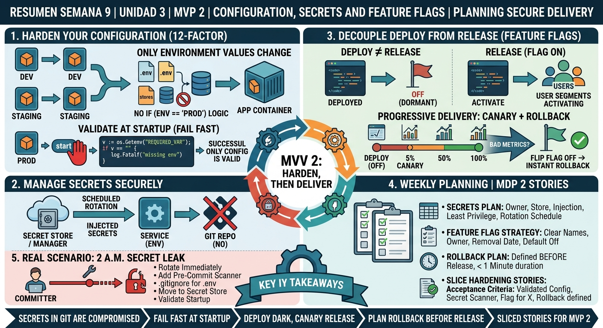

<!-- HU-STATUS TEMPLATE - do NOT remove the <!-- ... --> markers or the table headers.
     Your weekly grade is read AUTOMATICALLY from this file:
       09-week/hu-status/README.md  (inside YOUR fork). English. -->

# Weekly Status - Week 09

<!-- CONFIG-START - must match your profile repo (username/username) CONFIG -->
- FULL_NAME: Daniel Felipe Cerquera Idrobo
- GITHUB_USER: Pipecerquera
- TEAM: Barbersaas
- SPRINT_GOAL: Close the teacher's DOCS consistency tracker (07↔06↔05) so the documentation describes the ADR-004 polyrepo instead of the old monolith, then harden configuration for MVP 2 — `.env.example` + fail-fast validation of required vars, secrets injected (never in git), a pre-commit secret scan and at least one feature flag — and turn that into a secrets plan, a feature-flag policy and a canary + rollback plan with testable hardening stories.
<!-- CONFIG-END -->

## 1. User stories worked this week
| HU ID | Title | Status (todo/doing/done) | Evidence (PR or commit URL) |
|---|---|---|---|
| HU-000-018 | Carried over — As the team, we want the "full microservices" decision recorded as ADR-004 and reviewed, so the 29-repo polyrepo has documented rationale | **done — merged to `main`** | DOCS [PR #20](https://github.com/code-corhuila/barber-saas-docs/pull/20), squash-merged as [`8c1d057`](https://github.com/code-corhuila/barber-saas-docs/commit/8c1d057) (2026-09-28) |
| HU-000-021 | As the team, we want DOCS governance aligned with the course's Norm 2026-B (git conventions, governance rules, the ADRs the norm requires), so the repo is graded against the rules it actually follows | **done — merged to `main`** | DOCS [PR #28](https://github.com/code-corhuila/barber-saas-docs/pull/28) ([`16152b3`](https://github.com/code-corhuila/barber-saas-docs/commit/16152b3)), [PR #30](https://github.com/code-corhuila/barber-saas-docs/pull/30) ([`d6db217`](https://github.com/code-corhuila/barber-saas-docs/commit/d6db217)), [PR #32](https://github.com/code-corhuila/barber-saas-docs/pull/32) ([`5e2d807`](https://github.com/code-corhuila/barber-saas-docs/commit/5e2d807), ADR-005…009) — 2026-09-28. ADR-008 and ADR-009 stay *Proposed* until the teacher answers the questions left in PR #32 |
| HU-000-022 | As the team, we want to close the teacher's DOCS tracker (78%, consistency 07↔06↔05 in red), so architecture, data model and API contracts describe the same ADR-004 topology | **done — 7 PRs merged to `main`** | DOCS 2026-09-29: overview [#36](https://github.com/code-corhuila/barber-saas-docs/pull/36) ([`ee2c8d9`](https://github.com/code-corhuila/barber-saas-docs/commit/ee2c8d9)), deployment view [#37](https://github.com/code-corhuila/barber-saas-docs/pull/37) ([`8fc0eb5`](https://github.com/code-corhuila/barber-saas-docs/commit/8fc0eb5)), one DB per domain with UUID ids + cents [#38](https://github.com/code-corhuila/barber-saas-docs/pull/38) ([`f6321e2`](https://github.com/code-corhuila/barber-saas-docs/commit/f6321e2)), API contracts RS256 + gateway paths [#39](https://github.com/code-corhuila/barber-saas-docs/pull/39) ([`acf749d`](https://github.com/code-corhuila/barber-saas-docs/commit/acf749d)), DoR + context/product/domain [#40](https://github.com/code-corhuila/barber-saas-docs/pull/40) ([`f5251c2`](https://github.com/code-corhuila/barber-saas-docs/commit/f5251c2)), hexagonal as the rule [#41](https://github.com/code-corhuila/barber-saas-docs/pull/41) ([`74ff15b`](https://github.com/code-corhuila/barber-saas-docs/commit/74ff15b)), remaining docs to English [#42](https://github.com/code-corhuila/barber-saas-docs/pull/42) ([`e333bee`](https://github.com/code-corhuila/barber-saas-docs/commit/e333bee)). Package E (wireframes) still pending — needs the team's mockups |
| HU-000-024 | As the team, we want DOCS section 08 renamed from `08-uml` to `08-diagrams` (the teacher's correction) and filled with C4, UML and ER diagrams derived from 05/06/07, so the design is visible and consistent with ADR-004 | **done — 5 PRs approved by the teacher and merged to `main`** | DOCS issue [#43](https://github.com/code-corhuila/barber-saas-docs/issues/43) (2026-09-30): squash-merged 2026-09-30: rename + README [#44](https://github.com/code-corhuila/barber-saas-docs/pull/44) ([`20c3f58`](https://github.com/code-corhuila/barber-saas-docs/commit/20c3f58)), index [#45](https://github.com/code-corhuila/barber-saas-docs/pull/45) ([`0906748`](https://github.com/code-corhuila/barber-saas-docs/commit/0906748)), C4 L1–L3 [#46](https://github.com/code-corhuila/barber-saas-docs/pull/46) ([`e2f5106`](https://github.com/code-corhuila/barber-saas-docs/commit/e2f5106)), sequences + state machines [#47](https://github.com/code-corhuila/barber-saas-docs/pull/47) ([`3d440c5`](https://github.com/code-corhuila/barber-saas-docs/commit/3d440c5)), one ER per domain database [#48](https://github.com/code-corhuila/barber-saas-docs/pull/48) ([`1481114`](https://github.com/code-corhuila/barber-saas-docs/commit/1481114)) |
| HU-000-017 | Carried over, now Session 09-1 — As the team, we want hardened config: `.env.example` + fail-fast startup validation of required vars, secrets injected from a store (never in git), a pre-commit secret scan, and at least one feature flag guarding a new capability | **todo** (partial from Week 08) | Only the mail credentials are env-sourced so far (CODE [`72c622f`](https://github.com/code-corhuila/barber-saas/commit/72c622f), 2026-09-17). Still open on `develop`: `JWT_SECRET` and `POSTGRES_PASSWORD` hardcoded in `docker-compose.yml`, `JWT_SECRET` with a silent default in `application.yml` (no fail-fast), no pre-commit scanner, no feature flag. The 29 polyrepo repos have no `.env.example` yet |
| HU-000-023 | Session 09-2 (planning) — As the team, we want a secrets plan (owner, store, injection, least privilege, rotation), a feature-flag policy (naming, owner, removal date, default off) and a canary + rollback plan for one MVP 2 feature, with the hardening stories sliced into testable acceptance criteria | **todo** | Base already in DOCS to build on: `00-governance/security-policy.md`, `00-governance/security-rules.md`, `10-devops/environments.md`, `13-operations/incident-management.md` — none of them defines rotation owners, a flag policy or a canary plan yet |
| HU-000-011 | Carried over (Week 05→09) — As a team, we want to ship MVP 1 (promote to `main`, tag `v1.0.0`) so that Corte 1 is closed | doing (unchanged, 5th week) | `barber-saas` `main` still at [`4e5ab0a`](https://github.com/code-corhuila/barber-saas/commit/4e5ab0a); no commits on `develop` since `72c622f` (2026-09-17) — see Blockers |

## 2. My individual contribution
- Merged ADR-004 (PR #20) after the teacher's approval, so the polyrepo decision is now on `main` and supersedes ADR-002/003.
- Aligned DOCS governance with the course's Norm 2026-B: git conventions matched to the branching policy (PR #28), the rest of `00-governance` aligned with the norm and the framework pillars (PR #30), and the ADRs the norm requires recorded as ADR-005…009 (PR #32), leaving ADR-008/009 as *Proposed* with written questions to the teacher instead of guessing.
- Turned the teacher's DOCS tracker (78%, 07↔06↔05 in red) into one PR per package and merged all seven (#36–#42): the architecture overview and a new deployment view for the ADR-004 topology, ADR-010 plus a per-domain data model (UUID ids, money in cents, walk-in clients, idempotency/outbox) with its SQL checked in PGlite, the API contracts moved to RS256 + JWKS behind the gateway on `:8000` (Redocly lint with 0 errors), the Definition of Ready and the context/product/domain docs aligned with ADR-004, hexagonal architecture as the rule for every service, and the remaining Spanish documents translated to English.
- When PR #39 lost its approval after a later push (the ruleset dismisses stale reviews), I asked for the review again and did not push anything else to the branch. #39 and #42 were merged only once both were approved and clean (2026-09-29).
- Renamed DOCS section `08-uml` to `08-diagrams` after the teacher's correction and drew its content from the documents already on `main`: C4 context, containers and appointment-api components; sequences for login, booking without double-booking, completion through the outbox and the owner onboarding saga; appointment and barbershop state machines; one ER diagram per domain database (issue #43). Every Mermaid block was parsed with Mermaid 11.17 (0 errors). I split the work into five PRs (#44–#48) so each stays under 400 changed lines (norm 9.2), with disjoint files so they merge in any order.
- While drawing, recorded four doc-to-doc divergences in `08-diagrams/diagram-index.md` instead of fixing them on the side — e.g. the owner onboarding saga in OQ-12 creates the user first, which `chk_app_user_tenant` in `06-data` does not allow.
- Checked the Session 09 hardening items against the real repos and reported them as **todo** above instead of marking them done.

## 3. Blockers and risks
- **Secrets are still in git (Session 09-1 core item)**: `barber-saas` `develop` hardcodes `POSTGRES_PASSWORD: root` and a literal `JWT_SECRET` in `docker-compose.yml`, and `application.yml` falls back to a default `JWT_SECRET` instead of failing at startup. The Gmail password removed in `72c622f` is still in the git history, and its rotation hasn't been confirmed.
- **No pre-commit secret scan and no feature flag exist in any repo yet**, so there is nothing to base the Session 09-2 flag policy and canary plan on until at least one is built.
- **Where the hardening goes is undecided**: ADR-004 moves the real deliverable to the 29-repo polyrepo, but those repos only contain README + CODEOWNERS (seeded 2026-09-14). Hardening `barber-saas` vs. starting in the polyrepo (e.g. `identity-auth-api`) is still an open decision.
- **MVP 1 still not shipped** (5th week): `main` at `4e5ab0a`, no tag.
- **Doc-to-doc divergences found in 08 (D-1…D-4)**: OQ-12's step order vs. `chk_app_user_tenant`, no schedule port in appointment-api's hexagonal layout, `domain-events.md` still describing the prototype, and the undecided event transport (AT-004).
- **DOCS open items waiting on the teacher**: ADR-008 (framework, `-app` mobile) and ADR-009 (saga state) stay *Proposed* until the questions in PR #32 are answered. Tracker package E (wireframes) needs mockups from the team.

## 4. Plan for next week
- Finish Session 09-1 in code: move `JWT_SECRET`/`POSTGRES_PASSWORD` to env vars, make the service fail fast when a required var is missing, add a pre-commit secret scanner, and put one new capability behind a default-off feature flag.
- Write the Session 09-2 plans in DOCS: secrets plan (owners + rotation), feature-flag policy (naming, owner, removal date) and a canary + rollback plan for one MVP 2 feature, and slice the hardening stories with testable acceptance criteria.
- Resolve divergences D-1…D-4 of `08-diagrams/diagram-index.md` in their own documents (starting with OQ-12's step order).
- Confirm the exposed mail credential was rotated outside the repo.
- Session 10: persistence, then the MVP 2 release.

## 5. Compliance self-check
- [x] Conventional Commits - `type(scope): summary` — every DOCS merge this week (`8c1d057`, `16152b3`, `d6db217`, `5e2d807`, `ee2c8d9`, `8fc0eb5`, `f6321e2`, `acf749d`, `f5251c2`, `74ff15b`, `e333bee`) follows `type(scope): summary`, and so do the five `docs(diagrams): …` merges of PRs #44–#48 (`20c3f58`, `0906748`, `e2f5106`, `3d440c5`, `1481114`).
- [ ] Per-environment HU branch + PR to that environment (hu-xxx-dev -> develop, ...) — DOCS used `docs/NNN-slug` branches with one PR each to `main`, approved by the teacher's review; the `hu-xxx-*` naming is not used. No CODE work yet this week.
- [ ] Testable acceptance criteria — not yet for the hardening stories; slicing them with testable criteria is exactly HU-000-023.
- [ ] Tests added/updated (unit / integration) — none; this week's work so far is documentation only.
- [x] DDD / hexagonal boundaries respected (domain has no I/O) — PR #41 makes the hexagonal layout the documented rule for every service; no domain code touched.
- [ ] No secrets; config via environment variables — **not met, real gap**: see Blockers (`POSTGRES_PASSWORD`, `JWT_SECRET` in `docker-compose.yml`, default secret in `application.yml`).

## 6. Evidence links
- Repo: https://github.com/Pipecerquera/sistemas-distribuidos-2026-b-g2-daniel-cerquera.git
- This week's infographic: `09-week/hu-status/Week-09.jpg` (in this same folder)
- DOCS, ADR-004 merged: https://github.com/code-corhuila/barber-saas-docs/pull/20
- DOCS, Norm 2026-B alignment: https://github.com/code-corhuila/barber-saas-docs/pull/28, https://github.com/code-corhuila/barber-saas-docs/pull/30, https://github.com/code-corhuila/barber-saas-docs/pull/32
- DOCS, teacher tracker packages A–D: https://github.com/code-corhuila/barber-saas-docs/pull/36 … https://github.com/code-corhuila/barber-saas-docs/pull/42
- DOCS, section `08-diagrams` (approved and merged): https://github.com/code-corhuila/barber-saas-docs/issues/43 · https://github.com/code-corhuila/barber-saas-docs/pull/44 … https://github.com/code-corhuila/barber-saas-docs/pull/48
- DOCS, teammates' merged PRs this week: [#33](https://github.com/code-corhuila/barber-saas-docs/pull/33) and [#34](https://github.com/code-corhuila/barber-saas-docs/pull/34) (carlosleal16, shared API contract), [#35](https://github.com/code-corhuila/barber-saas-docs/pull/35) (JUANDAX233, five domain OpenAPI contracts)
- CODE, hardcoded secrets still on `develop`: `barbersaas-backend/barbersaas-backend/docker-compose.yml` (lines 8 and 45) at https://github.com/code-corhuila/barber-saas/tree/develop
- CODE, last config fix (mail credentials): https://github.com/code-corhuila/barber-saas/commit/72c622f

