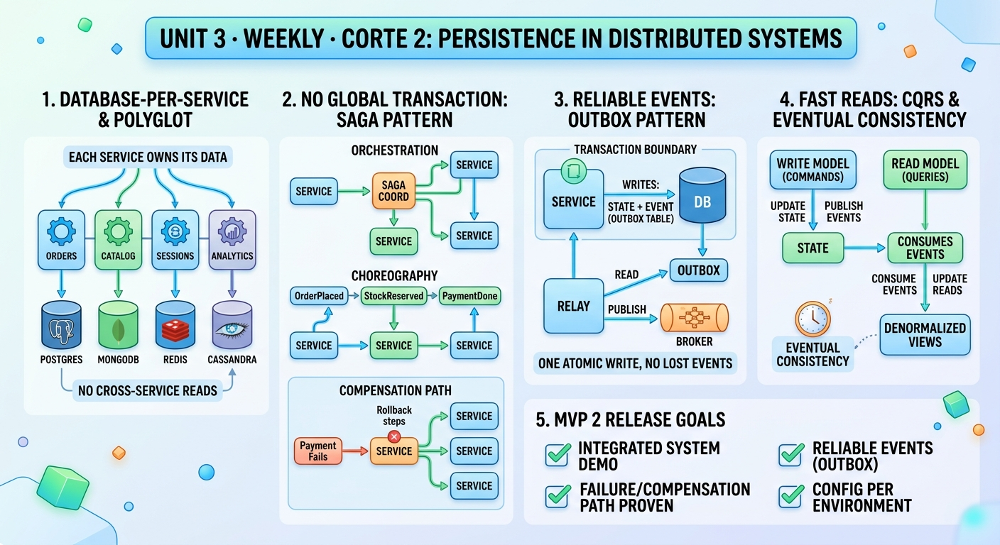

<!-- HU-STATUS TEMPLATE - do NOT remove the <!-- ... --> markers or the table headers.
     Your weekly grade is read AUTOMATICALLY from this file:
       10-week/hu-status/README.md  (inside YOUR fork). English. -->

# Weekly Status - Week 10

<!-- CONFIG-START - must match your profile repo (username/username) CONFIG -->
- FULL_NAME: Daniel Felipe Cerquera Idrobo
- GITHUB_USER: Pipecerquera
- TEAM: Barbersaas
- SPRINT_GOAL: Persistence in distributed systems, applied to BarberSaaS: close phase 1 of the migration as a working Android app, then build my part of phase 2 — events through the outbox pattern without a broker (ADR-016 and the `worker`), the platform administration domain (plans, barbershops, trial expiration), the owner-onboarding saga with a new compensated step, the single MongoDB instance, and the shell loading the Angular domain apps — each specified in DOCS first, built in small pull requests, and tested end to end on the running platform.
<!-- CONFIG-END -->

## 1. User stories worked this week
| HU ID | Title | Status (todo/doing/done) | Evidence (PR or commit URL) |
|---|---|---|---|
| HU-000-030 | Carried over — As a prospective barbershop owner, I want to register my barbershop myself from the app, so I start a 60-day trial (HU-AUTH-003, DOCS [#7](https://github.com/code-corhuila/barber-saas-docs/issues/7)) | **done — tested end to end on the platform and in the Android emulator** | DOCS #73–#75 approved and merged (2026-10-05); the saga completes since barbershop's internal operations landed; see HU-000-040 for the plan step |
| HU-000-032 | As a CLIENT, I want my session bound to the barbershop I pick, so I book only where I chose (closes OQ-07) | **done** | DOCS [#77](https://github.com/code-corhuila/barber-saas-docs/pull/77) · identity-auth-api [#13](https://github.com/code-corhuila/barber-saas-identity-auth-api/pull/13) · front [#6](https://github.com/code-corhuila/barber-saas-front/pull/6) |
| HU-000-033 | As the team, we want how one domain shows another's data decided, so no service reads another's schema (ADR-014 snapshot, ADR-015 busy slots; closes OQ-08, OQ-09) | **done** | DOCS [#78](https://github.com/code-corhuila/barber-saas-docs/pull/78) · identity-auth-api [#14](https://github.com/code-corhuila/barber-saas-identity-auth-api/pull/14) (`GET /internal/v1/users/{id}`) |
| HU-000-034 | As a user, I want the app installed on Android with every domain app inside, so it works without development servers (ADR-013) — closes phase 1 | **done** | front [#7](https://github.com/code-corhuila/barber-saas-front/pull/7) [#8](https://github.com/code-corhuila/barber-saas-front/pull/8) [#10](https://github.com/code-corhuila/barber-saas-front/pull/10) [#11](https://github.com/code-corhuila/barber-saas-front/pull/11) · identity-auth-app [#7](https://github.com/code-corhuila/barber-saas-identity-auth-app/pull/7) · schedule-app [#12](https://github.com/code-corhuila/barber-saas-schedule-app/pull/12) |
| HU-000-035 | As the team, we want the infrastructure Annex J asks for: `barber-saas-infra-postgres` (renamed) and the single MongoDB instance in `barber-saas-infra-mongo`, and every README naming BarberSaaS | **done** | DOCS [#79](https://github.com/code-corhuila/barber-saas-docs/pull/79) · infra-mongo [#1](https://github.com/code-corhuila/barber-saas-infra-mongo/pull/1) [#2](https://github.com/code-corhuila/barber-saas-infra-mongo/pull/2) [#3](https://github.com/code-corhuila/barber-saas-infra-mongo/pull/3) · infra-postgres [#16](https://github.com/code-corhuila/barber-saas-infra-postgres/pull/16) [#23](https://github.com/code-corhuila/barber-saas-infra-postgres/pull/23) · header PRs in my 11 repositories (e.g. worker [#2](https://github.com/code-corhuila/barber-saas-worker/pull/2)) |
| HU-000-036 | As the team, we want how domain events travel decided and contracted, so loyalty and notifications receive appointment's events reliably (outbox pattern; closes AT-004, D-3) | **done — 6 PRs approved by the teacher and merged** | ADR-016 [#82](https://github.com/code-corhuila/barber-saas-docs/pull/82) · envelope and consumers [#83](https://github.com/code-corhuila/barber-saas-docs/pull/83) · OQ-10 and trial expiry [#84](https://github.com/code-corhuila/barber-saas-docs/pull/84) · routing table [#85](https://github.com/code-corhuila/barber-saas-docs/pull/85) · appointment's outbox operations [#86](https://github.com/code-corhuila/barber-saas-docs/pull/86) · loyalty and identity-auth outboxes, `processed_event` [#87](https://github.com/code-corhuila/barber-saas-docs/pull/87) |
| HU-000-037 | As the platform, I want a worker that relays every outbox and runs the daily jobs, so events reach their consumers at least once and reminders, no-shows and trial expiry run on time (HU-NOTIF-001 [#5](https://github.com/code-corhuila/barber-saas-docs/issues/5), HU-APPT-002 [#8](https://github.com/code-corhuila/barber-saas-docs/issues/8), HU-SADMIN-002 [#24](https://github.com/code-corhuila/barber-saas-docs/issues/24)) | **done** | worker [#4](https://github.com/code-corhuila/barber-saas-worker/pull/4) [#5](https://github.com/code-corhuila/barber-saas-worker/pull/5) [#6](https://github.com/code-corhuila/barber-saas-worker/pull/6) [#7](https://github.com/code-corhuila/barber-saas-worker/pull/7) [#8](https://github.com/code-corhuila/barber-saas-worker/pull/8) · infra-postgres [#21](https://github.com/code-corhuila/barber-saas-infra-postgres/pull/21) |
| HU-000-038 | As a SUPER_ADMIN, I want to manage subscription plans and barbershops (status, plan, trial), and have expired trials suspended automatically (HU-SADMIN-001 [#12](https://github.com/code-corhuila/barber-saas-docs/issues/12), HU-SADMIN-002 [#24](https://github.com/code-corhuila/barber-saas-docs/issues/24)) | **done** | platform-admin-db [#3](https://github.com/code-corhuila/barber-saas-platform-admin-db/pull/3) · platform-admin-api [#3](https://github.com/code-corhuila/barber-saas-platform-admin-api/pull/3)–[#7](https://github.com/code-corhuila/barber-saas-platform-admin-api/pull/7) · platform-admin-app [#3](https://github.com/code-corhuila/barber-saas-platform-admin-app/pull/3)–[#7](https://github.com/code-corhuila/barber-saas-platform-admin-app/pull/7) · api-gateway [#10](https://github.com/code-corhuila/barber-saas-api-gateway/pull/10) · front [#12](https://github.com/code-corhuila/barber-saas-front/pull/12) · infra-postgres [#15](https://github.com/code-corhuila/barber-saas-infra-postgres/pull/15) [#19](https://github.com/code-corhuila/barber-saas-infra-postgres/pull/19) [#20](https://github.com/code-corhuila/barber-saas-infra-postgres/pull/20) |
| HU-000-039 | As a user who forgot the password, I want a 6-digit code to set a new one, sent without losing it if a service is down (HU-AUTH-002, DOCS [#6](https://github.com/code-corhuila/barber-saas-docs/issues/6)) | **done — the code now arrives by e-mail** | identity-auth-db [#7](https://github.com/code-corhuila/barber-saas-identity-auth-db/pull/7) · identity-auth-api [#16](https://github.com/code-corhuila/barber-saas-identity-auth-api/pull/16) [#17](https://github.com/code-corhuila/barber-saas-identity-auth-api/pull/17) [#18](https://github.com/code-corhuila/barber-saas-identity-auth-api/pull/18) [#19](https://github.com/code-corhuila/barber-saas-identity-auth-api/pull/19) · worker [#7](https://github.com/code-corhuila/barber-saas-worker/pull/7) · e-mail (`DEC-NOTIF-01`): notifications-db [#4](https://github.com/code-corhuila/barber-saas-notifications-db/pull/4) · notifications-api [#10](https://github.com/code-corhuila/barber-saas-notifications-api/pull/10) [#11](https://github.com/code-corhuila/barber-saas-notifications-api/pull/11) (merged by Carlos with two review fixes of his) · DOCS [#107](https://github.com/code-corhuila/barber-saas-docs/pull/107) |
| HU-000-040 | As a prospective owner, I want to pick an active plan when I register, as in the prototype (FR-004, HU-AUTH-003) | **done** | DOCS [#89](https://github.com/code-corhuila/barber-saas-docs/pull/89) (approved and merged) · platform-admin-api [#8](https://github.com/code-corhuila/barber-saas-platform-admin-api/pull/8) · workflow [#13](https://github.com/code-corhuila/barber-saas-workflow/pull/13) · identity-auth-app [#8](https://github.com/code-corhuila/barber-saas-identity-auth-app/pull/8) [#9](https://github.com/code-corhuila/barber-saas-identity-auth-app/pull/9) |
| HU-000-041 | As an owner or a client, I want a tab per Angular domain app, so I reach finances and loyalty from the app (ADR-013) | **done — tested in the emulator** | front [#12](https://github.com/code-corhuila/barber-saas-front/pull/12) (Angular host, Plataforma) · [#15](https://github.com/code-corhuila/barber-saas-front/pull/15) (Finanzas) · [#16](https://github.com/code-corhuila/barber-saas-front/pull/16) (Fidelidad for the client; "Programa de fidelidad" in the owner's profile, as in the prototype) |
| HU-000-042 | As the team, we want DOCS to describe the system that runs: service catalog, C4-02 and SEQ-03 with the worker, and the traceability matrix with the real tests (closes AT-006, AT-007, AT-008, D-4) | **done — approved and merged** | DOCS [#90](https://github.com/code-corhuila/barber-saas-docs/pull/90) · [#92](https://github.com/code-corhuila/barber-saas-docs/pull/92) · [#93](https://github.com/code-corhuila/barber-saas-docs/pull/93) |
| HU-000-043 | As a client, I want a sticker every time a barber completes my appointment, without anyone granting it by hand (HU-LOY-001 [#9](https://github.com/code-corhuila/barber-saas-docs/issues/9); Juan Pablo built loyalty's side, L-3) | **done — the whole chain tested on the platform** | worker [#9](https://github.com/code-corhuila/barber-saas-worker/pull/9) (`CONSUMERS: loyalty,notifications`); four-role check 30 OK, 0 FAIL: completing an appointment puts a sticker on the client's card, granted by who completed it, and the inbox shows "Cita completada" and "Ganaste un sello". `completedBy` is proposed in DOCS [#91](https://github.com/code-corhuila/barber-saas-docs/pull/91) |
| HU-000-044 | As a client with an earned reward, I want my active coupon applied when I book, so the service is free without asking staff (FR-010, HU-APPT-001 [#4](https://github.com/code-corhuila/barber-saas-docs/issues/4)) | **done — 171 tests in appointment-api, 74 in loyalty-api** | Decision first: DOCS [#108](https://github.com/code-corhuila/barber-saas-docs/pull/108) (`DEC-APPT-09`, `DEC-LOY-06`) and [#110](https://github.com/code-corhuila/barber-saas-docs/pull/110) (technical debt AT-009) · appointment-db [#7](https://github.com/code-corhuila/barber-saas-appointment-db/pull/7) · appointment-api [#19](https://github.com/code-corhuila/barber-saas-appointment-api/pull/19) · loyalty-api [#15](https://github.com/code-corhuila/barber-saas-loyalty-api/pull/15) · worker [#10](https://github.com/code-corhuila/barber-saas-worker/pull/10) |
| HU-000-045 | As the team, we want MVP 2 released: every repository promoted `develop` → `qa` → `release.2.0.0` → `main` with `cherry-pick -x` and tagged `v2.0.0`, with a CHANGELOG and the CI rules the teacher set (tracking DOCS [#109](https://github.com/code-corhuila/barber-saas-docs/issues/109)) | **done — the 30 code repositories and DOCS tagged `v2.0.0` on `main` with a GitHub Release (2026-10-09)** | 48 PRs: `hu-mvp2-dev` → `develop` (CI on `develop`/`qa` only, `timeout-minutes: 10`, `concurrency`; `CHANGELOG.md`), `hu-mvp2-qa` → `qa`, `hu-mvp2-release` → `release.2.0.0`, `release.2.0.0` → `main` (approved by the teacher) — e.g. worker [#11](https://github.com/code-corhuila/barber-saas-worker/pull/11) [#12](https://github.com/code-corhuila/barber-saas-worker/pull/12) [#13](https://github.com/code-corhuila/barber-saas-worker/pull/13) [#14](https://github.com/code-corhuila/barber-saas-worker/pull/14); tag and release [`v2.0.0`](https://github.com/code-corhuila/barber-saas-worker/releases/tag/v2.0.0) in the 12 repositories and in [DOCS](https://github.com/code-corhuila/barber-saas-docs/releases/tag/v2.0.0); every promoted commit carries its trail and the tree is identical to `develop`. Review findings answered on every PR; code ones recorded as MVP 3 backlog in DOCS [#111](https://github.com/code-corhuila/barber-saas-docs/issues/111). Team release closed: Juan Pablo's 9 repositories (with his agreement) and Carlos's 9 (approved and merged by him; tag, Release and answers to the review — e.g. barbershop-api [#24](https://github.com/code-corhuila/barber-saas-barbershop-api/pull/24), [`v2.0.0`](https://github.com/code-corhuila/barber-saas-barbershop-api/releases/tag/v2.0.0)); one delivery zip with the 31 `v2.0.0` source archives |
| HU-000-046 | As the team, we want the code repositories public (the teacher's decision on Actions minutes) without leaking any secret | **done** | Scanned the full history of the 30 repositories, DOCS and the prototype (gitleaks + own patterns): no real credential in the 30 repositories or DOCS; the prototype's leaked Gmail app password was revoked and replaced the same day; `barber-saas-infra-postgres` and `barber-saas-infra-mongo` made public after checking every `.env.example` is empty and `env/*.env`/`keys/` were never committed |
| HU-000-017 | Carried over — hardened config (`.env.example`, fail-fast, secret scan, a feature flag) | doing (unchanged in the prototype) | Every new repository this week ships only `.env.example`/`env/*.env.example`, fails fast on a missing secret (`${VAR:?}`) and keeps keys out of git (`dev-keys.sh` writes them locally); still no pre-commit secret scan or feature flag |
| HU-000-011 | Carried over — ship MVP 1 to `main` with a tag | **superseded by HU-000-045** | The first promotion to `main` is release `v2.0.0`, which carries MVP 1 and MVP 2 together |

## 2. My individual contribution
- **Closed phase 1 as a real Android app.** Packaged the Angular shell with every React domain app inside the APK, so it runs without development servers; gave the shell the prototype's look (dark theme, bottom tabs per role) and the Android back button; built and tested it on the emulator with JDK 21.
- **Specified events before building them (SDD).** ADR-016: no broker — each producer keeps its outbox, and a worker reads it through an internal operation of the producer and delivers it over internal HTTP, at least once, with idempotent consumers. Then the contracts: the shared `EventEnvelope`, the consumers' `POST /internal/v1/events`, the outbox operations of appointment, loyalty and identity-auth, the routing table and `processed_event` (DOCS #82–#87, all approved).
- **Built the worker** (Python 3.12, standard library only, hexagonal with `import-linter`): outbox relay every 5 s (50 events, 30 s per run, 8 attempts with exponential back-off and jitter, a 4xx fails at once, `published` only when every consumer answered 2xx), the daily jobs (`reminders-due` 18:00, `no-shows` 01:00, `trials/expire` 02:00), and `CONSUMERS` so a service can publish before it consumes. 21 tests.
- **Built the platform-admin domain end to end**: the `platform_admin` schema with its plan seed, the Java service (plans, barbershops through barbershop's internal operations, `DEC-PLAT-02`, trial expiry; 46 tests), and the first Ionic Angular domain app, which became the template Carlos and Juan Pablo copied.
- **Stood up MongoDB** as Annex J asks: one instance (replica set `rs0` with a key file) in `infra-mongo`, the `notifications_app` user, included by `infra-postgres`, with the notifications database migrated by its own runner. Checked that notifications lives only in MongoDB and the seven other domains only in PostgreSQL.
- **Password reset through the outbox** (`DEC-AUTH-08`): the code is stored only as a hash, its event commits in the same transaction, and the code is erased from the outbox row once published. 74 tests in identity-auth-api.
- **Found and fixed a gap between the prototype and the contracts**: the prototype asked for a plan at sign-up, the saga had lost it. Specified a new saga step, `assign-plan`, run by platform-admin with its compensation (`PLAN_NOT_AVAILABLE` removes the barbershop), and built it in the workflow, platform-admin and the sign-up screen.
- **Tested everything on the running platform** (13 containers): an appointment confirmation and a loyalty sticker reach the client's inbox through the worker; a sign-up on the Pro plan completes and a retired plan is compensated; the SUPER_ADMIN suspends and assigns plans; the reset code works once and disappears from the outbox.
- Kept every applied Liquibase changeset untouched (new changesets only), and merged 94 pull requests since 2026-10-05 (the first ones of that Monday were already listed in week 09), each with CI green and under 400 changed lines.
- **Finished two items of my teammates, with their agreement**, after the team decided I would: the password-reset e-mail (SMTP adapter with the standard library, the `processed_event` collection so a redelivery never e-mails twice, `503` so the worker retries; Carlos merged it and applied two review fixes) and the reward coupon at booking. For the coupon I wrote the decision before the code (`DEC-APPT-09`, `DEC-LOY-06`): the coupon cannot be consumed synchronously while booking — loyalty would check an appointment not yet stored — so booking reads the coupon, stores the appointment at price 0, and loyalty marks it `USED` from `AppointmentCreated`. Enforced in the schema too (`uq_appointment_coupon`, `chk_appointment_coupon_price`).
- **Answered every recommendation of the automated review** on my pull requests, in writing: applied the valid ones as new commits (e.g. a TTL and an `eventType` enum for `processed_event`, rollback order in appointment-db), and justified the rest; code findings of the release went to the MVP 3 backlog (DOCS #111).
- **Released MVP 2 in my 12 repositories**: CI rules the teacher set, a generated `CHANGELOG.md`, and the promotion `develop` → `qa` → `release.2.0.0` → `main` with `cherry-pick -x` (340 commits), checking each time that no commit lacks its trail, that every cited SHA exists in its source branch (norm 10.5) and that the tree is identical; then tagged `v2.0.0` with a GitHub Release. Wrote the step-by-step prompts so Carlos and Juan Pablo release their 18 repositories the same way, after a local dry run showed none of them conflicts.
- **Closed the team's release** (2026-10-08/09): merged, verified and tagged Juan Pablo's 9 repositories with his agreement; for Carlos's 9, once the teacher approved and Carlos merged them, checked that each `main` tree equals `release.2.0.0`, then created the annotated `v2.0.0` tag and the GitHub Release (notes from each `CHANGELOG.md`). Answered the 48 findings of the automated review on his 9 pull requests — first checking in the code the ones the bot could not confirm (the idempotency key reaches the request, only the worker may post events, the device token and its key share one MongoDB transaction) — and recorded the real defects, including a critical one in barbershop-app (an account left without a profile if the second step fails), as MVP 3 backlog in DOCS #111. Built the single delivery zip of the 31 `v2.0.0` source archives, and checked that it runs as delivered: unpacked with the repositories' full names in an empty folder, `./scripts/up.sh dev` brought the 13 containers up healthy on a new volume in 2 min 36 s, and the four-role check passed 31 of 31 (saga with the chosen plan, booking without double booking, the sticker and the notices arriving through the worker, tenant isolation, SUPER_ADMIN suspending and reactivating).
- **Closed the sprints and the board of corte 2**: `15-project-control/sprint-status.md` with Sprints 2–6 and the release 2.0.0 closure, and `ceremonies.md` with the planning, daily sync, review and retro of each sprint, reconstructed from the dated work-split handoffs (DOCS [#112](https://github.com/code-corhuila/barber-saas-docs/pull/112), approved by the teacher and merged); checked each open story against `v2.0.0` and closed with evidence the seven that work (#21, #23, #24, #25, #67, #68, #76), three resolved items (#51, #60, #88) and the release issue #109 — the board is 36 Done, 2 Backlog, with HU-NOTIF-003 (#22) carried over because `AppointmentMarkedNoShow` has no consumer yet.
- **Secret audit before the repositories went public**: full-history scan of 32 repositories; found and had revoked the Gmail app password in the prototype's history; published `infra-postgres` and `infra-mongo` only after verifying nothing sensitive is versioned.

## 3. Blockers and risks
- **The live demo with an injected failure** (Release rubric, 1.5 points) is not rehearsed yet.
- **The reset e-mail needs real SMTP credentials** in each developer's `env/dev.env` (a Gmail app password); without them the code waits in the outbox, which is safe but sends nothing.
- **Push notifications need a Firebase project** and its `google-services.json`, which is never versioned; F-4 waits for that decision.
- **48 review findings of release 2.0.0 are MVP 3 backlog** (DOCS #111), three of them critical; they must enter through `develop` before the next release.

## 4. Plan for next week
- Deliver release 2.0.0 (2026-10-13): the zip of the 31 `v2.0.0` repositories, and the platform started from those tags.
- Rehearse the demo end to end with the four roles, including an injected failure (a stopped service whose events wait in the outbox and arrive when it comes back).
- Start MVP 3 from the backlog of DOCS #111 (refresh-token revocation and logout first), and push notifications (F-4) once the Firebase project exists.

## 5. Compliance self-check
- [x] Conventional Commits - `type(scope): summary` — every commit of this week's pull requests (e.g. `feat(relay): relay loyalty's outbox before loyalty consumes events`, `feat(saga): assign the plan the owner picked during onboarding`).
- [x] Per-environment HU branch + PR to that environment (hu-xxx-dev -> develop, ...) — the release used exactly that flow in my 12 repositories: `hu-mvp2-dev` → `develop`, `hu-mvp2-qa` → `qa`, `hu-mvp2-release` → `release.2.0.0` → `main`, with `cherry-pick -x`; day-to-day work goes through child branches (`feat/`, `fix/`, `docs/NNN-slug`) and a PR.
- [x] Testable acceptance criteria — each contract change carries its decision and the cases it must answer (e.g. `DEC-WF-05`: a retired plan ends `COMPENSATED` with `PLAN_NOT_AVAILABLE`), and each one has a test.
- [x] Tests added/updated (unit / integration) — worker 21, platform-admin-api 46, identity-auth-api 74, workflow 43, identity-auth-app 23, shell 30; schema rebuilds in CI; all run on every PR.
- [x] DDD / hexagonal boundaries respected (domain has no I/O) — three Maven modules per Java service (the core has no Spring) and `import-linter` contracts in the worker.
- [x] No secrets; config via environment variables — only `.env.example` files are versioned; tokens and keys are generated locally by `dev-keys.sh`.

## 6. Evidence links
- Repo: https://github.com/Pipecerquera/sistemas-distribuidos-2026-b-g2-daniel-cerquera.git
- This week's infographic: `10-week/hu-status/Week-10.jpg` (in this same folder)
- DOCS, events (ADR-016 and contracts): https://github.com/code-corhuila/barber-saas-docs/pull/82 … https://github.com/code-corhuila/barber-saas-docs/pull/87
- DOCS, plan at sign-up: https://github.com/code-corhuila/barber-saas-docs/pull/89
- DOCS, the system as it runs (merged): https://github.com/code-corhuila/barber-saas-docs/pull/90 · https://github.com/code-corhuila/barber-saas-docs/pull/92 · https://github.com/code-corhuila/barber-saas-docs/pull/93
- DOCS, sprints and ceremonies of corte 2 (merged): https://github.com/code-corhuila/barber-saas-docs/pull/112
- Worker: https://github.com/code-corhuila/barber-saas-worker/pulls?q=is%3Amerged
- Platform admin: https://github.com/code-corhuila/barber-saas-platform-admin-api/pulls?q=is%3Amerged · https://github.com/code-corhuila/barber-saas-platform-admin-app/pulls?q=is%3Amerged · https://github.com/code-corhuila/barber-saas-platform-admin-db/pulls?q=is%3Amerged
- MongoDB: https://github.com/code-corhuila/barber-saas-infra-mongo/pulls?q=is%3Amerged
- Shell and Android app: https://github.com/code-corhuila/barber-saas-front/pulls?q=is%3Amerged
- **Complete record of my individual work this week** (every pull request, commit, issue, comment, tag and release of mine; generated from git and GitHub):
  - Pull requests: **158** (156 merged, 2 closed without merge).
  - `barber-saas-docs` (20):
    - [#73](https://github.com/code-corhuila/barber-saas-docs/pull/73) docs(architecture): accept adr-009, saga state in a workflow schema — merged 2026-10-05
    - [#74](https://github.com/code-corhuila/barber-saas-docs/pull/74) docs(api): add the onboarding operations for owners and barbers — merged 2026-10-05
    - [#75](https://github.com/code-corhuila/barber-saas-docs/pull/75) docs(api): specify the owner-onboarding saga and close oq-12 — merged 2026-10-05
    - [#77](https://github.com/code-corhuila/barber-saas-docs/pull/77) docs(api): bind a client token to the barbershop they pick — merged 2026-10-05
    - [#78](https://github.com/code-corhuila/barber-saas-docs/pull/78) docs(architecture): close oq-08 and oq-09 with adr-014 and adr-015 — merged 2026-10-05
    - [#79](https://github.com/code-corhuila/barber-saas-docs/pull/79) docs: barber-saas-infra-postgres rename and barber-saas-infra-mongo creation — merged 2026-10-06
    - [#82](https://github.com/code-corhuila/barber-saas-docs/pull/82) docs(adr): ADR-016 — the worker relays each outbox over internal HTTP — merged 2026-10-06
    - [#83](https://github.com/code-corhuila/barber-saas-docs/pull/83) docs(api): event envelope and the consumers' POST /internal/v1/events — merged 2026-10-06
    - [#84](https://github.com/code-corhuila/barber-saas-docs/pull/84) docs(api): close OQ-10 — platform-admin operates barbershops internally; trial expiry — merged 2026-10-06
    - [#85](https://github.com/code-corhuila/barber-saas-docs/pull/85) docs(domain): event transport and routing table in domain-events.md (D-3) — merged 2026-10-06
    - [#86](https://github.com/code-corhuila/barber-saas-docs/pull/86) docs(api): appointment's outbox relay and daily jobs for the worker — merged 2026-10-06
    - [#87](https://github.com/code-corhuila/barber-saas-docs/pull/87) docs(api): loyalty and identity-auth outboxes, e-mailed reset code, processed_event — merged 2026-10-07
    - [#89](https://github.com/code-corhuila/barber-saas-docs/pull/89) docs(api): the owner picks an active plan at sign-up — merged 2026-10-07
    - [#90](https://github.com/code-corhuila/barber-saas-docs/pull/90) docs: catalog the 30 repositories and close AT-006, AT-007 and AT-008 — merged 2026-10-07
    - [#92](https://github.com/code-corhuila/barber-saas-docs/pull/92) docs(diagrams): draw the worker relay in C4-02 and SEQ-03 — merged 2026-10-07
    - [#93](https://github.com/code-corhuila/barber-saas-docs/pull/93) docs(requirements): trace every FR to the tests of the polyrepo — merged 2026-10-07
    - [#107](https://github.com/code-corhuila/barber-saas-docs/pull/107) docs(notifications): the password-reset e-mail is implemented — merged 2026-10-08
    - [#108](https://github.com/code-corhuila/barber-saas-docs/pull/108) docs(appointment,loyalty): apply the reward coupon at booking — merged 2026-10-08
    - [#110](https://github.com/code-corhuila/barber-saas-docs/pull/110) docs(architecture): register the appointment-loyalty cycle as technical debt — merged 2026-10-09
    - [#112](https://github.com/code-corhuila/barber-saas-docs/pull/112) docs(project-control): close the corte 2 sprints and record their ceremonies — merged 2026-10-09
  - `barber-saas-api-gateway` (7):
    - [#7](https://github.com/code-corhuila/barber-saas-api-gateway/pull/7) feat(routes): route the workflow's saga operations — merged 2026-10-05
    - [#8](https://github.com/code-corhuila/barber-saas-api-gateway/pull/8) chore: Barber Saas header and the barber-saas-infra-postgres name — merged 2026-10-06
    - [#10](https://github.com/code-corhuila/barber-saas-api-gateway/pull/10) feat(routes): route platform-admin through the gateway — merged 2026-10-06
    - [#13](https://github.com/code-corhuila/barber-saas-api-gateway/pull/13) chore(release): prepare 2.0.0 — CI rules and CHANGELOG — merged 2026-10-08
    - [#14](https://github.com/code-corhuila/barber-saas-api-gateway/pull/14) chore(release): promote MVP 2 to qa with cherry-pick -x — merged 2026-10-08
    - [#15](https://github.com/code-corhuila/barber-saas-api-gateway/pull/15) chore(release): fill release 2.0.0 from qa with cherry-pick -x — merged 2026-10-08
    - [#16](https://github.com/code-corhuila/barber-saas-api-gateway/pull/16) release: 2.0.0 — MVP 2 (corte 2) — merged 2026-10-09
  - `barber-saas-appointment-api` (1):
    - [#19](https://github.com/code-corhuila/barber-saas-appointment-api/pull/19) feat(booking): apply the client's active reward coupon — merged 2026-10-08
  - `barber-saas-appointment-db` (1):
    - [#7](https://github.com/code-corhuila/barber-saas-appointment-db/pull/7) feat(ddl): add the reward coupon of an appointment — merged 2026-10-08
  - `barber-saas-front` (16):
    - [#6](https://github.com/code-corhuila/barber-saas-front/pull/6) feat(session): bind a client session to a barbershop — merged 2026-10-05
    - [#7](https://github.com/code-corhuila/barber-saas-front/pull/7) feat(native): add the Android app with the domain apps inside — merged 2026-10-05
    - [#8](https://github.com/code-corhuila/barber-saas-front/pull/8) fix(native): give the packaged domain apps root-relative addresses — merged 2026-10-05
    - [#9](https://github.com/code-corhuila/barber-saas-front/pull/9) docs(readme): point the header to Barber Saas and barber-saas-docs — merged 2026-10-06
    - [#10](https://github.com/code-corhuila/barber-saas-front/pull/10) feat(shell): the look of the prototype — dark theme, bottom tabs per role, welcome and profile — merged 2026-10-06
    - [#11](https://github.com/code-corhuila/barber-saas-front/pull/11) fix(android): back button goes back; buttons written as sentences — merged 2026-10-06
    - [#12](https://github.com/code-corhuila/barber-saas-front/pull/12) feat(shell): load Ionic Angular domain apps; Plataforma for SUPER_ADMIN — merged 2026-10-06
    - [#15](https://github.com/code-corhuila/barber-saas-front/pull/15) feat(navigation): mount the finance domain app for the owner — merged 2026-10-07
    - [#16](https://github.com/code-corhuila/barber-saas-front/pull/16) feat(navigation): mount the loyalty domain app — merged 2026-10-07
    - [#17](https://github.com/code-corhuila/barber-saas-front/pull/17) chore(git): never version the Firebase files — merged 2026-10-07
    - [#18](https://github.com/code-corhuila/barber-saas-front/pull/18) feat(native): register the device for push after each sign-in — merged 2026-10-07
    - [#19](https://github.com/code-corhuila/barber-saas-front/pull/19) ci: refuse Firebase files and keys in any pull request — merged 2026-10-07
    - [#20](https://github.com/code-corhuila/barber-saas-front/pull/20) chore(release): prepare 2.0.0 — CI rules and CHANGELOG — merged 2026-10-08
    - [#21](https://github.com/code-corhuila/barber-saas-front/pull/21) chore(release): promote MVP 2 to qa with cherry-pick -x — merged 2026-10-08
    - [#22](https://github.com/code-corhuila/barber-saas-front/pull/22) chore(release): fill release 2.0.0 from qa with cherry-pick -x — merged 2026-10-08
    - [#23](https://github.com/code-corhuila/barber-saas-front/pull/23) release: 2.0.0 — MVP 2 (corte 2) — merged 2026-10-09
  - `barber-saas-identity-auth-api` (12):
    - [#12](https://github.com/code-corhuila/barber-saas-identity-auth-api/pull/12) feat(http): add POST /api/v1/auth/barbers for owners — merged 2026-10-05
    - [#13](https://github.com/code-corhuila/barber-saas-identity-auth-api/pull/13) feat(http): add POST /api/v1/auth/barbershop-token for clients — merged 2026-10-05
    - [#14](https://github.com/code-corhuila/barber-saas-identity-auth-api/pull/14) feat(internal): add GET /internal/v1/users/{id} for barbershop — merged 2026-10-05
    - [#15](https://github.com/code-corhuila/barber-saas-identity-auth-api/pull/15) chore: Barber Saas header and the barber-saas-infra-postgres name — merged 2026-10-06
    - [#16](https://github.com/code-corhuila/barber-saas-identity-auth-api/pull/16) feat(core): reset a password with an e-mailed code — merged 2026-10-07
    - [#17](https://github.com/code-corhuila/barber-saas-identity-auth-api/pull/17) feat(persistence): relay the identity-auth outbox to the worker — merged 2026-10-07
    - [#18](https://github.com/code-corhuila/barber-saas-identity-auth-api/pull/18) feat(http): add password reset and the outbox relay operations — merged 2026-10-07
    - [#19](https://github.com/code-corhuila/barber-saas-identity-auth-api/pull/19) test(http): specify password reset through the outbox — merged 2026-10-07
    - [#20](https://github.com/code-corhuila/barber-saas-identity-auth-api/pull/20) chore(release): prepare 2.0.0 — CI rules and CHANGELOG — merged 2026-10-08
    - [#21](https://github.com/code-corhuila/barber-saas-identity-auth-api/pull/21) chore(release): promote MVP 2 to qa with cherry-pick -x — merged 2026-10-08
    - [#22](https://github.com/code-corhuila/barber-saas-identity-auth-api/pull/22) chore(release): fill release 2.0.0 from qa with cherry-pick -x — merged 2026-10-08
    - [#23](https://github.com/code-corhuila/barber-saas-identity-auth-api/pull/23) release: 2.0.0 — MVP 2 (corte 2) — merged 2026-10-09
  - `barber-saas-identity-auth-app` (9):
    - [#5](https://github.com/code-corhuila/barber-saas-identity-auth-app/pull/5) feat(ui): add the three-step barbershop sign-up screen — merged 2026-10-05
    - [#6](https://github.com/code-corhuila/barber-saas-identity-auth-app/pull/6) chore: Barber Saas header and the barber-saas-infra-postgres name — merged 2026-10-06
    - [#7](https://github.com/code-corhuila/barber-saas-identity-auth-app/pull/7) fix(sign-up): shorten the password hint so it fits on a phone — merged 2026-10-06
    - [#8](https://github.com/code-corhuila/barber-saas-identity-auth-app/pull/8) feat(owner): pick an active plan in the last sign-up step — merged 2026-10-07
    - [#9](https://github.com/code-corhuila/barber-saas-identity-auth-app/pull/9) fix(owner): word the barber cap of a plan as platform-admin-app — merged 2026-10-07
    - [#10](https://github.com/code-corhuila/barber-saas-identity-auth-app/pull/10) chore(release): prepare 2.0.0 — CI rules and CHANGELOG — merged 2026-10-08
    - [#11](https://github.com/code-corhuila/barber-saas-identity-auth-app/pull/11) chore(release): promote MVP 2 to qa with cherry-pick -x — merged 2026-10-08
    - [#12](https://github.com/code-corhuila/barber-saas-identity-auth-app/pull/12) chore(release): fill release 2.0.0 from qa with cherry-pick -x — merged 2026-10-08
    - [#13](https://github.com/code-corhuila/barber-saas-identity-auth-app/pull/13) release: 2.0.0 — MVP 2 (corte 2) — merged 2026-10-09
  - `barber-saas-identity-auth-db` (7):
    - [#5](https://github.com/code-corhuila/barber-saas-identity-auth-db/pull/5) chore: Barber Saas header and the barber-saas-infra-postgres name — merged 2026-10-06
    - [#6](https://github.com/code-corhuila/barber-saas-identity-auth-db/pull/6) fix(migrations): restore the applied roles changeset byte for byte — merged 2026-10-06
    - [#7](https://github.com/code-corhuila/barber-saas-identity-auth-db/pull/7) feat(ddl): set aside outbox events the worker cannot deliver — merged 2026-10-07
    - [#8](https://github.com/code-corhuila/barber-saas-identity-auth-db/pull/8) chore(release): prepare 2.0.0 — CI rules and CHANGELOG — merged 2026-10-08
    - [#9](https://github.com/code-corhuila/barber-saas-identity-auth-db/pull/9) chore(release): promote MVP 2 to qa with cherry-pick -x — merged 2026-10-08
    - [#10](https://github.com/code-corhuila/barber-saas-identity-auth-db/pull/10) chore(release): fill release 2.0.0 from qa with cherry-pick -x — merged 2026-10-08
    - [#11](https://github.com/code-corhuila/barber-saas-identity-auth-db/pull/11) release: 2.0.0 — MVP 2 (corte 2) — merged 2026-10-09
  - `barber-saas-infra-mongo` (7):
    - [#1](https://github.com/code-corhuila/barber-saas-infra-mongo/pull/1) feat(mongo): the single MongoDB instance and its domain users — merged 2026-10-06
    - [#2](https://github.com/code-corhuila/barber-saas-infra-mongo/pull/2) fix(mongo): run mongo-init only on demand, in the tooling profile — merged 2026-10-06
    - [#3](https://github.com/code-corhuila/barber-saas-infra-mongo/pull/3) fix: keep the container scripts with LF line endings — merged 2026-10-06
    - [#4](https://github.com/code-corhuila/barber-saas-infra-mongo/pull/4) chore(release): prepare 2.0.0 — CI rules and CHANGELOG — merged 2026-10-08
    - [#5](https://github.com/code-corhuila/barber-saas-infra-mongo/pull/5) chore(release): promote MVP 2 to qa with cherry-pick -x — merged 2026-10-08
    - [#6](https://github.com/code-corhuila/barber-saas-infra-mongo/pull/6) chore(release): fill release 2.0.0 from qa with cherry-pick -x — merged 2026-10-08
    - [#7](https://github.com/code-corhuila/barber-saas-infra-mongo/pull/7) release: 2.0.0 — MVP 2 (corte 2) — merged 2026-10-09
  - `barber-saas-infra-postgres` (17):
    - [#11](https://github.com/code-corhuila/barber-saas-infra-postgres/pull/11) feat(compose): include the workflow in the platform — merged 2026-10-05
    - [#12](https://github.com/code-corhuila/barber-saas-infra-postgres/pull/12) feat(keys): issue the barbershop and schedule service tokens — merged 2026-10-05
    - [#13](https://github.com/code-corhuila/barber-saas-infra-postgres/pull/13) docs(readme): use the new repository name barber-saas-infra-postgres — merged 2026-10-06
    - [#14](https://github.com/code-corhuila/barber-saas-infra-postgres/pull/14) docs(readme): point the header to Barber Saas and barber-saas-docs — merged 2026-10-06
    - [#15](https://github.com/code-corhuila/barber-saas-infra-postgres/pull/15) feat(keys): issue the platform-admin service token — merged 2026-10-06
    - [#16](https://github.com/code-corhuila/barber-saas-infra-postgres/pull/16) feat(compose): include the single MongoDB instance in the platform — merged 2026-10-06
    - [#19](https://github.com/code-corhuila/barber-saas-infra-postgres/pull/19) feat(compose): include platform-admin in the platform — merged 2026-10-06
    - [#20](https://github.com/code-corhuila/barber-saas-infra-postgres/pull/20) feat(scripts): create the development SUPER_ADMIN — merged 2026-10-06
    - [#21](https://github.com/code-corhuila/barber-saas-infra-postgres/pull/21) feat(compose): include the worker in the platform — merged 2026-10-06
    - [#23](https://github.com/code-corhuila/barber-saas-infra-postgres/pull/23) feat(compose): migrate the notifications database with the platform — merged 2026-10-07
    - [#26](https://github.com/code-corhuila/barber-saas-infra-postgres/pull/26) chore(env): name the FCM service account variable — merged 2026-10-07
    - [#27](https://github.com/code-corhuila/barber-saas-infra-postgres/pull/27) ci: refuse env files, Firebase files and keys in any pull request — merged 2026-10-07
    - [#28](https://github.com/code-corhuila/barber-saas-infra-postgres/pull/28) chore(env): list the smtp settings of the password-reset e-mail — closed without merge 2026-10-08
    - [#30](https://github.com/code-corhuila/barber-saas-infra-postgres/pull/30) chore(release): prepare 2.0.0 — CI rules and CHANGELOG — merged 2026-10-08
    - [#31](https://github.com/code-corhuila/barber-saas-infra-postgres/pull/31) chore(release): promote MVP 2 to qa with cherry-pick -x — merged 2026-10-08
    - [#32](https://github.com/code-corhuila/barber-saas-infra-postgres/pull/32) chore(release): fill release 2.0.0 from qa with cherry-pick -x — merged 2026-10-08
    - [#33](https://github.com/code-corhuila/barber-saas-infra-postgres/pull/33) release: 2.0.0 — MVP 2 (corte 2) — merged 2026-10-09
  - `barber-saas-loyalty-api` (1):
    - [#15](https://github.com/code-corhuila/barber-saas-loyalty-api/pull/15) feat(events): use the coupon applied at booking from AppointmentCreated — merged 2026-10-08
  - `barber-saas-notifications-api` (2):
    - [#10](https://github.com/code-corhuila/barber-saas-notifications-api/pull/10) feat(events): e-mail the password-reset code instead of an inbox notice — merged 2026-10-08
    - [#11](https://github.com/code-corhuila/barber-saas-notifications-api/pull/11) feat(email): send the password-reset code through smtp — merged 2026-10-08
  - `barber-saas-notifications-db` (1):
    - [#4](https://github.com/code-corhuila/barber-saas-notifications-db/pull/4) feat(ddl): add the processed_event collection — merged 2026-10-08
  - `barber-saas-platform-admin-api` (11):
    - [#2](https://github.com/code-corhuila/barber-saas-platform-admin-api/pull/2) docs(readme): point the header to Barber Saas and barber-saas-docs — merged 2026-10-06
    - [#3](https://github.com/code-corhuila/barber-saas-platform-admin-api/pull/3) chore: the platform-admin-api foundation (modules, tokens, errors, CI) — merged 2026-10-06
    - [#4](https://github.com/code-corhuila/barber-saas-platform-admin-api/pull/4) feat(plans): the subscription plan, its use cases and its persistence — merged 2026-10-06
    - [#5](https://github.com/code-corhuila/barber-saas-platform-admin-api/pull/5) feat(http): serve the plans of platform-admin-service — merged 2026-10-06
    - [#6](https://github.com/code-corhuila/barber-saas-platform-admin-api/pull/6) feat(barbershops): operate barbershops through barbershop-api; trial expiry — merged 2026-10-06
    - [#7](https://github.com/code-corhuila/barber-saas-platform-admin-api/pull/7) feat(http): barbershops of the platform, plan deactivation and trial expiry — merged 2026-10-06
    - [#8](https://github.com/code-corhuila/barber-saas-platform-admin-api/pull/8) feat(internal): assign the plan chosen at sign-up for the workflow — merged 2026-10-07
    - [#9](https://github.com/code-corhuila/barber-saas-platform-admin-api/pull/9) chore(release): prepare 2.0.0 — CI rules and CHANGELOG — merged 2026-10-08
    - [#10](https://github.com/code-corhuila/barber-saas-platform-admin-api/pull/10) chore(release): promote MVP 2 to qa with cherry-pick -x — merged 2026-10-08
    - [#11](https://github.com/code-corhuila/barber-saas-platform-admin-api/pull/11) chore(release): fill release 2.0.0 from qa with cherry-pick -x — merged 2026-10-08
    - [#12](https://github.com/code-corhuila/barber-saas-platform-admin-api/pull/12) release: 2.0.0 — MVP 2 (corte 2) — merged 2026-10-09
  - `barber-saas-platform-admin-app` (10):
    - [#2](https://github.com/code-corhuila/barber-saas-platform-admin-app/pull/2) docs(readme): point the header to Barber Saas and barber-saas-docs — merged 2026-10-06
    - [#3](https://github.com/code-corhuila/barber-saas-platform-admin-app/pull/3) chore: set up the Ionic Angular domain app with Native Federation — merged 2026-10-06
    - [#4](https://github.com/code-corhuila/barber-saas-platform-admin-app/pull/4) feat(platform): shell contract, view states and the platform-admin calls — merged 2026-10-06
    - [#5](https://github.com/code-corhuila/barber-saas-platform-admin-app/pull/5) feat(platform): barbershop screens of the SUPER_ADMIN — merged 2026-10-06
    - [#6](https://github.com/code-corhuila/barber-saas-platform-admin-app/pull/6) feat(platform): plan screens, deploy and the Angular domain app guide — merged 2026-10-06
    - [#7](https://github.com/code-corhuila/barber-saas-platform-admin-app/pull/7) fix(plans): say 'Hasta 1 barbero' for a one-barber plan — merged 2026-10-06
    - [#8](https://github.com/code-corhuila/barber-saas-platform-admin-app/pull/8) chore(release): prepare 2.0.0 — CI rules and CHANGELOG — merged 2026-10-08
    - [#9](https://github.com/code-corhuila/barber-saas-platform-admin-app/pull/9) chore(release): promote MVP 2 to qa with cherry-pick -x — merged 2026-10-08
    - [#10](https://github.com/code-corhuila/barber-saas-platform-admin-app/pull/10) chore(release): fill release 2.0.0 from qa with cherry-pick -x — merged 2026-10-08
    - [#11](https://github.com/code-corhuila/barber-saas-platform-admin-app/pull/11) release: 2.0.0 — MVP 2 (corte 2) — merged 2026-10-09
  - `barber-saas-platform-admin-db` (6):
    - [#2](https://github.com/code-corhuila/barber-saas-platform-admin-db/pull/2) docs(readme): point the header to Barber Saas and barber-saas-docs — merged 2026-10-06
    - [#3](https://github.com/code-corhuila/barber-saas-platform-admin-db/pull/3) feat: the platform_admin schema, its plans and its permissions — merged 2026-10-06
    - [#4](https://github.com/code-corhuila/barber-saas-platform-admin-db/pull/4) chore(release): prepare 2.0.0 — CI rules and CHANGELOG — merged 2026-10-08
    - [#5](https://github.com/code-corhuila/barber-saas-platform-admin-db/pull/5) chore(release): promote MVP 2 to qa with cherry-pick -x — merged 2026-10-08
    - [#6](https://github.com/code-corhuila/barber-saas-platform-admin-db/pull/6) chore(release): fill release 2.0.0 from qa with cherry-pick -x — merged 2026-10-08
    - [#7](https://github.com/code-corhuila/barber-saas-platform-admin-db/pull/7) release: 2.0.0 — MVP 2 (corte 2) — merged 2026-10-09
  - `barber-saas-schedule-app` (1):
    - [#12](https://github.com/code-corhuila/barber-saas-schedule-app/pull/12) fix(ui): keep the save bar above the cards' time inputs — merged 2026-10-06
  - `barber-saas-worker` (13):
    - [#2](https://github.com/code-corhuila/barber-saas-worker/pull/2) docs(readme): point the header to Barber Saas and barber-saas-docs — merged 2026-10-06
    - [#3](https://github.com/code-corhuila/barber-saas-worker/pull/3) feat: the worker's domain, routing, retry policy, relay and daily jobs — closed without merge 2026-10-06
    - [#4](https://github.com/code-corhuila/barber-saas-worker/pull/4) feat: the worker's HTTP adapters, scheduler, health and image — merged 2026-10-06
    - [#5](https://github.com/code-corhuila/barber-saas-worker/pull/5) fix(jobs): wait before calling a service that did not answer — merged 2026-10-06
    - [#6](https://github.com/code-corhuila/barber-saas-worker/pull/6) feat(deploy): deliver events to notifications-api — merged 2026-10-07
    - [#7](https://github.com/code-corhuila/barber-saas-worker/pull/7) feat(deploy): relay the identity-auth outbox — merged 2026-10-07
    - [#8](https://github.com/code-corhuila/barber-saas-worker/pull/8) feat(relay): relay loyalty's outbox before loyalty consumes events — merged 2026-10-07
    - [#9](https://github.com/code-corhuila/barber-saas-worker/pull/9) feat(deploy): deliver events to loyalty-api — merged 2026-10-07
    - [#10](https://github.com/code-corhuila/barber-saas-worker/pull/10) feat(routing): deliver AppointmentCreated to loyalty — merged 2026-10-08
    - [#11](https://github.com/code-corhuila/barber-saas-worker/pull/11) chore(release): prepare 2.0.0 — CI rules and CHANGELOG — merged 2026-10-08
    - [#12](https://github.com/code-corhuila/barber-saas-worker/pull/12) chore(release): promote MVP 2 to qa with cherry-pick -x — merged 2026-10-08
    - [#13](https://github.com/code-corhuila/barber-saas-worker/pull/13) chore(release): fill release 2.0.0 from qa with cherry-pick -x — merged 2026-10-08
    - [#14](https://github.com/code-corhuila/barber-saas-worker/pull/14) release: 2.0.0 — MVP 2 (corte 2) — merged 2026-10-09
  - `barber-saas-workflow` (16):
    - [#2](https://github.com/code-corhuila/barber-saas-workflow/pull/2) chore(app): lay out the hexagonal workflow service — merged 2026-10-05
    - [#3](https://github.com/code-corhuila/barber-saas-workflow/pull/3) chore(repo): add the pull request template, board tracking and readme — merged 2026-10-05
    - [#4](https://github.com/code-corhuila/barber-saas-workflow/pull/4) feat(db): version the workflow schema and its migration runner — merged 2026-10-05
    - [#5](https://github.com/code-corhuila/barber-saas-workflow/pull/5) feat(domain): model the owner-onboarding saga and its steps — merged 2026-10-05
    - [#6](https://github.com/code-corhuila/barber-saas-workflow/pull/6) feat(usecase): orchestrate owner onboarding with its compensation — merged 2026-10-05
    - [#7](https://github.com/code-corhuila/barber-saas-workflow/pull/7) feat(http): saga participants over HTTP and the JDBC saga store — merged 2026-10-05
    - [#8](https://github.com/code-corhuila/barber-saas-workflow/pull/8) feat(http): validate tokens on every saga route but the sign-up — merged 2026-10-05
    - [#9](https://github.com/code-corhuila/barber-saas-workflow/pull/9) feat(http): start owner onboarding and read a saga over HTTP — merged 2026-10-05
    - [#10](https://github.com/code-corhuila/barber-saas-workflow/pull/10) feat(deploy): package the workflow and compose it with its runner — merged 2026-10-05
    - [#11](https://github.com/code-corhuila/barber-saas-workflow/pull/11) chore: Barber Saas header and the barber-saas-infra-postgres name — merged 2026-10-06
    - [#12](https://github.com/code-corhuila/barber-saas-workflow/pull/12) fix(migrations): restore the applied roles changeset byte for byte — merged 2026-10-06
    - [#13](https://github.com/code-corhuila/barber-saas-workflow/pull/13) feat(saga): assign the plan the owner picked during onboarding — merged 2026-10-07
    - [#14](https://github.com/code-corhuila/barber-saas-workflow/pull/14) chore(release): prepare 2.0.0 — CI rules and CHANGELOG — merged 2026-10-08
    - [#15](https://github.com/code-corhuila/barber-saas-workflow/pull/15) chore(release): promote MVP 2 to qa with cherry-pick -x — merged 2026-10-08
    - [#16](https://github.com/code-corhuila/barber-saas-workflow/pull/16) chore(release): fill release 2.0.0 from qa with cherry-pick -x — merged 2026-10-08
    - [#17](https://github.com/code-corhuila/barber-saas-workflow/pull/17) release: 2.0.0 — MVP 2 (corte 2) — merged 2026-10-09
  - Commits: **245** changes authored by me, each listed once (the copies a rebase merge or a `cherry-pick -x` promotion to `qa`, `release.2.0.0` and `main` makes keep the same author date and message, so they are not repeated; the promotion pull requests above carry their trail).
    - `sistemas-distribuidos-2026-b-g2-daniel-cerquera` (8):
      - [`d9e977a`](https://github.com/Pipecerquera/sistemas-distribuidos-2026-b-g2-daniel-cerquera/commit/d9e977aa290749bbc83349717c5a4fd9518b52a1) docs(week-09): add owner onboarding and barber accounts — 2026-10-05
      - [`3bbac33`](https://github.com/Pipecerquera/sistemas-distribuidos-2026-b-g2-daniel-cerquera/commit/3bbac33d856f1af26c2deb0aef33dd4141ce0731) docs(week-10): the automatic sticker and the loyalty tab are in — 2026-10-07
      - [`931460e`](https://github.com/Pipecerquera/sistemas-distribuidos-2026-b-g2-daniel-cerquera/commit/931460ec24fb612a2aacd4f15da54853d463ec8d) docs(week-10): report persistence, events, platform admin and the plan step — 2026-10-07
      - [`328ca79`](https://github.com/Pipecerquera/sistemas-distribuidos-2026-b-g2-daniel-cerquera/commit/328ca7977388ed33bbaa22913262266a24be0b50) docs(week-10): report the reset e-mail, the coupon, the secret audit and release 2.0.0 — 2026-10-08
      - [`c89046a`](https://github.com/Pipecerquera/sistemas-distribuidos-2026-b-g2-daniel-cerquera/commit/c89046af0cf071d6c1bdf24ebe075d055cb4ea44) docs(week-09): list every pull request of the week — 2026-10-08
      - [`fbae665`](https://github.com/Pipecerquera/sistemas-distribuidos-2026-b-g2-daniel-cerquera/commit/fbae66595c68276ae59a75e2fb9ccca57bac3baf) docs(week-08): add the complete record of the week — 2026-10-08
      - [`a9634ed`](https://github.com/Pipecerquera/sistemas-distribuidos-2026-b-g2-daniel-cerquera/commit/a9634ed033c2236380b1b90778db0bba5db78fa2) docs(week-07): add the ADR-004 draft and the committed mail-credentials fix — 2026-10-08
      - [`79f49ea`](https://github.com/Pipecerquera/sistemas-distribuidos-2026-b-g2-daniel-cerquera/commit/79f49eadbdc353d768029c1789bcf7a4a4cda134) docs(week-06): correct the commits that landed at the end of the week — 2026-10-08
    - `barber-saas-api-gateway` (7):
      - [`622f35c`](https://github.com/code-corhuila/barber-saas-api-gateway/commit/622f35c2da9370020d3b57f69234cd35d5c4c91b) test(smoke): check the saga routes and that /internal is never routed — 2026-10-05
      - [`5fb1d4d`](https://github.com/code-corhuila/barber-saas-api-gateway/commit/5fb1d4d5bce362a7b1886911c5b6513b239cc3db) feat(routes): route the workflow's saga operations — 2026-10-05
      - [`fcdd684`](https://github.com/code-corhuila/barber-saas-api-gateway/commit/fcdd6849fad445c3b619640126f18d1968fa1360) feat(routes): route platform-admin through the gateway — 2026-10-06
      - [`924db7d`](https://github.com/code-corhuila/barber-saas-api-gateway/commit/924db7dfea94367a1303cc08f63dccd6e1b176fb) chore: use the new repository name barber-saas-infra-postgres — 2026-10-06
      - [`380ef9e`](https://github.com/code-corhuila/barber-saas-api-gateway/commit/380ef9e03d056755c1a556e4a691c3df54c85b7d) docs(readme): point the header to Barber Saas and barber-saas-docs — 2026-10-06
      - [`05ab51d`](https://github.com/code-corhuila/barber-saas-api-gateway/commit/05ab51d1f777bf0cd75ad00ed304b691af5924eb) docs(changelog): record release 2.0.0 — 2026-10-08
      - [`6567176`](https://github.com/code-corhuila/barber-saas-api-gateway/commit/65671764a22a6342be795eba8061bf7431b2ff80) ci: run only on pull requests to develop and qa, for at most 10 minutes — 2026-10-08
    - `barber-saas-appointment-api` (4):
      - [`5fa02f2`](https://github.com/code-corhuila/barber-saas-appointment-api/commit/5fa02f2dcc90695aa87629023e6e437f57eb4adc) feat(persistence): store the coupon of an appointment and wire loyalty-api — 2026-10-08
      - [`e0e65dc`](https://github.com/code-corhuila/barber-saas-appointment-api/commit/e0e65dc621b0b861f2312f5b85376a84be333df5) feat(http): read the active reward coupon from loyalty-api — 2026-10-08
      - [`d6f9946`](https://github.com/code-corhuila/barber-saas-appointment-api/commit/d6f99462d872e0dfb685be7be3aadf67c35090a1) feat(booking): apply the client's active reward coupon — 2026-10-08
      - [`fe27133`](https://github.com/code-corhuila/barber-saas-appointment-api/commit/fe271338ac517b61ac03b46c3dfb26d4c9ff7f34) feat(domain): an appointment can be paid by a reward coupon — 2026-10-08
    - `barber-saas-appointment-db` (4):
      - [`6a6f90f`](https://github.com/code-corhuila/barber-saas-appointment-db/commit/6a6f90f864dfec80a8bfddceb6a3755005718090) docs(readme): roll back only with rollback-count — 2026-10-08
      - [`f5e8930`](https://github.com/code-corhuila/barber-saas-appointment-db/commit/f5e89306141e2f3bb2a5f1d171990b75bf2fe6a6) feat(ddl): an appointment paid by a reward coupon costs 0 — 2026-10-08
      - [`46ef87b`](https://github.com/code-corhuila/barber-saas-appointment-db/commit/46ef87b061ed35d74442cd0f4c7492982604384d) feat(ddl): keep a reward coupon on one appointment — 2026-10-08
      - [`5e1e99c`](https://github.com/code-corhuila/barber-saas-appointment-db/commit/5e1e99c01baa1b315b22424f7f8f881caa71b7a8) feat(ddl): add coupon_id to appointment — 2026-10-08
    - `barber-saas-docs` (49):
      - [`ac7b751`](https://github.com/code-corhuila/barber-saas-docs/commit/ac7b7518d36d90dfc7000827267e41e259d55fdd) docs(api): close oq-08 and oq-09 and point their references — 2026-10-05
      - [`8f057b8`](https://github.com/code-corhuila/barber-saas-docs/commit/8f057b85fa5fe31fb18598d4371955a4561afac7) docs(api): specify the internal user read and busy slots — 2026-10-05
      - [`e967d44`](https://github.com/code-corhuila/barber-saas-docs/commit/e967d4486ff569e13900d20aaf623dc1ba867542) docs(architecture): add adr-015, busy slots read internally — 2026-10-05
      - [`7d84c45`](https://github.com/code-corhuila/barber-saas-docs/commit/7d84c450aed5fdf5b655d3a8604ebefacba46bb3) docs(architecture): add adr-014, display data as a snapshot — 2026-10-05
      - [`12458c1`](https://github.com/code-corhuila/barber-saas-docs/commit/12458c1e2fed85119244e362d8fb681fd6cf124f) docs(api): close oq-07 and point its references to dec-auth-06 — 2026-10-05
      - [`47ef91c`](https://github.com/code-corhuila/barber-saas-docs/commit/47ef91c2acc0a60d1ca5a17f28ab3ac37209b4d9) docs(api): bind a client token to the barbershop they pick — 2026-10-05
      - [`725ad27`](https://github.com/code-corhuila/barber-saas-docs/commit/725ad2732de00d8d23ed7bf62ad27a4655d14666) docs: payloads of the loyalty and reset events and the processed_event table — 2026-10-06
      - [`1ddf7eb`](https://github.com/code-corhuila/barber-saas-docs/commit/1ddf7eb4a236da910aca6a7c4623004fb6ba8699) docs(api): e-mail the password-reset code, never as an in-app notification — 2026-10-06
      - [`1d95845`](https://github.com/code-corhuila/barber-saas-docs/commit/1d95845ae300b476555ffb5f762a4518638480ee) docs(api): send the password-reset code through the outbox — 2026-10-06
      - [`8c820ba`](https://github.com/code-corhuila/barber-saas-docs/commit/8c820ba2fb9ada2315d1f1a90747d6b726f409ef) docs(api): let loyalty publish StickerGranted and RewardRedeemed — 2026-10-06
      - [`c9f02b8`](https://github.com/code-corhuila/barber-saas-docs/commit/c9f02b8028bfd3e854b74af27a4506551bddf092) docs(auth): list the worker as caller of appointment's internal operations — 2026-10-06
      - [`196ba70`](https://github.com/code-corhuila/barber-saas-docs/commit/196ba70ef1c5e0ce66d567c2ff208cb250004379) docs(data): add failed_at, last_error and reminder_sent_at — 2026-10-06
      - [`c4a9f4a`](https://github.com/code-corhuila/barber-saas-docs/commit/c4a9f4a9d917a125635b89905efa5eb2308c7d16) docs(api): add the worker's outbox relay and daily jobs to appointment — 2026-10-06
      - [`284e33e`](https://github.com/code-corhuila/barber-saas-docs/commit/284e33ebb9fcd1e20b1471f2cd60cabf44702278) docs(diagrams): resolve D-3 with the new event routing — 2026-10-06
      - [`f1ad71c`](https://github.com/code-corhuila/barber-saas-docs/commit/f1ad71c8735d64d0e04aeadaf5bf6618ba96cab8) docs(domain): describe the event transport and the worker's routing — 2026-10-06
      - [`c77d991`](https://github.com/code-corhuila/barber-saas-docs/commit/c77d9914551738930e2003f643bae68264907ec1) docs(api): close OQ-10 and list platform-admin and worker as internal callers — 2026-10-06
      - [`286dfa9`](https://github.com/code-corhuila/barber-saas-docs/commit/286dfa970bfb5ae20a2997c90a3cb5f4c6fcebaf) docs(api): route platform-admin through barbershop and expire trials — 2026-10-06
      - [`d16783b`](https://github.com/code-corhuila/barber-saas-docs/commit/d16783b4814415009a608b2e2998345609bbe023) docs(api): let platform-admin operate barbershops through internal operations — 2026-10-06
      - [`44fef22`](https://github.com/code-corhuila/barber-saas-docs/commit/44fef223a22c949c5eda3eb8676a3b08ea43ea91) docs(auth): list the worker as caller of the event operations — 2026-10-06
      - [`3c667fd`](https://github.com/code-corhuila/barber-saas-docs/commit/3c667fd1aa680bbfc291721b21c90634e1d49429) docs(api): let loyalty receive AppointmentCompleted from the worker — 2026-10-06
      - [`8af5eb1`](https://github.com/code-corhuila/barber-saas-docs/commit/8af5eb18281b9c5fa5299df763ec216dcecab069) docs(api): let notifications receive events from the worker — 2026-10-06
      - [`d5bbef3`](https://github.com/code-corhuila/barber-saas-docs/commit/d5bbef3daea10647b6a8b20089fac51a5c0c63bc) docs(api): add the event envelope and receipt shared by every consumer — 2026-10-06
      - [`4375cfa`](https://github.com/code-corhuila/barber-saas-docs/commit/4375cfaefa9f29862c802bf2b3dc2837bdac8112) docs: record ADR-016 in the index and close AT-004, DEP-03 and D-4 — 2026-10-06
      - [`0a0233a`](https://github.com/code-corhuila/barber-saas-docs/commit/0a0233a432cdce79a52a15ff30cd35b82547cf22) docs(adr): add ADR-016, the worker relays each outbox over internal HTTP — 2026-10-06
      - [`c6e8e41`](https://github.com/code-corhuila/barber-saas-docs/commit/c6e8e41cc7fd3d26d2ed182945267dc061ae84cb) docs(overview): count the 11 repositories already fixed in AT-008 — 2026-10-06
      - [`77064c7`](https://github.com/code-corhuila/barber-saas-docs/commit/77064c7b734d64c3daab6099a8865f05276e8838) docs(overview): mark AT-008 in progress with the repositories already fixed — 2026-10-06
      - [`f0646eb`](https://github.com/code-corhuila/barber-saas-docs/commit/f0646ebb960c00722a7cf13c5878b3d6a70cd59d) docs(diagrams): record barber-saas-infra-mongo as created and close D-8 — 2026-10-06
      - [`0ee27dd`](https://github.com/code-corhuila/barber-saas-docs/commit/0ee27dd85de802b62bbfc20f3cb5636af9f9b7bd) docs: use the new repository name barber-saas-infra-postgres — 2026-10-06
      - [`a9de2a5`](https://github.com/code-corhuila/barber-saas-docs/commit/a9de2a5aec884639d5da62e2f69e3548714691fd) docs(requirements): the automatic sticker and the finance screens are in — 2026-10-07
      - [`1d7a125`](https://github.com/code-corhuila/barber-saas-docs/commit/1d7a125e6da4a13c1dfe4b595001c2dd6b121077) docs(requirements): trace every FR to the tests of the polyrepo — 2026-10-07
      - [`910f6d8`](https://github.com/code-corhuila/barber-saas-docs/commit/910f6d85d7d0d58b005330037d960bc412044497) docs(diagrams): SEQ-03 runs end to end — 2026-10-07
      - [`d495c19`](https://github.com/code-corhuila/barber-saas-docs/commit/d495c19c795e3f866f43dc60df82a37b88e4c260) docs(diagrams): show SEQ-03 through the worker of ADR-016 — 2026-10-07
      - [`7c3d452`](https://github.com/code-corhuila/barber-saas-docs/commit/7c3d452f54f4757772232fa5f4c4d36747b0261c) docs(diagrams): draw the worker relay and the real internal calls in C4-02 — 2026-10-07
      - [`7d55f07`](https://github.com/code-corhuila/barber-saas-docs/commit/7d55f0783368633cc71d416005e9f0f66e7be09e) docs(microservices): loyalty consumes events and both Angular apps are mounted — 2026-10-07
      - [`3beffca`](https://github.com/code-corhuila/barber-saas-docs/commit/3beffca8e1573a18e7902e68d9df127fbf1357ef) docs(architecture): close AT-006, AT-007 and AT-008 — 2026-10-07
      - [`c986ef8`](https://github.com/code-corhuila/barber-saas-docs/commit/c986ef85632dfa0a9e726321edfadf28ec03e9b3) docs(microservices): catalog the 30 repositories as they run — 2026-10-07
      - [`e2a91f0`](https://github.com/code-corhuila/barber-saas-docs/commit/e2a91f03c94c6c002979ecb41a0e348e800c24fc) docs(api): the owner picks an active plan at sign-up — 2026-10-07
      - [`aec3e4f`](https://github.com/code-corhuila/barber-saas-docs/commit/aec3e4f191843eb24eea27cde7d65adc82f31be3) docs(api): let the onboarding saga assign the plan through platform-admin — 2026-10-07
      - [`1c9df5a`](https://github.com/code-corhuila/barber-saas-docs/commit/1c9df5a82a30c9033406a44089fb7099ae4d9437) docs(architecture): register the appointment-loyalty call cycle as technical debt — 2026-10-08
      - [`c2aa288`](https://github.com/code-corhuila/barber-saas-docs/commit/c2aa288504cc0414549cf25410cadda7d81e17e7) docs(loyalty): keep the contract changelog in version order — 2026-10-08
      - [`ebde3ef`](https://github.com/code-corhuila/barber-saas-docs/commit/ebde3ef4571c04ac4730747c268557557473ef14) docs(appointment): reconcile the coupon docs with the review of #108 — 2026-10-08
      - [`1c7fa82`](https://github.com/code-corhuila/barber-saas-docs/commit/1c7fa826b72093ee3b22378ce841453e5dd13341) docs(microservices): document the coupon applied at booking — 2026-10-08
      - [`9a1365b`](https://github.com/code-corhuila/barber-saas-docs/commit/9a1365b894c18950bd65b956ce045f88a0ce10a2) docs(appointment): apply the reward coupon at booking — 2026-10-08
      - [`2194b1b`](https://github.com/code-corhuila/barber-saas-docs/commit/2194b1b6f2f0f937f682cb2bfff7f8cb1100dd2f) docs(notifications): reconcile the reset e-mail docs with the review of #107 — 2026-10-08
      - [`6d3ad83`](https://github.com/code-corhuila/barber-saas-docs/commit/6d3ad839c93ae4af59cc3b14f6f4c7bd335bf5de) docs(requirements): trace FR-003 to the password-reset e-mail — 2026-10-08
      - [`4de8680`](https://github.com/code-corhuila/barber-saas-docs/commit/4de8680fa96831ee151fe37438d91e58a8e4ae72) docs(microservices): the password-reset e-mail is implemented — 2026-10-08
      - [`d746bfc`](https://github.com/code-corhuila/barber-saas-docs/commit/d746bfc4c7874919f0ebef1db3ea7b36e16df2f9) docs(notifications): contract the 503 and the processed_event of the reset e-mail — 2026-10-08
      - [`a7fd031`](https://github.com/code-corhuila/barber-saas-docs/commit/a7fd031ea2f23deff2ed84190f3d35ea3094a250) docs(project-control): record the ceremonies of the corte 2 sprints — 2026-10-09
      - [`a459cb0`](https://github.com/code-corhuila/barber-saas-docs/commit/a459cb0adf1262dad0edc54481c2251a9424705c) docs(project-control): close the sprints of corte 2 with release 2.0.0 — 2026-10-09
    - `barber-saas-front` (29):
      - [`1e4b133`](https://github.com/code-corhuila/barber-saas-front/commit/1e4b133899e899150ab6dc0894b9a2619024a902) fix(native): give the packaged domain apps root-relative addresses — 2026-10-05
      - [`fddaa8b`](https://github.com/code-corhuila/barber-saas-front/commit/fddaa8bb099a95e972d5a64c3f865bd9decc1552) docs(readme): explain how to package and run the Android app — 2026-10-05
      - [`990d7f5`](https://github.com/code-corhuila/barber-saas-front/commit/990d7f529050070852ff45cd5fd872c024cf81b3) feat(native): package the domain apps inside the Android build — 2026-10-05
      - [`adb6f50`](https://github.com/code-corhuila/barber-saas-front/commit/adb6f507aedc8c45c3c03ebe2fb48bd890ef7ff0) feat(native): add the Android project — 2026-10-05
      - [`2cf6ef1`](https://github.com/code-corhuila/barber-saas-front/commit/2cf6ef11ccadbdf471554cfdac639558404862ef) feat(http): read the gateway address written into the packaged app — 2026-10-05
      - [`4bad47f`](https://github.com/code-corhuila/barber-saas-front/commit/4bad47fb3f4c06f9382c0f15fabce865f020bfbd) test(http): specify the gateway address of the packaged app — 2026-10-05
      - [`005e4cd`](https://github.com/code-corhuila/barber-saas-front/commit/005e4cdbb52c120e2ba8c6a608e4a2f487cdb7b5) feat(remotes): give domain apps enterBarbershop and barbershopId — 2026-10-05
      - [`ff1665f`](https://github.com/code-corhuila/barber-saas-front/commit/ff1665fbc5a747e7a737f2d59d010ce072d7ccb0) feat(session): bind a client session to a barbershop — 2026-10-05
      - [`08a22bd`](https://github.com/code-corhuila/barber-saas-front/commit/08a22bde58a63c94d7f59b7e86e0da46822a3e1d) test(session): specify a client session bound to a barbershop — 2026-10-05
      - [`4d4e061`](https://github.com/code-corhuila/barber-saas-front/commit/4d4e061b8a106c5a181b2099ec60825febec9d07) feat(navigation): give SUPER_ADMIN the Plataforma tab — 2026-10-06
      - [`ebc3996`](https://github.com/code-corhuila/barber-saas-front/commit/ebc399696676a74daec4d95a70514269e3c535a6) feat(shell): load Ionic Angular domain apps and mount platform-admin — 2026-10-06
      - [`10f54a7`](https://github.com/code-corhuila/barber-saas-front/commit/10f54a7da8996b462c1f5d6ff747d85899ea1757) feat(auth): add roleGuard for domains only some roles open — 2026-10-06
      - [`04dc2ac`](https://github.com/code-corhuila/barber-saas-front/commit/04dc2ac0316685adcdc61bb4aa91f840e776a490) refactor(remotes): one shell session for React and Angular domain apps — 2026-10-06
      - [`66a3948`](https://github.com/code-corhuila/barber-saas-front/commit/66a3948f3bda54562609af66b7ec1eaf06990fee) fix(theme): write buttons and segments as sentences, as the prototype does — 2026-10-06
      - [`09984f5`](https://github.com/code-corhuila/barber-saas-front/commit/09984f54ba9614f47d2981c62cfb25ad32f14d52) fix(android): go back with the back button instead of closing the app — 2026-10-06
      - [`15693db`](https://github.com/code-corhuila/barber-saas-front/commit/15693dbb38afcac69467dc8c6b0adfeefadd334b) feat(android): keep the content clear of the system bars in dark — 2026-10-06
      - [`6c671fc`](https://github.com/code-corhuila/barber-saas-front/commit/6c671fc1cd0af2332d05bbd47548ad45a354f1e8) feat(home): welcome visitors and send signed-in users to their tabs — 2026-10-06
      - [`859be57`](https://github.com/code-corhuila/barber-saas-front/commit/859be5799d1dd35e2df82754fec97820d7b720df) feat(shell): show bottom tabs per role and a profile screen — 2026-10-06
      - [`89e5114`](https://github.com/code-corhuila/barber-saas-front/commit/89e511438ce6d0be47524f6aa8b552a605547526) feat(navigation): define the tabs and the home of each role — 2026-10-06
      - [`98d11f4`](https://github.com/code-corhuila/barber-saas-front/commit/98d11f458d7a060563fac763015d4e916b07176a) feat(theme): use the dark palette of the prototype — 2026-10-06
      - [`7f1b110`](https://github.com/code-corhuila/barber-saas-front/commit/7f1b110264577546a51571350f8e335e01b5af9b) docs(readme): point the header to Barber Saas and barber-saas-docs — 2026-10-06
      - [`f4c27ef`](https://github.com/code-corhuila/barber-saas-front/commit/f4c27ef7fa168d558f60ceb88cedc047ca2bb1a0) ci: skip the workflow's own pattern and print only file names — 2026-10-07
      - [`c7732cc`](https://github.com/code-corhuila/barber-saas-front/commit/c7732cce10589a2980f7ddcf5cd680b11dd76256) ci: refuse Firebase files and keys in any pull request — 2026-10-07
      - [`98e91b2`](https://github.com/code-corhuila/barber-saas-front/commit/98e91b263ac0960177275dacf76852c063505a79) feat(native): register the device for push after each sign-in — 2026-10-07
      - [`5610221`](https://github.com/code-corhuila/barber-saas-front/commit/5610221a23ed821bfb5507270d5ccbe2b21713b2) chore(git): never version the Firebase files — 2026-10-07
      - [`41de98a`](https://github.com/code-corhuila/barber-saas-front/commit/41de98a2c263cd2df3f858eed8cd1c65d72c63b4) feat(navigation): mount the loyalty domain app — 2026-10-07
      - [`6868b47`](https://github.com/code-corhuila/barber-saas-front/commit/6868b47dd66b6d93c60acf4e03edf9ff9d272fd7) feat(navigation): mount the finance domain app for the owner — 2026-10-07
      - [`8032791`](https://github.com/code-corhuila/barber-saas-front/commit/8032791e0e0aa1074990e6d894db23c7a745144b) docs(changelog): record release 2.0.0 — 2026-10-08
      - [`e8734ed`](https://github.com/code-corhuila/barber-saas-front/commit/e8734ed45f65855bd12c6e25c1fa9eefdb05b298) ci: run only on pull requests to develop and qa, for at most 10 minutes — 2026-10-08
    - `barber-saas-identity-auth-api` (18):
      - [`594e639`](https://github.com/code-corhuila/barber-saas-identity-auth-api/commit/594e63906188746fa36b489eb00cb9ad77ec17b7) docs(readme): list the internal user read — 2026-10-05
      - [`dd26d2e`](https://github.com/code-corhuila/barber-saas-identity-auth-api/commit/dd26d2e12228ea0916f77e8d39b246d2b2146e68) feat(internal): add GET /internal/v1/users/{id} for barbershop — 2026-10-05
      - [`7ff7c2c`](https://github.com/code-corhuila/barber-saas-identity-auth-api/commit/7ff7c2ce5fa8a26f2ea9dad0313beb35087fb1e6) test(internal): specify the internal read of a user — 2026-10-05
      - [`dc3adc5`](https://github.com/code-corhuila/barber-saas-identity-auth-api/commit/dc3adc591dfda12f7d4a4ff120ac74ef601d8848) docs(readme): list the barbershop-token operation — 2026-10-05
      - [`f6927f3`](https://github.com/code-corhuila/barber-saas-identity-auth-api/commit/f6927f3963e2459c311b5248cc5a978dee8624bb) feat(http): add POST /api/v1/auth/barbershop-token for clients — 2026-10-05
      - [`1aade1f`](https://github.com/code-corhuila/barber-saas-identity-auth-api/commit/1aade1f66f9d6f75982f6f9e02ab98c0f808aa40) test(http): specify POST /api/v1/auth/barbershop-token — 2026-10-05
      - [`60f315e`](https://github.com/code-corhuila/barber-saas-identity-auth-api/commit/60f315e175f4418f6d6052f639b5d15bd147df86) feat(http-client): ask barbershop-api whether a barbershop is open — 2026-10-05
      - [`ba346fe`](https://github.com/code-corhuila/barber-saas-identity-auth-api/commit/ba346fe27577d63dcd86424bf129c0cbc3c46e0c) feat(security): sign a client token bound to a barbershop — 2026-10-05
      - [`189ac60`](https://github.com/code-corhuila/barber-saas-identity-auth-api/commit/189ac60148672016dd1f46c97d724998436bac6c) feat(usecase): issue a client token bound to an open barbershop — 2026-10-05
      - [`54a5ed2`](https://github.com/code-corhuila/barber-saas-identity-auth-api/commit/54a5ed2673e0cd6bfa4aff62beb8fd3e4a17b95a) test(usecase): specify the client token bound to a barbershop — 2026-10-05
      - [`313672e`](https://github.com/code-corhuila/barber-saas-identity-auth-api/commit/313672ea78645572c2f86f7913606f9990db6bb5) chore: use the new repository name barber-saas-infra-postgres — 2026-10-06
      - [`6f9d185`](https://github.com/code-corhuila/barber-saas-identity-auth-api/commit/6f9d1850f1c019d24d3817ac2db3cd1790a5db04) docs(readme): point the header to Barber Saas and barber-saas-docs — 2026-10-06
      - [`2379679`](https://github.com/code-corhuila/barber-saas-identity-auth-api/commit/23796798c7b0127ffd74442894533f1fa4466e67) test(http): specify password reset through the outbox — 2026-10-07
      - [`29be6d4`](https://github.com/code-corhuila/barber-saas-identity-auth-api/commit/29be6d4200830c1f71940a19761b4216fc585f3f) feat(http): add password reset and the outbox relay operations — 2026-10-07
      - [`480a6a7`](https://github.com/code-corhuila/barber-saas-identity-auth-api/commit/480a6a7878b29167d563c66fe1501e43495f8511) feat(persistence): relay the identity-auth outbox to the worker — 2026-10-07
      - [`0e89d2b`](https://github.com/code-corhuila/barber-saas-identity-auth-api/commit/0e89d2b073f5d3f0f429ed7f08503989c8ee0f9d) feat(core): reset a password with an e-mailed code — 2026-10-07
      - [`2fdaf20`](https://github.com/code-corhuila/barber-saas-identity-auth-api/commit/2fdaf209a7e4753a07e9030acdb2dc5c811a2798) docs(changelog): record release 2.0.0 — 2026-10-08
      - [`cca4ca0`](https://github.com/code-corhuila/barber-saas-identity-auth-api/commit/cca4ca0edcf8bab0aa4d18c0899ef02219d18e67) ci: run only on pull requests to develop and qa, for at most 10 minutes — 2026-10-08
    - `barber-saas-identity-auth-app` (10):
      - [`3b8b201`](https://github.com/code-corhuila/barber-saas-identity-auth-app/commit/3b8b201612c9d92cefff8e2020540a87a4ed6995) docs(readme): describe the barbershop sign-up — 2026-10-05
      - [`a7c366a`](https://github.com/code-corhuila/barber-saas-identity-auth-app/commit/a7c366ae652d1df7d2e6afafaf9301dd645a78d8) feat(ui): add the three-step barbershop sign-up screen — 2026-10-05
      - [`3af6090`](https://github.com/code-corhuila/barber-saas-identity-auth-app/commit/3af609027f5918c835d038d7aeb7f8916a2972fd) feat(auth): run the owner-onboarding saga from the app — 2026-10-05
      - [`6084f16`](https://github.com/code-corhuila/barber-saas-identity-auth-app/commit/6084f16c47529f48a73e53ac9fcad86f1d488c1d) fix(sign-up): shorten the password hint so it fits on a phone — 2026-10-06
      - [`a4b8093`](https://github.com/code-corhuila/barber-saas-identity-auth-app/commit/a4b8093fb0e8e38d73778179bd45f3b146731ad0) chore: use the new repository name barber-saas-infra-postgres — 2026-10-06
      - [`8efe98d`](https://github.com/code-corhuila/barber-saas-identity-auth-app/commit/8efe98ddaf2715a8d3d350ce9866163e70f0090a) docs(readme): point the header to Barber Saas and barber-saas-docs — 2026-10-06
      - [`0dd7d46`](https://github.com/code-corhuila/barber-saas-identity-auth-app/commit/0dd7d462c27fd50636fe1735afd1296c388e50ea) fix(owner): word the barber cap of a plan as platform-admin-app — 2026-10-07
      - [`3b23928`](https://github.com/code-corhuila/barber-saas-identity-auth-app/commit/3b239284aa6f15fc6630db29b70c577f233e2488) feat(owner): pick an active plan in the last sign-up step — 2026-10-07
      - [`6240be7`](https://github.com/code-corhuila/barber-saas-identity-auth-app/commit/6240be775136720c123393f1f508887116b84cf5) docs(changelog): record release 2.0.0 — 2026-10-08
      - [`5921ccd`](https://github.com/code-corhuila/barber-saas-identity-auth-app/commit/5921ccd94eed70036d93af5bb47e6c3c92c90a29) ci: run only on pull requests to develop and qa, for at most 10 minutes — 2026-10-08
    - `barber-saas-identity-auth-db` (6):
      - [`f1c5b90`](https://github.com/code-corhuila/barber-saas-identity-auth-db/commit/f1c5b90aee251c24c513aa728727a2efeb5ec61c) fix(migrations): restore the applied roles changeset byte for byte — 2026-10-06
      - [`99d9f01`](https://github.com/code-corhuila/barber-saas-identity-auth-db/commit/99d9f018f589e60422ba6acee68a30fb1d81a96f) chore: use the new repository name barber-saas-infra-postgres — 2026-10-06
      - [`9db811c`](https://github.com/code-corhuila/barber-saas-identity-auth-db/commit/9db811ce74ee90465c1031158296225e870f750f) docs(readme): point the header to Barber Saas and barber-saas-docs — 2026-10-06
      - [`f3f882a`](https://github.com/code-corhuila/barber-saas-identity-auth-db/commit/f3f882a1c492b02090b975e28f59ba7117bb3320) feat(ddl): set aside outbox events the worker cannot deliver — 2026-10-07
      - [`7360303`](https://github.com/code-corhuila/barber-saas-identity-auth-db/commit/7360303a5e03b7acfe829cdce85318269b90cc85) docs(changelog): record release 2.0.0 — 2026-10-08
      - [`ce59e79`](https://github.com/code-corhuila/barber-saas-identity-auth-db/commit/ce59e79004f9507dcd1b920830ac23ecbaf252a0) ci: run only on pull requests to develop and qa, for at most 10 minutes — 2026-10-08
    - `barber-saas-infra-mongo` (4):
      - [`fec6017`](https://github.com/code-corhuila/barber-saas-infra-mongo/commit/fec601795824c947fb2812a4f38d3bd8fecb5f99) fix: keep the container scripts with LF line endings — 2026-10-06
      - [`09bba26`](https://github.com/code-corhuila/barber-saas-infra-mongo/commit/09bba265aba2a3c23f4daff90976731208317ae6) fix(mongo): run mongo-init only on demand, in the tooling profile — 2026-10-06
      - [`9eba92c`](https://github.com/code-corhuila/barber-saas-infra-mongo/commit/9eba92cf63302faa78897def0d7c2b1e61fbb8c2) feat(mongo): define the single MongoDB instance and its domain users — 2026-10-06
      - [`43830ad`](https://github.com/code-corhuila/barber-saas-infra-mongo/commit/43830ad10ea2ea02b7bcb3e57bcad3e2a5bbbbbd) docs(changelog): record release 2.0.0 — 2026-10-08
    - `barber-saas-infra-postgres` (19):
      - [`7448d0e`](https://github.com/code-corhuila/barber-saas-infra-postgres/commit/7448d0e5d5b32f4660ffef8cbaa4af7cfc331aff) chore(env): name the domain service tokens in every environment — 2026-10-05
      - [`24fd923`](https://github.com/code-corhuila/barber-saas-infra-postgres/commit/24fd923225556dbd5bbf97d3c15c37ed3cdda3ba) feat(keys): issue the barbershop and schedule service tokens — 2026-10-05
      - [`39d4877`](https://github.com/code-corhuila/barber-saas-infra-postgres/commit/39d48773dde6d5cc6b935cb7a5287ae9c3098a2c) docs(readme): list what the platform composes today — 2026-10-05
      - [`3718352`](https://github.com/code-corhuila/barber-saas-infra-postgres/commit/3718352f20041771217db524cb15be06f4d9e816) feat(compose): include the workflow in the platform — 2026-10-05
      - [`e3400b6`](https://github.com/code-corhuila/barber-saas-infra-postgres/commit/e3400b6fc2cbf013cc5071f7bd932dda94192b54) feat(compose): include the worker in the platform — 2026-10-06
      - [`497a4a4`](https://github.com/code-corhuila/barber-saas-infra-postgres/commit/497a4a466667beb54709d18d13dd079e6f034b8b) feat(scripts): create the development SUPER_ADMIN — 2026-10-06
      - [`1f46ae2`](https://github.com/code-corhuila/barber-saas-infra-postgres/commit/1f46ae206ee5cf24368a13dabe1227bc9d5321ae) feat(compose): include platform-admin in the platform — 2026-10-06
      - [`1732d13`](https://github.com/code-corhuila/barber-saas-infra-postgres/commit/1732d1342873cbc7b3596200a76b1322f48ba7ac) feat(compose): include the single MongoDB instance in the platform — 2026-10-06
      - [`03202ee`](https://github.com/code-corhuila/barber-saas-infra-postgres/commit/03202ee31ac8ba14ef9cebdd16d918e1868d1745) feat(keys): issue the platform-admin service token — 2026-10-06
      - [`86e9f78`](https://github.com/code-corhuila/barber-saas-infra-postgres/commit/86e9f78f69c0e9228ef75debb0dbe3643137ef94) docs(readme): point the header to Barber Saas and barber-saas-docs — 2026-10-06
      - [`26700bc`](https://github.com/code-corhuila/barber-saas-infra-postgres/commit/26700bc718ba80c7f39027a8964e8cb6530de4e6) docs(readme): use the new repository name barber-saas-infra-postgres — 2026-10-06
      - [`f95fc14`](https://github.com/code-corhuila/barber-saas-infra-postgres/commit/f95fc1435314283fbe96526bed9292688c7a5b9e) ci: skip the workflow's own pattern and print only file names — 2026-10-07
      - [`f9d34c5`](https://github.com/code-corhuila/barber-saas-infra-postgres/commit/f9d34c5d96719fe1ff130f125c0d8a4779946c12) ci: refuse env files, Firebase files and keys in any pull request — 2026-10-07
      - [`1649b22`](https://github.com/code-corhuila/barber-saas-infra-postgres/commit/1649b22aec9448606948cd8f15501f3f11fb4b9e) chore(env): name the FCM service account variable — 2026-10-07
      - [`c69628b`](https://github.com/code-corhuila/barber-saas-infra-postgres/commit/c69628b9fa3484be1f4fc3e51fe1d5b4ed2954f5) feat(compose): migrate the notifications database with the platform — 2026-10-07
      - [`2c4af26`](https://github.com/code-corhuila/barber-saas-infra-postgres/commit/2c4af26556b56636147ab207281bf4eb44157eea) docs(changelog): record release 2.0.0 — 2026-10-08
      - [`8d4408e`](https://github.com/code-corhuila/barber-saas-infra-postgres/commit/8d4408e705ec2b930df532fdfecae35ee338200f) ci: run only on pull requests to develop and qa, for at most 10 minutes — 2026-10-08
      - [`1bc9b59`](https://github.com/code-corhuila/barber-saas-infra-postgres/commit/1bc9b59ff656d669ae7317c673870613b1fa34ed) chore(env): list the accepted values of SMTP_SECURITY — 2026-10-08
      - [`b6131dc`](https://github.com/code-corhuila/barber-saas-infra-postgres/commit/b6131dc888b4e19ba3fe3835291de0641dd73f5e) chore(env): list the smtp settings of the password-reset e-mail — 2026-10-08
    - `barber-saas-loyalty-api` (3):
      - [`9160430`](https://github.com/code-corhuila/barber-saas-loyalty-api/commit/916043085f7325424ed4b2bafaa4f3f8985d9fae) test(persistence): refuse a redelivered coupon event the same way in both adapters — 2026-10-08
      - [`5e7af63`](https://github.com/code-corhuila/barber-saas-loyalty-api/commit/5e7af639fe0ec4d9dad218591468f167bbc178f9) feat(persistence): use the coupon and record the event in one transaction — 2026-10-08
      - [`f017735`](https://github.com/code-corhuila/barber-saas-loyalty-api/commit/f017735bfd137a93b9b35b24bd276686067b0122) feat(events): use the coupon applied at booking from AppointmentCreated — 2026-10-08
    - `barber-saas-notifications-api` (6):
      - [`56d7df9`](https://github.com/code-corhuila/barber-saas-notifications-api/commit/56d7df901b855bd3a565b8b7d685dbe1a2fd67a3) feat(app): wire the password-reset e-mail from SMTP_* settings — 2026-10-08
      - [`8a03d93`](https://github.com/code-corhuila/barber-saas-notifications-api/commit/8a03d932829ae0915a3609e0736496963d25726b) feat(persistence): keep processed events in mongodb — 2026-10-08
      - [`91552a8`](https://github.com/code-corhuila/barber-saas-notifications-api/commit/91552a88b4bec748b68ca7a3e65822550291661d) feat(email): send through smtp with the standard library — 2026-10-08
      - [`831bb96`](https://github.com/code-corhuila/barber-saas-notifications-api/commit/831bb966189e52dc4923cf3c8cbccdd1b458bd15) test(events): cover the password-reset e-mail — 2026-10-08
      - [`798dbc6`](https://github.com/code-corhuila/barber-saas-notifications-api/commit/798dbc603eefbedb9ab4d0fed9d422ff90bbb65b) feat(events): e-mail the reset code once and answer 503 when it cannot — 2026-10-08
      - [`59702f5`](https://github.com/code-corhuila/barber-saas-notifications-api/commit/59702f5a77f5ce50d25950d0a1a5415b06a676a7) feat(domain): build the password-reset e-mail instead of an inbox notice — 2026-10-08
    - `barber-saas-notifications-db` (5):
      - [`52c96e5`](https://github.com/code-corhuila/barber-saas-notifications-db/commit/52c96e52dd1e108b48d5c68d97b1ce580adadd7e) test(structure): check the required fields, types and TTL of processed_event — 2026-10-08
      - [`7fd1dfa`](https://github.com/code-corhuila/barber-saas-notifications-db/commit/7fd1dfaecc249882340409b1994fa5b61aff302a) feat(ddl): expire processed events after 30 days — 2026-10-08
      - [`f6dd565`](https://github.com/code-corhuila/barber-saas-notifications-db/commit/f6dd5659f9570587a217607ce784e2160bc78436) fix(ddl): accept only the e-mailed event types in processed_event — 2026-10-08
      - [`0c09fcd`](https://github.com/code-corhuila/barber-saas-notifications-db/commit/0c09fcd070457ec8e59a28ed35630bfcecdee020) test(structure): check that processed_event refuses duplicates and payloads — 2026-10-08
      - [`b2e5006`](https://github.com/code-corhuila/barber-saas-notifications-db/commit/b2e50064a6b35fc660266ee8049bc3fc92e3638f) feat(ddl): add the processed_event collection — 2026-10-08
    - `barber-saas-platform-admin-api` (20):
      - [`5a8f2ff`](https://github.com/code-corhuila/barber-saas-platform-admin-api/commit/5a8f2ff182da3a1852481cccd3b0cfd68f43934f) test(http): cover the barbershops against a fake barbershop-api — 2026-10-06
      - [`f05ea69`](https://github.com/code-corhuila/barber-saas-platform-admin-api/commit/f05ea6933fe0321c943d7df95517d364b87e170a) feat(http): deactivate a plan and expire trials for the worker — 2026-10-06
      - [`a1e57bd`](https://github.com/code-corhuila/barber-saas-platform-admin-api/commit/a1e57bdba52d5d01763791fd1fdf8f3085f55493) feat(http): serve the barbershops of the platform to SUPER_ADMIN — 2026-10-06
      - [`9887e8a`](https://github.com/code-corhuila/barber-saas-platform-admin-api/commit/9887e8a5c2420fa23e460b742af3a339e4d6fe37) feat(http): call barbershop-api's internal operations with this service's token — 2026-10-06
      - [`84871fa`](https://github.com/code-corhuila/barber-saas-platform-admin-api/commit/84871fa9ba7a8bb74106895940786b86acfc16d4) feat(trials): suspend the barbershops whose trial expired — 2026-10-06
      - [`80d515d`](https://github.com/code-corhuila/barber-saas-platform-admin-api/commit/80d515d94208a16feda3b817eb0d4fca405a203a) feat(plans): refuse to deactivate a plan barbershops still use — 2026-10-06
      - [`2d5b862`](https://github.com/code-corhuila/barber-saas-platform-admin-api/commit/2d5b862db4f5f9520e98116d774d1767a9b15f6a) feat(barbershops): operate barbershops through barbershop-api's port — 2026-10-06
      - [`94dede3`](https://github.com/code-corhuila/barber-saas-platform-admin-api/commit/94dede3b1a6d79f2adef4f656d788719d05bdee5) test(http): cover the plans over HTTP — 2026-10-06
      - [`07d25b7`](https://github.com/code-corhuila/barber-saas-platform-admin-api/commit/07d25b7f5f2f158f7761f6633105f0573026678a) feat(http): serve the plans of platform-admin-service — 2026-10-06
      - [`09eb6a0`](https://github.com/code-corhuila/barber-saas-platform-admin-api/commit/09eb6a0b3281ed69efe0028d02d74ad169cdea89) feat(persistence): keep plans in platform_admin.subscription_plan — 2026-10-06
      - [`74150e5`](https://github.com/code-corhuila/barber-saas-platform-admin-api/commit/74150e572a032eefe0fe96dddba0d53bb4cebb0c) feat(plans): model the subscription plan and its use cases — 2026-10-06
      - [`2c28d42`](https://github.com/code-corhuila/barber-saas-platform-admin-api/commit/2c28d42ab20516e4f3d99596a8909714b957df1f) docs(readme): explain the service, its modules and how to run it — 2026-10-06
      - [`36460cf`](https://github.com/code-corhuila/barber-saas-platform-admin-api/commit/36460cf613a06a95666fd8e8c3b930bfd9a3abd7) test: cover the token verifier, the JSON body and the foundation over HTTP — 2026-10-06
      - [`8da4a05`](https://github.com/code-corhuila/barber-saas-platform-admin-api/commit/8da4a054b1bd39c685c0655d110cf5ee174becf7) feat(app): add the composition root and the service configuration — 2026-10-06
      - [`02ef29b`](https://github.com/code-corhuila/barber-saas-platform-admin-api/commit/02ef29bd46e97afa44e6dcc2edba846b99a5d91f) feat(http): validate tokens, carry the correlation id and answer one error envelope — 2026-10-06
      - [`26120a5`](https://github.com/code-corhuila/barber-saas-platform-admin-api/commit/26120a574ad25d655c444966da8e0bce37c5cbcf) chore: set up the three Maven modules, CI and the container — 2026-10-06
      - [`4dc2f69`](https://github.com/code-corhuila/barber-saas-platform-admin-api/commit/4dc2f69fced1cf8029667c1e01d2cdfd5a730b1d) docs(readme): point the header to Barber Saas and barber-saas-docs — 2026-10-06
      - [`fb965e6`](https://github.com/code-corhuila/barber-saas-platform-admin-api/commit/fb965e6f16f09c42e692955e4ef82f059a909fcb) feat(internal): assign the plan chosen at sign-up for the workflow — 2026-10-07
      - [`92fba0a`](https://github.com/code-corhuila/barber-saas-platform-admin-api/commit/92fba0a060cd415268ac0da2fdbaade2e9c72884) docs(changelog): record release 2.0.0 — 2026-10-08
      - [`3854652`](https://github.com/code-corhuila/barber-saas-platform-admin-api/commit/385465227a9d64dda24a7e712f200ac144006f18) ci: run only on pull requests to develop and qa, for at most 10 minutes — 2026-10-08
    - `barber-saas-platform-admin-app` (12):
      - [`9867b44`](https://github.com/code-corhuila/barber-saas-platform-admin-app/commit/9867b4404f011860eb723db125cad604dafecb48) fix(plans): say 'Hasta 1 barbero' for a one-barber plan — 2026-10-06
      - [`ebc01e9`](https://github.com/code-corhuila/barber-saas-platform-admin-app/commit/ebc01e9a903752bf2ba464f4841ba3b2dfe47b69) docs(readme): explain the app and how to build an Angular domain app — 2026-10-06
      - [`f0dcb9c`](https://github.com/code-corhuila/barber-saas-platform-admin-app/commit/f0dcb9ca35b09b4be2ada21cd8b9235e3ce9b566) chore(deploy): serve the built remote for development and review — 2026-10-06
      - [`7b88e66`](https://github.com/code-corhuila/barber-saas-platform-admin-app/commit/7b88e664b6c42d2844425a23eaed1e58e689fa1d) feat(platform): add the plan screens — 2026-10-06
      - [`21080e6`](https://github.com/code-corhuila/barber-saas-platform-admin-app/commit/21080e6dde454ad66b574975bcb3acc75ac84077) feat(platform): add the barbershop screens and expose them as routes — 2026-10-06
      - [`ad8f1fe`](https://github.com/code-corhuila/barber-saas-platform-admin-app/commit/ad8f1fee9492b988d33b7a6a141c4158cc1043fe) feat(platform): call platform-admin-service and apply its rules — 2026-10-06
      - [`150ffa9`](https://github.com/code-corhuila/barber-saas-platform-admin-app/commit/150ffa943116c1e1b0c5aba128179e6d2bef63c0) feat(shell): add the contract with the shell and the four view states — 2026-10-06
      - [`71800a1`](https://github.com/code-corhuila/barber-saas-platform-admin-app/commit/71800a1c838ea66732baca4dc2a8dff6f4358630) chore: let the test step pass until the first test exists — 2026-10-06
      - [`2d25a69`](https://github.com/code-corhuila/barber-saas-platform-admin-app/commit/2d25a69eadec6647a730e3a02b3a6face5478771) chore: set up the Ionic Angular domain app with Native Federation — 2026-10-06
      - [`5351651`](https://github.com/code-corhuila/barber-saas-platform-admin-app/commit/5351651d2419345b017bd63d4bdc1cfd3ce090b9) docs(readme): point the header to Barber Saas and barber-saas-docs — 2026-10-06
      - [`1b41520`](https://github.com/code-corhuila/barber-saas-platform-admin-app/commit/1b415208acbb04ae78304e01ab7eddbf30e96cb0) docs(changelog): record release 2.0.0 — 2026-10-08
      - [`02421c4`](https://github.com/code-corhuila/barber-saas-platform-admin-app/commit/02421c4c2623c7aa7f38359e1aae5f7f98e7a280) ci: run only on pull requests to develop and qa, for at most 10 minutes — 2026-10-08
    - `barber-saas-platform-admin-db` (8):
      - [`a9de340`](https://github.com/code-corhuila/barber-saas-platform-admin-db/commit/a9de3403d1e6b793417b06a20b986f89a44cf215) docs(readme): explain the schema and how it is migrated — 2026-10-06
      - [`1dbd959`](https://github.com/code-corhuila/barber-saas-platform-admin-db/commit/1dbd9593d68127a87730212ff47b06202d901672) feat(dcl): grant the platform_admin permissions — 2026-10-06
      - [`b8653a8`](https://github.com/code-corhuila/barber-saas-platform-admin-db/commit/b8653a88ba73fa4b7b63a04d7caa1ece1c259fcc) feat(dml): seed the Basico, Pro and Premium plans — 2026-10-06
      - [`ecb3848`](https://github.com/code-corhuila/barber-saas-platform-admin-db/commit/ecb384822797c4d5ce45f4bb96d17ab544cb50ec) feat(ddl): create the platform_admin schema and its tables — 2026-10-06
      - [`c0672c1`](https://github.com/code-corhuila/barber-saas-platform-admin-db/commit/c0672c1d8f17775bded3f3fd1a85d51e138ae69b) chore(liquibase): add the liquibase structure and the migration runner — 2026-10-06
      - [`ca886e3`](https://github.com/code-corhuila/barber-saas-platform-admin-db/commit/ca886e3b3a0039eb64f8ee3bd1b0d6a5cb9418af) docs(readme): point the header to Barber Saas and barber-saas-docs — 2026-10-06
      - [`fce6f90`](https://github.com/code-corhuila/barber-saas-platform-admin-db/commit/fce6f9078ef5eab078157539cd952f44d42db6f7) docs(changelog): record release 2.0.0 — 2026-10-08
      - [`639a89a`](https://github.com/code-corhuila/barber-saas-platform-admin-db/commit/639a89a5b01b4d86ed1acd533d03a7c7d870b474) ci: run only on pull requests to develop and qa, for at most 10 minutes — 2026-10-08
    - `barber-saas-schedule-app` (1):
      - [`b4453ec`](https://github.com/code-corhuila/barber-saas-schedule-app/commit/b4453ec8c390fa5428c0b3ad64443f8571008f4f) fix(ui): keep the save bar above the cards' time inputs — 2026-10-06
    - `barber-saas-worker` (16):
      - [`dfdc988`](https://github.com/code-corhuila/barber-saas-worker/commit/dfdc98821ec785f429f83c0f110c63ec33f4a72d) fix(jobs): wait before calling a service that did not answer — 2026-10-06
      - [`e24327f`](https://github.com/code-corhuila/barber-saas-worker/commit/e24327fbdf18db2f2731f6885cd9ca1dee7835dd) docs(readme): explain the worker, its delivery rules and how to run it — 2026-10-06
      - [`2ff59d7`](https://github.com/code-corhuila/barber-saas-worker/commit/2ff59d71db3f659651f34391c71304c2e1481a18) feat(app): wire the jobs from the environment and ship the image — 2026-10-06
      - [`50612de`](https://github.com/code-corhuila/barber-saas-worker/commit/50612de4e54eb28a74a0e98140dd2ad43cbd4c76) feat(adapters): urllib clients, the scheduler and the health probe — 2026-10-06
      - [`972c5ab`](https://github.com/code-corhuila/barber-saas-worker/commit/972c5ab91a80d946746af65377c6e4d34dde6c72) feat(relay): relay each outbox and run the daily jobs — 2026-10-06
      - [`b6b98a3`](https://github.com/code-corhuila/barber-saas-worker/commit/b6b98a3b3e80359f4928ab8747158f8f2460e54d) feat(domain): the event, its routing and the retry policy — 2026-10-06
      - [`75b5d9e`](https://github.com/code-corhuila/barber-saas-worker/commit/75b5d9e8f72ceb4d08eba5c3c2e8afd6ad937342) chore: set up the Python package, the layer contracts and CI — 2026-10-06
      - [`8451c8c`](https://github.com/code-corhuila/barber-saas-worker/commit/8451c8cb36ba6f4b5adfe7a40f10c8c05107647c) docs(readme): point the header to Barber Saas and barber-saas-docs — 2026-10-06
      - [`6fcdea5`](https://github.com/code-corhuila/barber-saas-worker/commit/6fcdea5eea7193787d7289793289351c65b337d9) feat(deploy): deliver events to loyalty-api — 2026-10-07
      - [`fd3098c`](https://github.com/code-corhuila/barber-saas-worker/commit/fd3098c3f5ae0ddcc31c58b7892bde1f19d15cf4) feat(relay): relay loyalty's outbox before loyalty consumes events — 2026-10-07
      - [`5ae8ef1`](https://github.com/code-corhuila/barber-saas-worker/commit/5ae8ef180a0923c830589e8571c9593a5c964012) feat(deploy): relay the identity-auth outbox — 2026-10-07
      - [`d0166d5`](https://github.com/code-corhuila/barber-saas-worker/commit/d0166d5847893b34d2c83fc7b074e7b5257cc2cc) feat(deploy): deliver events to notifications-api — 2026-10-07
      - [`f20a327`](https://github.com/code-corhuila/barber-saas-worker/commit/f20a327c0d3dd90e9d34ff24161272152544392e) docs(changelog): record release 2.0.0 — 2026-10-08
      - [`f8d43c8`](https://github.com/code-corhuila/barber-saas-worker/commit/f8d43c832c8d87353b488f8426abe2dc235335a8) ci: run only on pull requests to develop and qa, for at most 10 minutes — 2026-10-08
      - [`6627dbb`](https://github.com/code-corhuila/barber-saas-worker/commit/6627dbb9c7b2cc8d999bb6c222aa35e9389de6e8) docs(routing): link the coupon route to its decision record — 2026-10-08
      - [`fdef4e2`](https://github.com/code-corhuila/barber-saas-worker/commit/fdef4e29adfea57d81851f31b26b8dc6652eac79) feat(routing): deliver AppointmentCreated to loyalty — 2026-10-08
    - `barber-saas-workflow` (16):
      - [`15aea58`](https://github.com/code-corhuila/barber-saas-workflow/commit/15aea58f0f566e32bcd281e7d5716f49b025978f) docs(readme): explain how to start, where the data is and how to test — 2026-10-05
      - [`0236b47`](https://github.com/code-corhuila/barber-saas-workflow/commit/0236b471b75347afa0cbe8debc0acdce3195c8c6) feat(deploy): package the workflow and compose it with its runner — 2026-10-05
      - [`2d99357`](https://github.com/code-corhuila/barber-saas-workflow/commit/2d99357dfcc074a9eff2612ce411651fac7b519c) feat(app): wire the saga store, participants and startup recovery — 2026-10-05
      - [`a327f00`](https://github.com/code-corhuila/barber-saas-workflow/commit/a327f00b10f99cb1e64c65621038fb6675c11aef) feat(http): start owner onboarding and read a saga over HTTP — 2026-10-05
      - [`c6e5800`](https://github.com/code-corhuila/barber-saas-workflow/commit/c6e5800a6ae7922b552cab8374d51143b31368f3) feat(http): validate tokens on every saga route but the sign-up — 2026-10-05
      - [`279ed45`](https://github.com/code-corhuila/barber-saas-workflow/commit/279ed4513f92cd4dd33f7920d482ba1ee95e09e5) feat(persistence): store each saga in the workflow schema — 2026-10-05
      - [`847bbc7`](https://github.com/code-corhuila/barber-saas-workflow/commit/847bbc7d7905d70b36097ec042b0b47e42d57bc5) feat(http): call barbershop and identity-auth as saga participants — 2026-10-05
      - [`a6a6367`](https://github.com/code-corhuila/barber-saas-workflow/commit/a6a6367498e83b6ac257e68f42bb91f503ff32b0) feat(usecase): orchestrate owner onboarding with its compensation — 2026-10-05
      - [`372a976`](https://github.com/code-corhuila/barber-saas-workflow/commit/372a9765781038dc1fb5ba6e6f8ee985edc04b62) feat(domain): model the owner-onboarding saga and its steps — 2026-10-05
      - [`936b1bf`](https://github.com/code-corhuila/barber-saas-workflow/commit/936b1bfcd046d51d2b01b89184bae984faa007a5) fix(migrations): restore the applied roles changeset byte for byte — 2026-10-06
      - [`0ce0ebb`](https://github.com/code-corhuila/barber-saas-workflow/commit/0ce0ebb8c245cfebd10ae8c916a2107b7a1af8b3) chore: use the new repository name barber-saas-infra-postgres — 2026-10-06
      - [`7c750a2`](https://github.com/code-corhuila/barber-saas-workflow/commit/7c750a230b3405322012c633ddb7392fbb842edd) docs(readme): point the header to Barber Saas and barber-saas-docs — 2026-10-06
      - [`d742d3f`](https://github.com/code-corhuila/barber-saas-workflow/commit/d742d3fcb21cf5a33f593816e3b3a3756c5c89ee) feat(saga): assign the plan the owner picked during onboarding — 2026-10-07
      - [`15f9ac5`](https://github.com/code-corhuila/barber-saas-workflow/commit/15f9ac5bdc6208e4062491407bea2c0e82861243) feat(db): accept PLAN_NOT_AVAILABLE as a saga failure reason — 2026-10-07
      - [`f3df0ba`](https://github.com/code-corhuila/barber-saas-workflow/commit/f3df0ba216455fcb39bece127caf1fadd6664afb) docs(changelog): record release 2.0.0 — 2026-10-08
      - [`911199b`](https://github.com/code-corhuila/barber-saas-workflow/commit/911199bb52e44957590b1dbb30b926f7616d06f5) ci: run only on pull requests to develop and qa, for at most 10 minutes — 2026-10-08
  - Issues opened: **2**:
    - [barber-saas-docs#111](https://github.com/code-corhuila/barber-saas-docs/issues/111) MVP 3 backlog: findings of the review on the release 2.0.0 pull requests — 2026-10-08 (open)
    - [barber-saas-docs#109](https://github.com/code-corhuila/barber-saas-docs/issues/109) Release 2.0.0 (MVP 2): promote develop → qa → main and tag v2.0.0 — 2026-10-08 (open)
  - Comments on pull requests and issues: **56** (answers to the automated review, tracking and backlog notes):
    - [barber-saas-worker#3](https://github.com/code-corhuila/barber-saas-worker/pull/3#issuecomment-6025233726) — 2026-10-06
    - [barber-saas-docs#107](https://github.com/code-corhuila/barber-saas-docs/pull/107#issuecomment-6069732272) — 2026-10-08
    - [barber-saas-docs#108](https://github.com/code-corhuila/barber-saas-docs/pull/108#issuecomment-6069732652) — 2026-10-08
    - [barber-saas-docs#108](https://github.com/code-corhuila/barber-saas-docs/pull/108#issuecomment-6070619228) — 2026-10-08
    - [barber-saas-docs#110](https://github.com/code-corhuila/barber-saas-docs/pull/110#issuecomment-6073203292) — 2026-10-08
    - [barber-saas-docs#111](https://github.com/code-corhuila/barber-saas-docs/issues/111#issuecomment-6073681560) — 2026-10-08
    - [barber-saas-notifications-db#4](https://github.com/code-corhuila/barber-saas-notifications-db/pull/4#issuecomment-6069729965) — 2026-10-08
    - [barber-saas-finance-inventory-db#8](https://github.com/code-corhuila/barber-saas-finance-inventory-db/pull/8#issuecomment-6073683990) — 2026-10-08
    - [barber-saas-finance-inventory-app#11](https://github.com/code-corhuila/barber-saas-finance-inventory-app/pull/11#issuecomment-6073683708) — 2026-10-08
    - [barber-saas-finance-inventory-api#18](https://github.com/code-corhuila/barber-saas-finance-inventory-api/pull/18#issuecomment-6073683479) — 2026-10-08
    - [barber-saas-loyalty-db#9](https://github.com/code-corhuila/barber-saas-loyalty-db/pull/9#issuecomment-6073683259) — 2026-10-08
    - [barber-saas-loyalty-app#10](https://github.com/code-corhuila/barber-saas-loyalty-app/pull/10#issuecomment-6073683024) — 2026-10-08
    - [barber-saas-loyalty-api#15](https://github.com/code-corhuila/barber-saas-loyalty-api/pull/15#issuecomment-6069731075) — 2026-10-08
    - [barber-saas-loyalty-api#19](https://github.com/code-corhuila/barber-saas-loyalty-api/pull/19#issuecomment-6073682728) — 2026-10-08
    - [barber-saas-appointment-db#7](https://github.com/code-corhuila/barber-saas-appointment-db/pull/7#issuecomment-6069730349) — 2026-10-08
    - [barber-saas-appointment-db#11](https://github.com/code-corhuila/barber-saas-appointment-db/pull/11#issuecomment-6073682368) — 2026-10-08
    - [barber-saas-appointment-app#16](https://github.com/code-corhuila/barber-saas-appointment-app/pull/16#issuecomment-6073682122) — 2026-10-08
    - [barber-saas-appointment-api#19](https://github.com/code-corhuila/barber-saas-appointment-api/pull/19#issuecomment-6069730700) — 2026-10-08
    - [barber-saas-appointment-api#23](https://github.com/code-corhuila/barber-saas-appointment-api/pull/23#issuecomment-6073681830) — 2026-10-08
    - [barber-saas-workflow#17](https://github.com/code-corhuila/barber-saas-workflow/pull/17#issuecomment-6073203027) — 2026-10-08
    - [barber-saas-worker#10](https://github.com/code-corhuila/barber-saas-worker/pull/10#issuecomment-6069731498) — 2026-10-08
    - [barber-saas-worker#14](https://github.com/code-corhuila/barber-saas-worker/pull/14#issuecomment-6073202719) — 2026-10-08
    - [barber-saas-front#23](https://github.com/code-corhuila/barber-saas-front/pull/23#issuecomment-6073202352) — 2026-10-08
    - [barber-saas-api-gateway#16](https://github.com/code-corhuila/barber-saas-api-gateway/pull/16#issuecomment-6073202081) — 2026-10-08
    - [barber-saas-platform-admin-app#11](https://github.com/code-corhuila/barber-saas-platform-admin-app/pull/11#issuecomment-6073201805) — 2026-10-08
    - [barber-saas-platform-admin-api#12](https://github.com/code-corhuila/barber-saas-platform-admin-api/pull/12#issuecomment-6073201367) — 2026-10-08
    - [barber-saas-platform-admin-db#7](https://github.com/code-corhuila/barber-saas-platform-admin-db/pull/7#issuecomment-6073201002) — 2026-10-08
    - [barber-saas-identity-auth-app#13](https://github.com/code-corhuila/barber-saas-identity-auth-app/pull/13#issuecomment-6073200601) — 2026-10-08
    - [barber-saas-identity-auth-api#23](https://github.com/code-corhuila/barber-saas-identity-auth-api/pull/23#issuecomment-6073200275) — 2026-10-08
    - [barber-saas-identity-auth-db#11](https://github.com/code-corhuila/barber-saas-identity-auth-db/pull/11#issuecomment-6073199967) — 2026-10-08
    - [barber-saas-infra-mongo#7](https://github.com/code-corhuila/barber-saas-infra-mongo/pull/7#issuecomment-6073199650) — 2026-10-08
    - [barber-saas-infra-postgres#28](https://github.com/code-corhuila/barber-saas-infra-postgres/pull/28#issuecomment-6069731927) — 2026-10-08
    - [barber-saas-infra-postgres#28](https://github.com/code-corhuila/barber-saas-infra-postgres/pull/28#issuecomment-6069746860) — 2026-10-08
    - [barber-saas-infra-postgres#33](https://github.com/code-corhuila/barber-saas-infra-postgres/pull/33#issuecomment-6073199329) — 2026-10-08
    - [barber-saas-docs#111](https://github.com/code-corhuila/barber-saas-docs/issues/111#issuecomment-6082276761) — 2026-10-09
    - [barber-saas-docs#21](https://github.com/code-corhuila/barber-saas-docs/issues/21#issuecomment-6082654882) — 2026-10-09
    - [barber-saas-docs#23](https://github.com/code-corhuila/barber-saas-docs/issues/23#issuecomment-6082655989) — 2026-10-09
    - [barber-saas-docs#24](https://github.com/code-corhuila/barber-saas-docs/issues/24#issuecomment-6082657270) — 2026-10-09
    - [barber-saas-docs#25](https://github.com/code-corhuila/barber-saas-docs/issues/25#issuecomment-6082658356) — 2026-10-09
    - [barber-saas-docs#67](https://github.com/code-corhuila/barber-saas-docs/issues/67#issuecomment-6082659620) — 2026-10-09
    - [barber-saas-docs#68](https://github.com/code-corhuila/barber-saas-docs/issues/68#issuecomment-6082660677) — 2026-10-09
    - [barber-saas-docs#76](https://github.com/code-corhuila/barber-saas-docs/issues/76#issuecomment-6082661681) — 2026-10-09
    - [barber-saas-docs#51](https://github.com/code-corhuila/barber-saas-docs/issues/51#issuecomment-6082663040) — 2026-10-09
    - [barber-saas-docs#60](https://github.com/code-corhuila/barber-saas-docs/issues/60#issuecomment-6082664455) — 2026-10-09
    - [barber-saas-docs#88](https://github.com/code-corhuila/barber-saas-docs/issues/88#issuecomment-6082665652) — 2026-10-09
    - [barber-saas-docs#109](https://github.com/code-corhuila/barber-saas-docs/issues/109#issuecomment-6082666830) — 2026-10-09
    - [barber-saas-docs#22](https://github.com/code-corhuila/barber-saas-docs/issues/22#issuecomment-6082669511) — 2026-10-09
    - [barber-saas-notifications-db#8](https://github.com/code-corhuila/barber-saas-notifications-db/pull/8#issuecomment-6082276314) — 2026-10-09
    - [barber-saas-notifications-app#9](https://github.com/code-corhuila/barber-saas-notifications-app/pull/9#issuecomment-6082275937) — 2026-10-09
    - [barber-saas-notifications-api#15](https://github.com/code-corhuila/barber-saas-notifications-api/pull/15#issuecomment-6082275516) — 2026-10-09
    - [barber-saas-schedule-db#10](https://github.com/code-corhuila/barber-saas-schedule-db/pull/10#issuecomment-6082275134) — 2026-10-09
    - [barber-saas-schedule-app#16](https://github.com/code-corhuila/barber-saas-schedule-app/pull/16#issuecomment-6082274747) — 2026-10-09
    - [barber-saas-schedule-api#22](https://github.com/code-corhuila/barber-saas-schedule-api/pull/22#issuecomment-6082274359) — 2026-10-09
    - [barber-saas-barbershop-db#11](https://github.com/code-corhuila/barber-saas-barbershop-db/pull/11#issuecomment-6082273984) — 2026-10-09
    - [barber-saas-barbershop-app#18](https://github.com/code-corhuila/barber-saas-barbershop-app/pull/18#issuecomment-6082273558) — 2026-10-09
    - [barber-saas-barbershop-api#24](https://github.com/code-corhuila/barber-saas-barbershop-api/pull/24#issuecomment-6082273121) — 2026-10-09
  - Tags and releases: **31** (annotated tag on `main` + GitHub Release):
    - [barber-saas-api-gateway `v2.0.0`](https://github.com/code-corhuila/barber-saas-api-gateway/releases/tag/v2.0.0) — 2026-10-08
    - [barber-saas-appointment-api `v2.0.0`](https://github.com/code-corhuila/barber-saas-appointment-api/releases/tag/v2.0.0) — 2026-10-08
    - [barber-saas-appointment-app `v2.0.0`](https://github.com/code-corhuila/barber-saas-appointment-app/releases/tag/v2.0.0) — 2026-10-08
    - [barber-saas-appointment-db `v2.0.0`](https://github.com/code-corhuila/barber-saas-appointment-db/releases/tag/v2.0.0) — 2026-10-08
    - [barber-saas-barbershop-api `v2.0.0`](https://github.com/code-corhuila/barber-saas-barbershop-api/releases/tag/v2.0.0) — 2026-10-09
    - [barber-saas-barbershop-app `v2.0.0`](https://github.com/code-corhuila/barber-saas-barbershop-app/releases/tag/v2.0.0) — 2026-10-09
    - [barber-saas-barbershop-db `v2.0.0`](https://github.com/code-corhuila/barber-saas-barbershop-db/releases/tag/v2.0.0) — 2026-10-09
    - [barber-saas-docs `v2.0.0`](https://github.com/code-corhuila/barber-saas-docs/releases/tag/v2.0.0) — 2026-10-08
    - [barber-saas-finance-inventory-api `v2.0.0`](https://github.com/code-corhuila/barber-saas-finance-inventory-api/releases/tag/v2.0.0) — 2026-10-08
    - [barber-saas-finance-inventory-app `v2.0.0`](https://github.com/code-corhuila/barber-saas-finance-inventory-app/releases/tag/v2.0.0) — 2026-10-08
    - [barber-saas-finance-inventory-db `v2.0.0`](https://github.com/code-corhuila/barber-saas-finance-inventory-db/releases/tag/v2.0.0) — 2026-10-08
    - [barber-saas-front `v2.0.0`](https://github.com/code-corhuila/barber-saas-front/releases/tag/v2.0.0) — 2026-10-08
    - [barber-saas-identity-auth-api `v2.0.0`](https://github.com/code-corhuila/barber-saas-identity-auth-api/releases/tag/v2.0.0) — 2026-10-08
    - [barber-saas-identity-auth-app `v2.0.0`](https://github.com/code-corhuila/barber-saas-identity-auth-app/releases/tag/v2.0.0) — 2026-10-08
    - [barber-saas-identity-auth-db `v2.0.0`](https://github.com/code-corhuila/barber-saas-identity-auth-db/releases/tag/v2.0.0) — 2026-10-08
    - [barber-saas-infra-mongo `v2.0.0`](https://github.com/code-corhuila/barber-saas-infra-mongo/releases/tag/v2.0.0) — 2026-10-08
    - [barber-saas-infra-postgres `v2.0.0`](https://github.com/code-corhuila/barber-saas-infra-postgres/releases/tag/v2.0.0) — 2026-10-08
    - [barber-saas-loyalty-api `v2.0.0`](https://github.com/code-corhuila/barber-saas-loyalty-api/releases/tag/v2.0.0) — 2026-10-08
    - [barber-saas-loyalty-app `v2.0.0`](https://github.com/code-corhuila/barber-saas-loyalty-app/releases/tag/v2.0.0) — 2026-10-08
    - [barber-saas-loyalty-db `v2.0.0`](https://github.com/code-corhuila/barber-saas-loyalty-db/releases/tag/v2.0.0) — 2026-10-08
    - [barber-saas-notifications-api `v2.0.0`](https://github.com/code-corhuila/barber-saas-notifications-api/releases/tag/v2.0.0) — 2026-10-09
    - [barber-saas-notifications-app `v2.0.0`](https://github.com/code-corhuila/barber-saas-notifications-app/releases/tag/v2.0.0) — 2026-10-09
    - [barber-saas-notifications-db `v2.0.0`](https://github.com/code-corhuila/barber-saas-notifications-db/releases/tag/v2.0.0) — 2026-10-09
    - [barber-saas-platform-admin-api `v2.0.0`](https://github.com/code-corhuila/barber-saas-platform-admin-api/releases/tag/v2.0.0) — 2026-10-08
    - [barber-saas-platform-admin-app `v2.0.0`](https://github.com/code-corhuila/barber-saas-platform-admin-app/releases/tag/v2.0.0) — 2026-10-08
    - [barber-saas-platform-admin-db `v2.0.0`](https://github.com/code-corhuila/barber-saas-platform-admin-db/releases/tag/v2.0.0) — 2026-10-08
    - [barber-saas-schedule-api `v2.0.0`](https://github.com/code-corhuila/barber-saas-schedule-api/releases/tag/v2.0.0) — 2026-10-09
    - [barber-saas-schedule-app `v2.0.0`](https://github.com/code-corhuila/barber-saas-schedule-app/releases/tag/v2.0.0) — 2026-10-09
    - [barber-saas-schedule-db `v2.0.0`](https://github.com/code-corhuila/barber-saas-schedule-db/releases/tag/v2.0.0) — 2026-10-09
    - [barber-saas-worker `v2.0.0`](https://github.com/code-corhuila/barber-saas-worker/releases/tag/v2.0.0) — 2026-10-08
    - [barber-saas-workflow `v2.0.0`](https://github.com/code-corhuila/barber-saas-workflow/releases/tag/v2.0.0) — 2026-10-08
- *End of the complete record.*

